# Introduction

Much of this guide is specific to Voron printers running Klipper.

A handful of the [troubleshooting sections](#troubleshooting) and some of the tuning hints focus on CoreXY (sorry, Switchwire folks).

**(!) Please pay special attention to anything bolded and marked with "(!)"**

My SuperSlicer profiles are located [here](https://github.com/AndrewEllis93/Ellis-PIF-Profile).

I am adding new information all the time, be sure to check back.\
If you have issues, comments, or suggestions, please let me know on Discord: [Ellis#4980](https://discordapp.com/users/207622442842062849)

You can find bed the models and textures I am using in [Hartk's GitHub repo](https://github.com/hartk1213/MISC/tree/main/Voron%20Mods/SuperSlicer). The bed texture I am using is an older one from him in [VoronUsers.](https://github.com/VoronDesign/VoronUsers/tree/master/slicer_configurations/PrusaSlicer/hartk1213/V0/Bed_Shape) 

Thank you to **bythorsthunder** for help with testing these methods and providing some of the photos.

[](https://www.paypal.com/donate?business=U6F2FZMXXSBSW&no_recurring=0&currency_code=USD)

# Table of Contents
- [**Before We Begin**](#-before-we-begin)
    - [**(!) Important Checks**](#-important-checks)
    - [A Note About Line Width](#a-note-about-line-width)
- **Print Tuning**
    - [First Layer Squish](#first-layer-squish)
        - [Background and Common Issues/Mistakes](#background-and-common-issuesmistakes)
        - [Method](#method)
        - [Print Examples](#print-examples)
    - [Build Surface Adhesion](#build-surface-adhesion)
    - [Pressure Advance](#pressure-advance)
        - [Tower Method (Simple)](#tower-method-simple)
        - [Lines Method (Advanced)](#lines-method-advanced)
        - [Fine-Tuning and What to Look For](#fine-tuning-and-what-to-look-for)
    - [Extrusion Multiplier](#extrusion-multiplier)
        - [Methods I'm Not a Fan Of](#methods-im-not-a-fan-of)
        - [Notes on Dimensional Accuracy](#notes-on-dimensional-accuracy)
        - [Method](#method-2)
        - [The Relationship Between Pressure Advance & EM](#the-relationship-between-pressure-advance--em)
    - [Cooling and Layer Times](#cooling-and-layer-times)
        - [Signs of Overheating](#signs-of-overheating)
        - [How to Fix It](#how-to-fix-it)
    - [Retraction](#retraction)
    - [Infill/Perimeter Overlap](#infillperimeter-overlap)
- **Printer Tuning**
    - [Determining Maximum Volumetric Flow Rate](#determining-maximum-volumetric-flow-rate)
        - [Why?](#why)
        - [Approximate Values](#approximate-values)
        - [How Volumetric Flow Rate Relates to Print Speed](#how-volumetric-flow-rate-relates-to-print-speed)
        - [Method](#method-4)
    - [Determining Motor Currents](#determining-motor-currents)
    - [Determining Maximum Speeds and Accelerations](#determining-maximum-speeds-and-accelerations)
        - [Method](#method-5)
        - [Usage of the TEST_SPEED Macro](#usage-of-the-test_speed-macro)
- **Miscellaneous**
    - [Passing Variables to PRINT_START](#passing-variables-to-print_start)
    - [Controlling G-code Order *Without* Passing Variables](#controlling-g-code-order-without-passing-variables)
- **Troubleshooting**
    - [BMG Clockwork Backlash Issues](#bmg-clockwork-backlash-issues)
    - [Bulging](#bulging)
    - [Bulges at STL Vertices](#bulges-at-stl-vertices)
    - [Bulging Patterns on Overhangs (SS)](#bulging-patterns-on-overhangs-ss)
    - [Crimps](#crimps)
    - [Extruder Skipping](#extruder-skipping)
    - [Layer Shifting](#layer-shifting)
        - [Electrical](#electrical)
        - [Mechanical](#mechanical)
        - [Speeds and Accelerations](#speeds-and-accelerations)
    - [PLA is Overheating](#pla-is-overheating)
    - [Pockmarks](#pockmarks)
    - [Repeating Vertical Fine Artifacts (VFAs) With ~2mm Spacing](#repeating-vertical-fine-artifacts-vfas-with-2mm-spacing)
    - [Repeating Vertical Fine Artifacts (VFAs) With Non-2mm Spacing](#repeating-vertical-fine-artifacts-vfas-with-non-2mm-spacing)
    - [Slicer is Putting Heating G-codes in the Wrong Place/Order](#slicer-is-putting-heating-g-codes-in-the-wrong-placeorder)
    - [Small Infill Areas Look Overextruded](#small-infill-areas-look-overextruded)

# Before We Begin

## (!) Important Checks
Before you follow *any* tuning methods in this guide, ensure that:
- Your nozzle is clean.
- Your nozzle has been tightened **while hot** (unless it's a Revo), and is not leaking material through the threads around the nozzle or heatbreak.
- **(!) Your nozzle is not partially clogged.**
    - If your nozzle is partially clogged, you may not even notice. You may be able to print, but you will have an **extremely difficult time trying to tune**.
        - Ensure that you can easily extrude by hand with the filament latch open.
        - Ensure that the material falls straight down out of the nozzle when extruding midair. It should not shoot out to the side.

- Your thermistors are the correct types in your config.
    - **(!) If you use NTC100K B3950 thermistors, please see [this.](https://discord.com/channels/460117602945990666/461133450636951552/896057891264561152)** 
        - *(if the link is not working, check the Voron Discord server in #slicers_and_print_help, there is a pinned message from mallcop)*
- **(!) Everything is tight (seriously, check again)**
    - Go back again and re-tighten *every single screw* you can possibly find, *especially* grub screws and everything in the toolhead. 
    - I do this once every once in a while, and I often find something that has shaken loose and is causing me issues that are *extremely* difficult to troubleshoot.
- Your motion components are clean, particularly between gear/pulley/idler teeth.

## A Note About Line Width
Any line widths are expressed as a **percentage of nozzle diameter.** \
This allows the guide to remain agnostic to nozzles.

SuperSlicer natively allows percentages to be entered this way.

However: 
- Prusa Slicer bases percentages on layer heights instead.
- Cura does not allow percentages at all. 
- Other slicers may or may not support this.

**(!) For Cura / Prusa Slicer / possibly others, you MUST use static line widths.** \
For example, enter **0.48mm** instead of **120%** if you are using a 0.4mm nozzle.
# First Layer Squish

I'm going to call it "squish" to be unambiguous. "Z offset" and "z height" can be conflated with other concepts. \
[It stops sounding like a real word after you type it 100 times.](https://en.wikipedia.org/wiki/Semantic_satiation)

## Background and Common Issues/Mistakes

- This section assumes that you have already done a rough [Z offset calibration](https://docs.vorondesign.com/build/startup/#initial--simple-process).

- This section also assumes that you have a *consistent* first layer squish, both across the entire build surface and between prints. Here are some tips if you are having issues with either.
     - You should use [bed mesh](https://docs.vorondesign.com/tuning/secondary_printer_tuning.html#bed-mesh). I personally recommend generating a bed mesh before every print, by adding `BED_MESH_CALIBRATE` to your `PRINT_START` macro. (requires the config section in the link above.)
        - Do not omit the `relative_reference_index` setting. This should correspond to the point you calibrate your Z offset to (almost always the center point.)
            - relative_reference_index = ((x points * y points) - 1) / 2
        - Some discourage using bed mesh unless absolutely necessary, but I disagree. As far as I'm concerned, it's cheap insurance. Additionally, it's rare for larger printers to have a perfect first layer without it.
        - Your heat soaked mesh will also be different from your cold mesh. It will even vary at different temperatures. This is why I prefer to generate a fresh bed mesh for every print.
        - **Bed mesh can't always save you from mechanical problems.**
            - Most bed mesh issues are caused by the gantry rather than the bed itself.
                - On V2/Trident, heat soak for 2+ hours, [square your gantry](https://discord.com/channels/460117602945990666/472450547534921729/854120317299064852) and [de-rack](https://www.youtube.com/watch?v=cOn6u9kXvy0). This helps to remove tension in your gantry, and can improve your mesh/first layer.
                    - These instructions are for V2, but the process should be similar for Trident.
                    - You have to be *somewhat* quick, as things start cooling down once you take off the panels. Don't stress about it too much though.
                - On all CoreXY printers: [de-rack](https://www.youtube.com/watch?v=cOn6u9kXvy0).
                - If you are using dual X rails, **make sure they are properly aligned with each other.** This can cause left-to-right first layer issues that mesh can't compensate for.

    - If you are using a V2: 
        - Ensure that you place your `BED_MESH_CALIBRATE` **after** G32, as G32 clears bed meshes by default.
        - Ensure that you are homing Z again after QGL, as QGL throws off Z height.
        - You may need to play with how tight your bed mounting screws are. 
            - The common advice of only three bed screws, with "one tight, two snug" is generally good advice. 
            - I've found that if any are *too* loose, it can cause first layer consistency issues.

    - **(!) On larger enclosed printers (i.e. V2 & Trident), ensure that you are heat soaking for *at least* an hour.** \
    Z will drift upwards as the frame and gantry thermally expand with chamber heat. This can cause your first layer squish to vary between prints, and can even cause your first layer to drift up *as it prints*.

        Don't believe me? Look at this *(the red line)*:

         

        It's not ideal, but just get into a routine - start the heat soak from your phone when you wake up in the morning.\
        There *are* ways around this - specifically by using gantry backers in combination with software-based frame thermal expansion compensation, but that is a rabbit hole well outside the scope of this guide.* 
        
        <sup>* *Some links: [1](https://github.com/VoronDesign/VoronUsers/tree/master/printer_mods/whoppingpochard/extrusion_backers) [2](https://github.com/VoronDesign/VoronUsers/tree/master/printer_mods/bythorsthunder/MGN9_Backers) [3](https://deepfriedhero.in/products/titanium-extrusion-backers?_pos=1&_sid=e2f989fec&_ss=r) [4](https://www.fabreeko.com/collections/voron/products/v2-4-trident-titanium-extrusion-backers) [5](https://github.com/tanaes/whopping_Voron_mods/blob/main/docs/frame_expansion/frame_thermal_compensation_howto.md) [6](https://github.com/alchemyEngine/measure_thermal_behavior) [7](https://github.com/alchemyEngine/measure_thermal_behavior/blob/main/process_frame_expansion.py) [8](https://youtu.be/RXJKdh1KZ0w)</sup>*\
        <sup>\* *This is the one thing I would ask you not to message me about. It is outside the scope of what I am hoping to accomplish with this guide. The graph above is solely intended to demonstrate my point about heat soak times.*</sup>


## Method
**1)** Scatter square patches around your bed in your slicer. *(See Test_Prints folder)*
-     

**2)** Set your first layer height to **0.25** or greater.

- Thinner first layer heights are considerably more sensitive and more difficult to maintain.

**3)** Set your first layer [line width](#a-note-about-line-width) to **120%** or greater.

**4)** Start the print. While it is printing, [live adjust z](https://docs.vorondesign.com/build/startup/#fine-tuning-z-height).

- This can be done via g-codes/macros, LCD, or via web. I find it easiest to sit in front of the printer and fine-tune with the LCD.
### Examples
In these examples, the third square is closest.\
There are print examples in the next section.

- #### Smooth Build Surface
    - **Top Surface**
        - You don't want too many ridges/hairs on top. 
            - It's normal to have a *little* bit of this near the corners, or in small  footprint areas.
        - You shouldn't see any gaps between the lines.
            - It's fine to have some very small pinholes where the infill meets the     perimeters.
        - 
        - 
    - **Bottom Surface**
        - You should not have any gaps between the lines.
        - You should still be able to clearly see the lines. They should not be fading or   invisible.
        - 
- #### Textured Build Surface
    - **Top Surface**
        - Follow the same guidance as for smooth build surfaces (above). You can see hairs/lumps with too much squish, and gaps with not enough squish.
        - 
    - **Bottom Surface**
        - **The lines will not be as visible as on a smooth build surface.**
        - As with smooth build surfaces, you should not have any gaps between the lines.
        - With textured, it's a bit easier to tell squish using the top surface rather than the bottom surface.
        - 


**5)** Once you are happy with your squish, cancel the print and then save your new offset with one of the below methods:

- **Dedicated Z Endstop:**\
(With dedicated Z endstops. Stock V0/V2/Trident are set up this way)
    - Enter `Z_OFFSET_APPLY_ENDSTOP`* 
        - This will apply your new offset to your stepper_z's `position_endstop`.
    - Enter `SAVE_CONFIG`.

- **Virtual Z Endstop:**\
(When using the probe *as* the Z endstop. Stock Switchwire and Legacy are set up this way)
    - Enter `Z_OFFSET_APPLY_PROBE`*
        - This will apply your new offset to your probe's `z_offset`.
    - Enter `SAVE_CONFIG`.

- **Klicky Auto Z Calibration:**\
(This is a mod, it uses Klicky AND nozzle endstop to automatically baby step before each print. See [here](https://github.com/protoloft/klipper_z_calibration) for more information.)
    - Manually adjust your `switch_offset` based on how much extra you had to baby step. 
        - Higher value = more squish 
        - Lower value = less squish

<sup>* Requires a semi-recent version of Klipper.</sup>
## Print Examples 
You should still clearly be able to see the lines. If it's completely smooth, your squish is too much.
 If you see gaps between the lines, you need more squish.
### Good Squish
- 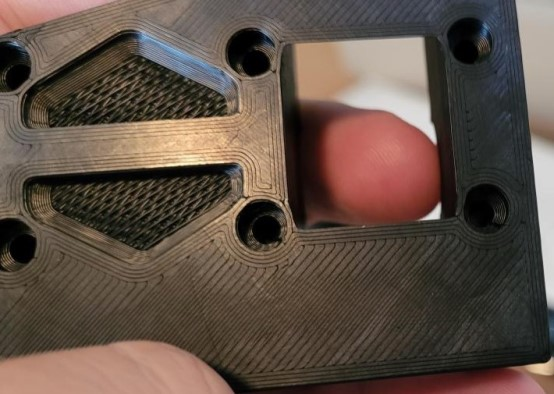 
### Too Much Squish

- Can't see any lines, or the lines are starting to fade (smooth PEI):

    -   

- Wavy patterns appear:

    - 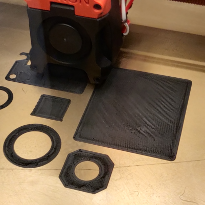 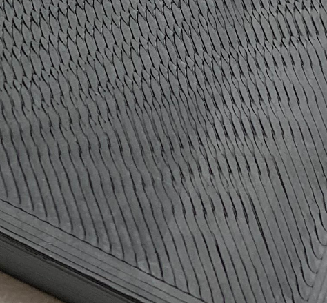 


### Not Enough Squish
- There are gaps between the lines:

    -    


# Build Surface Adhesion

- **(!)** Avoid touching your build surface as much as possible. Oils from your fingers will cause issues. Handle your spring steel with a clean rag or cloth.

- **Smooth PEI:**
    - **Scuff it up** with a [Scotch-Brite scouring pad](https://www.scotch-brite.com/3M/en_US/scotch-brite/tools/~/Scotch-Brite-Heavy-Duty-Scour-Pad/?N=4337+3294529207+3294631680&rt=rud).
        - The rough side of a fresh sponge, ~800-1000 grit sandpaper, or other brands of scouring pads could also work.
        - This helps immensely, much like how you would scuff/sand a surface before painting or gluing something to it.
        - You can refresh the surface this way on occasion, just remember to wash it again afterwards.
    - Ensure that you actually *have* smooth PEI. Some spring steels, particularly the reverse side of some textured steels, are yellow/orange in appearance but do not actually have PEI applied. Inspect the edges of the plate to verify.

- **Textured PEI:**
    - Needs more squish than smooth PEI, to push the filament into the cracks/dimples.

- **(!) Thoroughly wash all build plates with dish soap and water, followed by 70+% isopropyl alcohol.**
    - You should do this even for brand new surfaces.
    - Isopropyl alcohol does not do a great job of cleaning oils. It mostly just spreads them around.
    - I keep a spray bottle of soapy water next to my printer. Using a paper towel, I scrub with soapy water, then again with isopropyl alcohol (IPA).
    - Soap is not needed for every print. You can use IPA most of the time, with occasional soap when it needs further refreshing.

- Ensure your PEI is not counterfeit. You may have to ask in the Discord for others' experiences with a given brand. If your PEI is clear rather than yellowish, it's fake.
    - Stick to well-known brands. 
    - This is prevalent with unknown AliExpress and Amazon sellers.

- Instead of PEI, you can use strong adhesives like [Vision Miner Nano Polymer](https://visionminer.com/products/nano-polymer-adhesive) on bare spring steel.

- As a **very last resort**, you can try refreshing the surface with acetone. Keep in mind, however that this weakens PEI over time, and I heave heard cases of it **destroying** certain surfaces (mainly certain brands of textured sheets). **Only try this if it's going in the trash otherwise.**
# Pressure Advance

Pressure advance changes the **distribution** of material, not the **amount** of material.
- Lower values result in less material in the middle of lines, and more at the ends/corners. 
- Higher values result in more material in the middle of lines, and less at the ends/corners.
- Here is an example:
    - PA Values: 0, 0.035, 0.05, 0.09, 0.12 (Galileo clockwork / Dragon HF)
    - 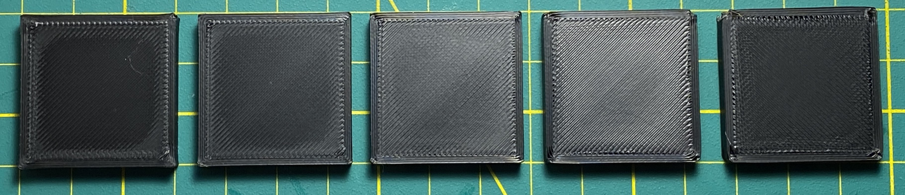 


- **Remember: There is rarely such thing as perfect pressure advance.** Either accelerations or decelerations will almost always be slightly imperfect. You should always err on the side of lower PA values.

- Pressure advance can change with different filaments. Typically I only find it necessary to tune per material type - ABS, PETG, PLA, TPU, etc.  I will only tune specific brands or colors of they are noticeably different.

There are two approaches - the [tower method](#tower-method-simple) (simple), and the [Lines method](#marlin-method-advanced) (advanced).

## Tower Method (Simple)

This is based off of the [Klipper Pressure Advance guide](https://www.klipper3d.org/Pressure_Advance.html#tuning-pressure-advance), but with some modifications. 

The Klipper guide recommends limiting acceleration to 500 and square corner velocity (SCV) to 1, among other things. The intent behind these changes is to exaggerate the effects of pressure advance as much as possible. I'm not a fan of this approach.

In my opinion, it is best to run the calibration in close to normal printing conditions. This can make it slightly harder to tell the difference, but I find it more accurate.

**1)** Download and slice the [pressure advance tower](https://www.klipper3d.org/prints/square_tower.stl) with *your normal print settings (accelerations included)*. \
The only modifications you should make are these:

- **120mm/s** external perimeter speed
- **1** perimeter
- **0%** infill
- **0** top layers
- **0 second** "minimum layer time" / "layer time goal"
- **High fan speed**

**2)** Initiate the print.

**3)** After the print has *already started\**, enter the following command:

- (Direct Drive) `TUNING_TOWER COMMAND=SET_PRESSURE_ADVANCE PARAMETER=ADVANCE START=0 FACTOR=.0025`
- (Bowden) `TUNING_TOWER COMMAND=SET_PRESSURE_ADVANCE PARAMETER=ADVANCE START=0 FACTOR=.025`

You should now see increasing pressure advance values reporting to the g-code terminal as the print progresses.

<sup>\* *Certain patterns in your start g-code can cancel the tuning tower. \
\* It does not matter how quickly you enter the command, as it is based on height.*\
\* Alternatively, you can temporarily add the tuning tower command after your start g-code.</sup>

**4)** Allow the print to run until it starts showing obvious issues/gaps. Then you may cancel.

**5)** Measure the height of the perfect PA with calipers **(see images below)**
- Ensure you are **not** measuring your Z seam corner.
- There should be no signs of underextrusion before or after the corner. 
    - It can help to shine a bright flashlight between the walls.
- **It is normal for there to be a small amount of bulge on the trailing edge. When in doubt, choose the lower value.**
- If the height differs between corners, take a rough average.

**6)** Calculate your new pressure advance value:
- Multiply measured height by your `FACTOR`.
- Add the `START` value (usually just 0).

**8)** In the `[extruder]` section of your config, update `pressure_advance` to the new value.

**9)** Issue `RESTART` command.

### Example
**You may need to zoom in here, the differences are subtle.** There is always some ambiguity.

Excuse the gigantic photos - high resolution is needed here.

 
 

## Lines Method (Advanced)

### Background
This method is quicker to run and more precise than the tower method, but requires additional preparation and manually modifying g-code files. 


**(!) If you are not familiar with manually modifying g-code, please consider using the tower method instead. You risk crashes & damage if you don't know what you are doing.**
### Method

**1)** Add this macro to your Klipper config.

```
# Convert Marlin linear advance (M900) commands to Klipper (SET_PRESSURE_ADVANCE) commands.
# Used in conjunction with Marlin's linear advance calibration tool: 
# https://marlinfw.org/tools/lin_advance/k-factor.html
[gcode_macro M900]
gcode:
	# Parameters
	
	
	SET_PRESSURE_ADVANCE ADVANCE={pa}
```

**2)** Type `RESTART` into the g-code terminal.

**3)** Visit the [Marlin K-factor calibration site](https://marlinfw.org/tools/lin_advance/k-factor.html).

**4)** Fill out the parameters. Most are self explanatory or should be left at defaults, but these are some specific settings that I recommend:
 
- **Printer**
    - **Layer Height**: 0.25mm
- **Speed**
    - **Slow Printing Speed**: Your square corner velocity
    - **Fast Printing Speed**: 120mm/sec
    - **Acceleration**: Your perimeter acceleration (NOT external perimeter)
- **Pattern**
    - **Starting Value for K**: 0
    - **Ending Value for K**:  
        - **Direct Drive**: 0.1
        - **Bowden**: 1.5
    - **K-factor Stepping:**: 
        - **Direct Drive**: 0.005
        - **Bowden**: 0.05
    - **Print Anchor Frame**: Checked
- **Advanced**
    - **Nozzle Line Ratio**: 1.2
    - **Use Bed Leveling:** No
    - **Prime Nozzle**: Unchecked
    - **Dwell Time**: 0

Note that the "Extrusion Multiplier" setting is a decimal, NOT a percent.

**5)** Generate and download the g-code file.

**6)** Edit the g-code file.

**(!) Again, if you are confused about g-code editing, please consider using the tower method instead. You risk crashes & damage if you don't know what you are doing.**

I will not give extremely specific directions here, as it depends on how you start & end your prints. I will show you mine as an example, however.

- Modify the "prepare printing" g-code section appropriately at the beginning.
    - Change `M204 P` to `M204 S`.
    - Add `PRINT_START` in the appropriate place.
        - If you are [passing variables to `PRINT_START`](https://github.com/AndrewEllis93/Ellis-PIF-Profile#passing-variables-to-print_start), remember to remove the heating commands and pass them to `PRINT_START` instead, e.g: `PRINT_START HOTEND=240 BED=110`
            - Example: \
            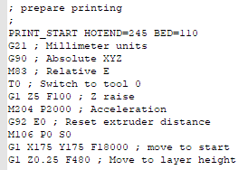 
    - Ensure that the preparation commands (G90, M83, G92 E0 etc.) remain, and happen **after** `PRINT_START`.

- Modify the "FINISH" g-code section appropriately at the end.
    - Don't forget to add `PRINT_END`.\
     

**7)** Print it, and inspect the results. 
- This calibration pattern is a great visual representation of what I mentioned earlier: **that there is rarely a perfect PA value.** 
    - Even at the "best" PA value, the line may not be perfect thickness all the way across.
    - Often, either acceleration *or* deceleration will look good. They will not always both look good on the same line.
        - **ALWAYS** choose the lower value. 
    - This requires some interpretation. In this example, I would choose about **0.055**.\
*(note: mine may be higher than yours, I am using an Orbiter + Dragon HF.)*

     
## Fine-Tuning and What to Look For

The above methods are usually good enough on their own. Choosing the right height/line, however, can take some experience. Here are some things to look out for.
### Pressure Advance is Too High
- Divots or underextrusion at corners and line ends.
- Gaps between perimeters at corners.

-  

### Pressure Advance is Too Low
- Bulging at corners and line ends.
- Gaps between straight line perimeters.

- 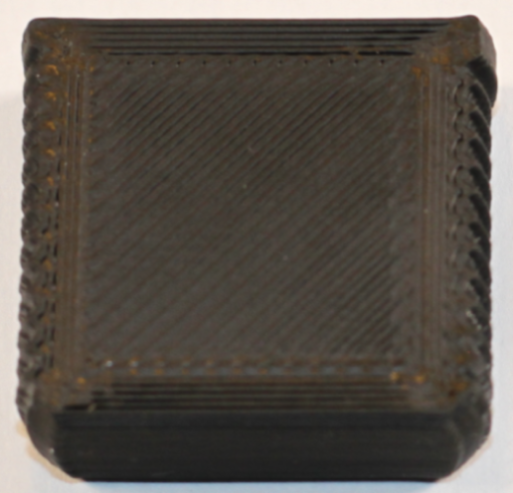 

You can manually tweak pressure advance based on actual prints. Usually increments of 0.005 (with direct drive) are a good starting point.

# Extrusion Multiplier


**(!) You should [calibrate your extruder](https://docs.vorondesign.com/build/startup/#extruder-calibration-e-steps) first.**

- Calibrating your extruder ensures that the extrusion multiplier will be the same across all printers. Extruder calibration simply ensures that 100mm requested = 100mm extruded. Extrusion *multiplier* is a per-filament setting, depending on the properties of each material.

**(!) You should [tune pressure advance](#pressure-advance) first.**

- These tests try to remove PA as a variable as much as possible, but having a good PA value is still ideal.

This must be done, at a minimum, per filament brand/type. It may vary by color or by roll, depending how consistent your filament brand of choice is. With KVP I am usually able to run the same EM for all colors.

## Background
This is a bit of a debated subject. Getting the perfect extrusion multiplier (EM) is *crucial* for good looking prints.
### Methods I'm Not a Fan Of
The below methods I've found to have error of up to 5% (sometimes even more) - which may not sound too bad but it makes a *huge* difference on the appearance of your prints.
- #### Measuring Wall Thickness With Calipers
    - Some guides you will find online mention printing a single or two-walled object and measuring the thickness with calipers. 
        - I find this method not to work very well at all, especially with ABS, presumably due to shrinkage.
        - This method is also impacted by pressure advance, which can easily throw off your results.
- #### SuperSlicer Calibration
    - SuperSlicer has a built-in flow calibration tool, however I do not like this either, for a few reasons:
        - It is very reliant on first layer squish.
        - Because it uses 100% infill, the first layer squish carries through all the way to the top. 
        - It has ironing turned on by default.
        - The objects are too small. It's normal for [smaller infill areas to look a bit more overextruded than larger infill areas.](#small-infill-areas-look-overextruded)

### Notes on Dimensional Accuracy
I find the below method to result in prints that are within my personal acceptable tolerances, and work well for Voron parts. It's an aesthetics-first approach that also happens to get "good enough" dimensional accuracy in my experience.

**Voron parts are designed for some shrinkage**, and for reasonable tolerances, so don't go crazy with calipers and comparing measurements to CAD/STL dimensions. In many cases they are not intended to match.

With the Voron test prints, as long as:
- The thread tests screw together nicely, and
- Bearings fit nicely without too much force into the Voron cube (F695 on bottom, 625 on top),

Then you are pretty much good to go.

**If dimensional accuracy is your top priority for other projects:**
- Firstly, adjust your expectations. Remember, our 3D printers are hobby-grade, glorified hot glue guns, not CNC. You will not reliably get 0.01mm tolerances everywhere.
- You likely need to play with part scaling, CAD dimensions, or even slicer shrinkage compensation since we are dealing with ABS. ABS shrinks a fair bit, and the nature of FDM can also make shrinkage a bit less predicatable. 
    - The best place to accomodate for shrinkage is in the part design itself. 
    - Consider using a different plastic with less shrinkage, or even filled ABS.
- You can fine-tune EM based on part dimensions or fitment, and use my method to tune top layer flow separately for aesthetics and flush mating surfaces.
- There is some debate around whether you should calibrate your A/B (or X/Y) axes. I have never found this necessary, however. 

You will have to find the method that works best for you. I am considering extremely tight dimensional accuracy outside the scope of this guide. 
## Method
The best method I have found is purely visual/tactile.

We will print some 30x30x3mm cubes. *(see the Test_Prints folder)*

**Print Settings:**
- **40+% Infill**\
    We need sparse infill rather than 100% solid infill, to remove the first layer squish from impacting the top layer. \
    We still need enough to adequately support the top layers.
- **100% Top Layer [Line Width](#a-note-about-line-width)**\
    This is more subject to interpretation, but I find 100% to have good results. It has a nice finish and tends to show off EM differences the best.
- **5 Top Layers**\
    This ensures that we have adequate support for the surface layer.
- **Monotonic (filled)** top infill pattern\
    Make sure that this is not set to "ironing". If not available, use rectalinear or "lines" instead (depends on slicer).
- **30mm/s Solid & Top Solid Infill Speed***\
    This helps to remove pressure advance as a variable. The faster we go, the more pressure advance will impact our results.\
    <sup> - *If your pressure advance is well tuned, you may actually get more "true to life"/accurate results printing at your normal print speeds. If your pressure advance is off, however, it can [throw you off further.](#a-note-about-pressure-advance--em)</sup>
- **High Fan Speed**\
    As these are only small objects, we need to ensure they have enough cooling so that the top layers don't sag. This depends on your fan, maybe around 80% with AB-BN or 100% with the stock 4020 fan.

**Steps:**

**1)** Print multiple test cubes with variations of 2% EM. 
- You can do this all in once plate by adjusting settings for each object. Save it as a .3mf file for reuse later.
    - **(!) In PS/SS, if you set flow per-object, make sure to set your EM to 1 in the filament settings.** The per-object EM settings are a percentage that is **multiplied by** the EM in your filament settings.
    1) 
    2) 
    3) 
    4) 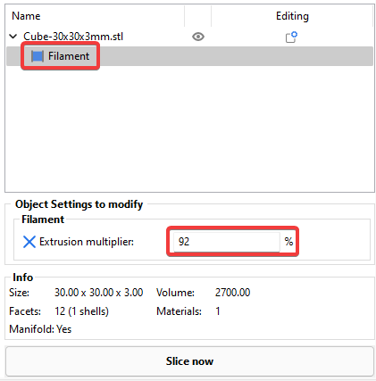

**2)** Inspect each cube. Once you are nearing the correct EM, the top should feel noticeably smoother. Too much EM will look and feel rougher, and too little EM will have gaps between the lines.

**3)** If desired, run the process again but with 0.5% intervals. Most PIF providers tune down to the 0.5% range, some even less. 

I have found that most ABS falls within the 91-94% range.

### Examples

This can be difficult to convey in photos. **You may have to zoom in to see the differences.** It's easier to see in person - especially because you can manipulate the test prints and look at them in different lighting angles.

Focus your attention near the center of the test prints. It's normal for it to look a bit more overextruded near the edges and corners.

You will get better at this through experience.
#### 2% Intervals
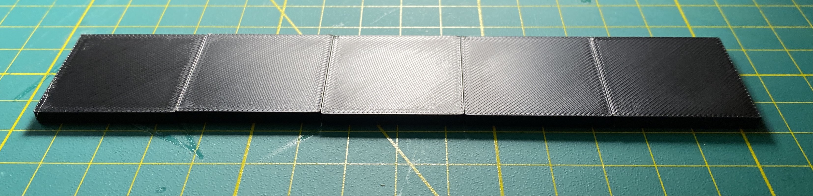 
#### 0.5% Intervals
Now we run the print again at 0.5% intervals between the "too low" and "too high" examples from above.

Notice how the print becomes noticeably more shiny and glass-like around perfect EM (cube #2). 
This is not just a trick of the light. Shininess is not always the best indicator, but it makes a good visual example.

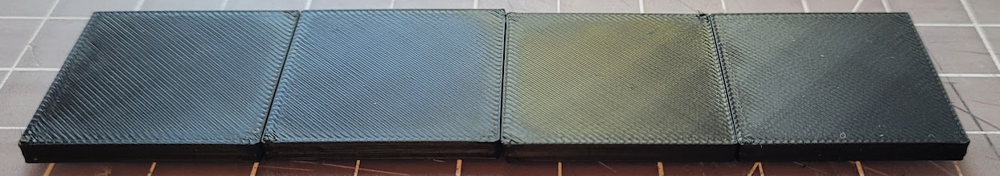 

### The Relationship Between Pressure Advance & EM
Remember: pressure advance changes the **distribution** of material, not the **amount** of material.

Pressure advance and flow are interrelated, so tuning one can affect the other. The method above has you lowering your top layer speeds in order to reduce the impact of pressure advance as much as possible.

The faster you print, the larger the area that pressure advance will impact. Lower speeds will relegate the effects of pressure advance to be closer to the edges, while higher speeds will cause it to affect a wider area.

Imagine a single extrusion line. In this line, the toolhead accelerates to full speed, stays at top speed, and then decelerates again towards the end of the line. Pressure advance takes effect during these accelerations and decelerations. \
In both of the below examples, assume the same acceleration settings.
- When printing with a faster speed, the line is printed in less time, and the extruder spends a larger portion of the line accelerating and decelerating to reach the higher top speed. Therefore, a larger portion of the line is spent equalizing pressure.
- When printing with a slower speed, the line is printed in more time, the extruder spends a smaller portion of the line accelerating and decelerating. Therefore, a smaller portion of the line is spent equalizing pressure, and more of the line is printed at steady speed with steady pressure.

If your actual print results with faster top layers do not look as good as your test cubes, provided they have adequate infill, top layers, etc, **your [pressure advance](#pressure-advance) value may need further tuning.** 

You can run faster solid infill, but I would recommend using a moderate top layer speed still. I use 60mm/s.

### Actual Print with Tuned EM:

 

# Cooling and Layer Times
## Signs of Overheating
  
 
 
 
 
## How to Fix It

People often start printing by ABS with no cooling. While this is valid advice for unenclosed printers, it's not a universal rule. **ABS often needs some cooling, especially in an enclosure.**

There are multiple things you can do to minimize overheating with ABS.

**1) Increase fan speeds.**

- The higher your chamber temperature is, the more fan speed you will need.
- Use constant fan speeds when possible. For filaments that shrink, **varying fan speeds during a print will cause inconsistent layers and banding.** Some layers will essentially shrink more than others.
- You probably need more cooling than you think. 
    - For example I run AB-BN (5015 fan mod) and have a 63C chamber.
        - For large plates, I use 40% fan.
        - For small numbers of small objects, I use up to 80% fan.
    - For very large objects, you may want to be more conservative with cooling. Large objects are much more prone to warping.
        - This is the only time I might use differing fan speeds. Lower fan speeds for the majority of the print, with higher fan speeds for overhangs.
- If your prints are curling away from the bed even at low fan speeds, it may actually be a [build surface adhesion](#build-surface-adhesion) issue.


**2) Increase "minimum layer time" / "layer time goal"**

- I set this to a minimum of 15 seconds.
- This essentially slows down the print for very short/small layers, allowing each layer adequate time to cool.
- When layer times are **too short**, they do not have enough time to properly cool. You will then be printing on top of layers that are still soft.

**3) Print more objects at once, and spread them out.**

- We can allow objects to have some "break time" between layers simply by printing more objects at once. Spread them out to induce more travel time, and maybe even reduce travel speeds.
-  

# Retraction

**(!) You should [tune pressure advance](#pressure-advance) first.**
Pressure advance can lower the amount of retraction needed, especially for bowden.

If you typically print with z-hop, leave it on for this test.

**There is some trial and error involved.** You may need to re-run these tests at varying retraction speeds and temperatures if you are not getting good results. You will just have to experiment. You should hot tighten your nozzle (unless it's an E3D Revo).

If you are having persistent issues:
- **(!) Ensure that your filament is dry.** Wet filament can cause near-unfixable stringing.
- Ensure that your hotend is not leaking around the threads or heat break. This can indicate that your nozzle or heatbreak is loose or not making adequate contact.
- You may need to use less z hop (z lift). I run 0.2mm. Too high gives me stringing.

There are a few factors that can affect your retraction settings, such as:
- Material type
- Print temperature
- Hotend
- Extruder
## Method

**We will be using using [SuperSlicer](https://github.com/supermerill/SuperSlicer/releases)'s calibration tools.**

- If you do not typically use SuperSlicer, you can start with one of the built-in Voron profiles for this test. 
    - The built-in profiles are not great in my opinion, but will work fine just for running the calibration tools. 
    - Shameless plug: try [my profiles](https://github.com/AndrewEllis93/Ellis-PIF-Profile) later on. There are some other warnings and dependencies, however *(please thoroughly read its readme)*, so just stick with the built-in ones for now.

We will be printing these retraction towers at three different temperatures. If you are confident that your filament temperature is well tuned, you may get good results with just one tower.

**1)** Ensure that your nozzle is clean. You can use a brass brush while it is heated.

**2)** Set your fan speed high.
- These are small towers, we don't want them to get melty.

**3)** Set your retract and unretract speeds to **30mm/s** to start. 
- This is located in the "printer settings" tab, under "extruder 1".
- I have had more luck with slower retraction speeds. Your mileage may vary.

**4)** Use medium-high fan speeds. 
- These are located in the "filament settings" tab, under "cooling".
- These retraction towers are small and need some additional cooling. 

**5)** Select "extruder retraction calibration" from the menu.

- 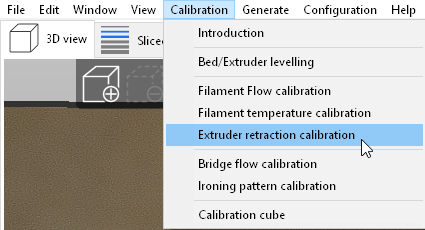 

**6)** Click "remove fil. slowdown".

- 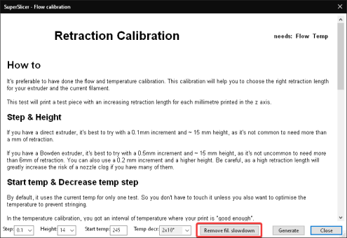 

**7)** Fill out the parameters and select "Generate".

- 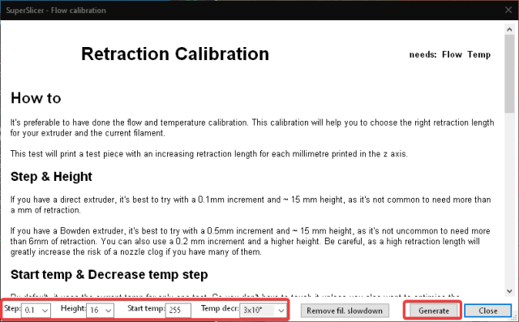 

    - **Start temp:**
        - Set a **bit higher** than your normal printing temps (maybe around 10C higher).
            - For this example, I will be using 255C with KVP ABS.
    - **Step:**
        - Direct drive: **0.1mm**
        - Bowden: **0.5mm**
    - **Height:**
        - Your maximum retraction length will be **(height - 1) * step**.
            - Do not exceed **1mm** for direct drive.\
            *(height: 11 when using a step of 0.1mm)*
                - You will *rarely* need more than this, but it is possible with some high flow hotends and setups. Start with 1mm, only go up to an absolute max of 2mm if required.
            - For bowden, this can vary. Try starting with a maximum of **3mm**. \
            *(height: 7 when using a step of 0.5mm)*
                - You may need more, depending on a few factors like pressure advance, bowden tube length, bowden tube internal diameter, and how firmly attached the tube is in the couplings.
                - Ensure that your bowden tubes are as firmly attached as possible, and do not [move too much in and out of their couplings during printing](https://youtu.be/lboDSH0945g?t=120). 
    - **Temp decrease (temp decr):**
        - **3x10°**.
            - This will print three retraction towers. One will be at your "start temp", the other two will be 10C increments below this.

    - You should get output like this:
        -  

    **8) (!) Arrange the towers front to back**\* **on your build plate.**
    - These objects are printed one at a time. **This ensures that they are not knocked over by the gantry/toolhead.** 
    - Arrange them from the hottest tower at the front, to coolest tower at the back.
        - The towers are printed from hottest to coldest. This just lowers the chance of collisions (particularly with poorly written `PRINT_END` macros). 
    - 

     <sup>\* If you are using a different kinematic system than CoreXY/i3 cartesian, you may need to use a different arrangement. For example, a cross gantry would need diagonal.</sup>

    **9) Print it, and inspect the results.** 
    - If your hotter towers are much stringier, consider choosing a lower extrusion temperature.
    - **To get your new retraction length:**
        - Count the rings (from the bottom), subtract 1, and multiply by your "step" value.
            - In my opinion, choose a height **1-2 rings higher** than where the stringing disappears. This just gives you a bit more headroom for filaments that may behave a bit differently.
            - We are subtracting 1 because the first ring is 0 retraction.

## Infill/Perimeter Overlap

After tuning flow and pressure advance, you may still have some pinholes where your top infill meets your perimeters. This is more prevalent in PS/SS.

This is *not necessarily* an indicator that your flow or pressure advance are wrong, though they can impact it. 

*Some people have widely varying overlap settings. You will need to tune this for yourself. I am still figuring out why it varies between people. It may be impacted by line width, but I have not yet tested this theory.*

**Simply increase "infill/perimeter overlap" (PS/SS) until satisfied.**

### Examples
-  
-  
### Overlap Tweaked:

-  

### Regarding "Not Connected" Top Infill (SuperSlicer)

- Some use "not connected" for their top infill. This does resolve the pinholes, however I find this to cause the opposite problem. It *overshoots.* 

- To resolve this overshoot, you then need to *lower* your overlap. And because overlap is a global setting, this also starts to affect sparse infill/perimeter bonding - and therefore affects print strength.

# Determining Maximum Volumetric Flow Rate

Volumetric flow rate indicates how much plastic that your hotend/extruder can extrude per second.

Volumetric flow is expressed in mm<sup>3</sup>/sec (cubic millimeters per second).
### Why?
You can use this volumetric flow rate **to determine how fast your hotend/extruder is able to print.**

- See [this section](#how-volumetric-flow-rate-relates-to-print-speed) to determine what maximum speeds you can print at with a given flow rate.
    - See [this section](#approximate-values) for approximate values for certain hotends.
- Some slicers (including Prusa Slicer/SuperSlicer) let you configure this limit to ensure that you never outrun your hotend.
    - This means that you can change layer heights, nozzle sizes, line widths, and speeds without worrying about outrunning your hotend. It will automatically limit you. 
    - You can also set any print speeds to 0 (like infill) to print that extrusion type as fast as your hotend will allow.
- 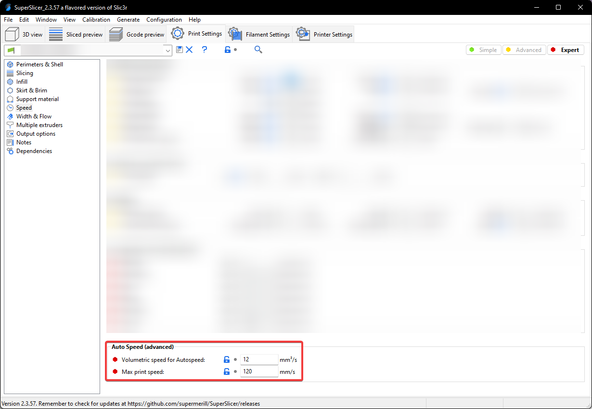 

## Approximate Values

| Hotend     | Flow Rate (mm<sup>3</sup>/sec) |
| :---        |    :----:   |
| E3D V6            | 11
| E3D Revo            | 15
| Dragon SF| 15
| Dragon HF| 24
| Mosquito| 20
| Mosquito Magnum| 30

You should be okay using an approximate value and just lowering it if you have any issues. 

These are approximate values **assuming a standard brass 0.4mm nozzle.** 

Nozzle properties may affect these numbers. For example:
- Larger diameter nozzles will have higher flow rates
- Hardened steel has a lower thermal conductivity and you may get lower flow rates unless you compensate with higher temperatures. 
- Plated copper and tungsten carbide have higher thermal conductivity and might allow a bit higher flow rate. 
- Bondtech CHT nozzles use a different internal geometry that allows higher flow rates.

*If you want to get more scientific, test with a specific nozzle or setup, or your hotend just isn't listed, see the last section (["Determining Max Volumetric Flow Rate"](#determining-max-volumetric-flow-rate)) for more details.*

## How Volumetric Flow Rate Relates to Print Speed

Working out how quickly you can print at a given volumetric flow rate is quite simple:

- **speed = volumetric flow / layer height / line width**

Or, inversely,
- **volumetric flow = speed * line width * layer height**

For example, if your hotend is capable of 24mm<sup>3</sup>/sec, and you are printing with 0.4mm line width, at 0.2mm layer height:

- **24 / 0.4 / 0.2 = Maximum print speed of 300mm/sec**

## Method
You will follow a similar process to extruder calibration. 

This is a rough calculation. Maximum volumetric flow rate can change with a number of factors, like temperatures, material, and nozzle type. You should set your limit slightly lower in the slicer for margin of safety, and to avoid having to tune for different filaments that don't flow as nicely.

**1)** Heat your hotend. \
**2)** Extrude a little bit to ensure your E motor is energized and holding.\
**3)** Mark a 120mm length of filament going into your extruder.\
**4)** Extrude at increasing speeds. At each interval, measure to ensure that exactly 100mm entered the extruder.

For example, the gcode to extrude at 5mm/sec is:
```
M83 ; Relative extrusion mode
G1 E100 F300 ; Extrude 100mm at 5mm/sec
```
Remember the the F speed is in mm/min, **not** mm/sec, so multiply your desired speed by 60.

**5)** Keep increasing speeds and extruding until it starts dropping below 100mm. This is your max flow rate. \
**6)** Convert your extrusion speed to volumetric speed using the below formulas. \
**7)** Enter a slightly lower volumetric speed into the slicer.

### Formulas

**mm<sup>3</sup> = mm / 0.416**

Or, inversely, 

**mm = mm<sup>3</sup> * 0.416**

For example, if you extrude at **5mm/sec**, that comes out to **~12mm<sup>3</sup>/sec.** (5mm / 0.416)

\* <sup>*For 2.85mm filament, use 0.157 instead of 0.416.*</sup>\
\* <sup>*These fomulas are simplified versions of the cylinder volume equation (V=πr<sup>2</sup>h) given r and h or V, rounded to 3 significant figures. This is more than enough accuracy for our purposes (down to the thousandths). [Calculator](https://www.calculatorsoup.com/calculators/geometry-solids/cylinder.php)*</sup>
# Determining Motor Currents
**(!)** The below guidance is for **A/B/X/Y motors only**.

Extruder motors/pancake steppers are a bit different, as there is more variance between models. I will add this at a future date.

- **Check with the community first.**
    - If you are using BoM motors, check the stock configs.
    - Check in Discord to see what others are running.

- **You should start off with a more conservative** `run_current`.
    - You may be able to attain additional motor performance by increasing currents, but come back to that later. **Get your printer working reliably first.**

- **Some motors vary.**
    - I have found my LDO 0.9 degree steppers to be able to achieve notably higher max accels/speeds with higher currents. 
    - My OMC 1.8 degree motors, on the other hand, performed very well even at moderate currents.

- We are derating the motors/drivers for margin of safety. Rated currents are the absolute maximum *in ideal conditions*. In reality, things like chamber and driver temperature come into play. Margin of safety is also standard practice.
- TMC2209 drivers are rated to 2a RMS, but I would not exceed 1.4a RMS.

## Determining Initial `run_current`:
Start with around **40-50%** of rated current.

For example, with a 2a motor, start around 0.8-1a.
## Determining Maximum `run_current`:
A good rule of thumb is to not exceed **70%** of the rated current.

For example, a 2a motor would be about 1.4a max.


- Keep in mind that currents approaching maximum may need greater stepper driver cooling.
- If you are pushing higher currents, you may also want to consider measuring the temperature of your motors. Ensure that they do not exceed 70-75C.
    - Measure the temps when actually printing in a heat soaked chamber.
        - Some multimeters come with a k-type thermocouple. You can kapton tape it to the motor housing.
    - *You cannot accurately gauge this by feel.*
    - The motors themselves can generally handle much more. This temp limit comes from the printed parts rather than the motors themselves.
## Determining `hold_current`
A rule of thumb is about 70% of your `run_current`.
# Determining Maximum Speeds and Accelerations

This section is purely about finding your absolute maximum speeds/accels. **This does not necessarily mean that these speeds or accelerations will be practical to print with** - but it can be handy to find the limits of your printer. You can use max speeds for things like travels, mesh, QGL, etc.

You may be able to get higher performance out of your motors by increasing currents (see previous section), but be careful not to push them too high.

You may also get higher maximum accelerations by utilizing input shaper.
## Method

Tune maximum speeds first, THEN tune accelerations separately.

**1)** Add [this macro](Macros/TEST_SPEED.cfg) to your `printer.cfg` file.

**2)** Lower your `max_accel` in your config.
- We want to test speeds and accels *separately*. This helps to remove the other as a variable.

**3)** Run the `TEST_SPEED` macro using the [instructions below](#usage-of-the-test_speed-macro) with increasing speeds [until you experience skipping.](#determining-if-skipping-occured) 
- Start with a small number of iterations.
    - Example: `TEST_SPEED SPEED=350 ITERATIONS=2`
- Once you experience skipping, back the speed down and try again until you no longer get any skipping.

**4)** Once you have found a rough maximum, run the test again with a large number of iterations.
- This is essentially an extended torture test.
    - Example: `TEST_SPEED SPEED=400 ITERATIONS=50`
- If you experience any skipping during extended tests, back the speed down again.

**5)** *Use a slightly lower value than your results.*
- Sometimes a maximum that works perfectly, even in extended torture tests, can skip during actual prints. Go a bit lower for a margin of safety.

**6)** Save your new maximum velocity to `max_velocity` in your config.

**7)** Return your `max_accel` in your config to its previous value. *(changed in step 2)*

**8)** Repeat the process, this time increasing accelerations rather than speeds.
- Example: `TEST_SPEED ACCEL=400 ITERATIONS=2`

**9)** Save your new maximum acceleration to `max_accel` in your config.
- Set your `max_accel_to_decel` to *half* of this value.

## Usage of the TEST_SPEED Macro

The macro is available [here.](Macros/TEST_SPEED.cfg)

This macro will home, QGL *(if your printer uses QGL)*, move the toolhead in a test pattern at the specificed speeds/accels, and home again. 

You will [watch, listen, and compare the terminal output from before/after.](#determining-if-skipping-occured)

### Available arguments
- `SPEED` - Speed in mm/sec. 
    - *Default: your `max_velocity`*
- `ACCEL` - Acceleration 
    - *Default: your `max_accel`*
- `ITERATIONS` - Number of times to repeat the test pattern 
    - *Default: 5*
- `BOUND` - How far to inset the test pattern. 
    - *Default: 20mm (from the edges)*

**(!)** *Note that any speed or acceleration you input into this macro can **exceed** 
`max_velocity` and `max_accel` from your config. 
### Examples

- `TEST_SPEED SPEED=350 ITERATIONS=50` 

- `TEST_SPEED ACCEL=10000 ITERATIONS=50` 

### Determining if Skipping Occured

**1.** Watch and listen. 
- Often, the skipping will be very obvious. Your toolhead may start shuddering and making erratic movements and loud noises.
- Even if no skipping manifests, your motors might start to make loud resonant noises. *This can be an indication that you are near the limit, and should consider backing off a bit.*

**2.** If there was no apparent major skipping, check for minor skipping:

- Inspect the g-code terminal output:
    - Compare the numbers for the X and Y steppers for the first and second homing.
    -  
    - These numbers represent the microstep position of the toolhead at X/Y max position.
    - Ensure that the difference between these numbers **has not exceeded a full step.**
        - For example, I am running `microsteps` of **32** for my A and B motors. I would ensure that the values for each axis have not changed by more than **32**.
        - If the number has deviated more than this, that means that the corresponding axis has likely skipped.

    \* *Measuring to a full step just accounts for endstop variance. It does not necessarily mean that any microsteps were lost. Endstops are only so accurate.*


# Passing Variables to PRINT_START
**I would recommend starting with a standard PRINT_START and setting this up later.**

By default, slicers will put heating commands either entirely before or after `PRINT_START`. You have to pass the temps TO `PRINT_START` in order to control when they happen. 
For example I don’t want my nozzle to heat until the very end so it’s not oozing during QGL, mesh etc.

If you don’t use a chamber thermistor, just remove the chamber stuff. 

## Example macro:

This macro is a **template**. \
You will have to add things like `G32`,`QUAD_GANTRY_LEVEL`,`BED_MESH_CALIBRATE`, or whatever other routines that you need to run during your `PRINT_START`.

```
[gcode_macro PRINT_START]
gcode:        
    # Parameters
    
    
    
    
    G28
    # <insert your routines here>
    M190 S{bedtemp}                                                              ; set & wait for bed temp
    TEMPERATURE_WAIT SENSOR="temperature_sensor chamber" MINIMUM={chambertemp}   ; wait for chamber temp
    # <insert your routines here>
    M109 S{hotendtemp}                                                           ; set & wait for hotend temp
    # <insert your routines here>
    G28 Z                                                                        ; final z homing
```

This would now be run like `PRINT_START BED=110 HOTEND=240 CHAMBER=50`. 
Chamber defaults to 0 if not specified.
## Slicer Start G-code

Don't split any of these gcodes to separate lines.
### SuperSlicer
(3 lines)
 ```    
M104 S0 ; Stops PS/SS from sending temp waits separately
M140 S0
PRINT_START BED=[first_layer_bed_temperature] HOTEND={first_layer_temperature[initial_extruder]+extruder_temperature_offset[initial_extruder]} CHAMBER=[chamber_temperature]
```
 

### Prusa Slicer 
(3 lines)

*Prusa Slicer doesn’t support chamber temp.*
    
```
M104 S0 ; Stops PS/SS from sending temp waits separately
M140 S0
PRINT_START BED=[first_layer_bed_temperature] HOTEND={first_layer_temperature[initial_extruder]+extruder_temperature_offset[initial_extruder]}
```
 

### Cura
(1 line)
```
PRINT_START BED={material_bed_temperature_layer_0} HOTEND={material_print_temperature_layer_0} CHAMBER={build_volume_temperature}
```
 

# Controlling G-code Order *Without* Passing Variables

**The [above section](#passing-variables-to-print_start) is the preferable way to set it up**, as it allows you the most control. 

If your slicer is putting heating g-codes AFTER `PRINT_START` and you want them to happen before (or the inverse, or you want to split it), this would be a simpler way to control the ordering. This method only allows you to send temperature g-codes before or after `PRINT_START`, but at least allows you to control the order.

To force the g-code ordering, place any of the following g-codes from the following lists in your start gcode where you desire:
### Prusa Slicer / SuperSlicer
- `M140 S[first_layer_bed_temperature] ; set bed temp`
- `M190 S[first_layer_bed_temperature] ; wait for bed`
- `M104 S{first_layer_temperature[initial_extruder]+extruder_temperature_offset[initial_extruder]} ; set hotend temp`
- `M109 S{first_layer_temperature[initial_extruder]+extruder_temperature_offset[initial_extruder]} ; wait for hotend `
### Cura
- `M140 S{material_bed_temperature_layer_0} ; set bed temp`
- `M190 S{material_bed_temperature_layer_0} ; wait for bed`
- `M104 S{material_print_temperature_layer_0} ; set hotend temp`
- `M109 S{material_print_temperature_layer_0} ; wait for hotend `

### Warnings
- **These are just lists** of available commands, they don't have to be in this order, nor do you have to use all of them. Place them as you like.
- Each bullet point is only **ONE** line. Do not split them into multiple lines.
- There are many other variables available in each slicer, and you can pass whatever variables you like to whatever g-codes you like. The available variables are not always documented.
### Example
Forces both bed and hotend to heat up fully before executing `PRINT_START` (SS):
-  

# Troubleshooting
## BMG Clockwork Backlash Issues

**Ensure that you have some [backlash](https://gfycat.com/mealycautiouscoqui) between the motor gear and the plastic gear.**
- Gauge this with filament loaded and the spring tensioned (the backlash will reduce a bit once it is loaded).
- You want a little backlash, but not *too* much.

This is adjusted by moving the motor itself up and down.\
The motor plate has 3 slotted screw holes to allow for adjustment:

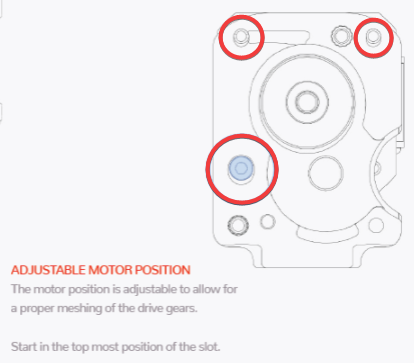

- The top two screws are easily reachable.
- The bottom left screw can be reached by opening the filament latch fully and using a ball-end hex driver.

I don't have a Mini Afterburner so I can't give an exact process for it. From what I understand, it now also has some slotted screw holes to allow for adjustment.
### Too Little Backlash:
- Repeating Patterns in Extrusion
    - Adjusting backlash can help considerably with these issues, but is not always guaranteed to fix it.
    - These issues can also be caused by poor quality BMG parts. Genuine Bondtech or Trianglelab BMG parts are best.
    - Galileo/Orbiter seem to be less likely to have these extrusion patterns in my experience.
    - Test prints: https://mihaidesigns.com/pages/inconsistent-extrusion-test
    - **Examples:**
        - The left cube shows a pattern. The right cube is normal:\
    
        - Diagonal patterns:\
    
        - "Wood Grain":\
    

### Too Much Backlash:
- Clacking noises during retraction
- Clacking noises during pressure advance moves
## Bulging

This may or may not just be a Prusa Slicer / SuperSlicer thing. I have not tested it in other slicers. 

 
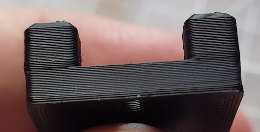 

- Disable any "extra perimeters" and "supporting dense layer" settings (PS/SS)
- [Reduce perimeter accelerations considerably.](https://github.com/AndrewEllis93/Ellis-PIF-Profile#acceleration-control)
## Bulges at STL Vertices


 
- Your square corner velocity may be too low. (Did you leave it set at 1 by chance?)
- This can also be a sign that your perimeter speeds/accels are too high.
## Bulging Patterns on Overhangs (SS)


- Some SuperSlicer profiles have "above the bridges" flow set to greater than 100%. This can cause the issues you see above. 
- There are three solutions:
    - **Set "threshold for bridge speed and fan" to 0**
        - This totally prevents SS from applying bridging settings to overhangs.
        - 
    - **Set "threshold for bridge flow" to 0**
        - This prevents SS from applying *bridging flow* settings to overhangs, but still applies bridging speeds/fan settings.
        - 
    - **Reduce "above the bridges" flow to back to 100%**
        - 
- If these do not fix it, it might instead be an [overheating issue.](#cooling-and-layer-times)

## Crimps
- Pull on each wire. Ensure that none of the pins are starting to back out of the housings.
    - If any pins are backing out, it's possible that you may have crimped incorrectly. 
        - You may not have pushed the pins all the way into the housings. Push them in with some sharp tweezers, SIM card tool, or similar until you feel them click into place.
        - Incorrectly crimping microfit pins is very common, and an easy mistake to make.
            - *Male* pins go into the *female* housings, and vice versa.
                - 
            - The crimped side of the pins should be facing *towards the latch*, as shown above.
            - The lower arms should be crimped onto the insulation, and the following arms should be crimped onto the bare wire.
            - The female pins have *three* sets of arms. *You should only crimp the lower two.*
                - **(!) DO NOT CRIMP THESE ARMS.**
                - 
            - **Example of correct crimps:**
                - 
        - Do a "pull test". Ensure that the pins do not come out. 
            - Microfits hold *very* strongly. The pins should be nearly impossible to pull out. The wire will usually tear before they ever come out.
## Extruder Skipping
These skips will typically be wider than [pockmarks.](#pockmarks)

\
\


Skipping below top layer:

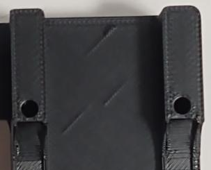

- If it occurs mainly on the first layer, ensure that you are not printing with [too much squish]((#first-layer-squish)) or with too much first layer flow.
- Ensure that your filament gear tension (usually a spring tensioner screw) is not too tight or too loose.
    - Yank on the filament and keep tightening the tensioner screw until it stops slipping. Tighten it a little extra, maybe 1-2 turns.
- **Use a reverse bowden tube*** with direct drive, and ensure that there is not too much resistance coming from the spool.
    - *Reverse bowden tubes go from the direct drive extruder back to the spool (and should be fixed at the spool side), and prevent fast toolhead movements from yanking the filament.
        - Use a 3mm inner diameter tube. 1.9mm/2mm ID tubes are more restrictive.
        - Ensure that it doesn't have any kinks.
        - Ensure that your spool is not catching on anything as it rotates. 
        - If you are pulling from a dry box, try without.
        - For Voron spool holders, make sure you have the PTFE tube piece installed to lessen friction.
- For Voron direct drive toolheads, ensure that you have the short piece of PTFE tubing installed between the clockwork and the hotend. 
    - Make sure it is not too long or too short. You should trim it down until it just fits without compressing the tube.
- Ensure that there are no issues with your hotend fan.
    - Ensure that your hotend fan is running and is not stopping/starting during printing from a wiring issue.
    - Also ensure that your hotend fan is running at 100%. 
        - Some vendor githubs have the `[heater_fan hotend_fan]`'s `max_power` setting at 0.4 (40%) for some    reason.
        - Ensure that you are running it at the correct voltage.
- Ensure that your hotend thermistor is correct in your config and that you are not using temps that are too    low.
- **(!) If you use an NTC100K B3950 thermistor, please see [this](https://discord.com/channels/460117602945990666/461133450636951552/896057891264561152).**
- Ensure that your retraction distance is not too high. 
    - The default Cura profile uses a high retraction distance, as it is configured for bowden. 
    - You should generally use a maximum of 1mm for direct drive.
- With the filament latch open, try extruding by hand. **It should be easy.** \
If there is much resistance, *figure out where it is coming from:*
    - You may need to drill out the filament path in the printed parts.
    - Your nozzle may be partially clogged. 
        - See if extruded plastic is shooting out to the side instead of straight down when extruding in mid-air.
        - Unclog it using a cold pull or nozzle cleaning needles.
        - Try a new nozzle.
    - Your heatbreak may be partially clogged. 
        - Remove the nozzle, cool the hotend, and try pushing fresh filament through it. Make sure to cut off the bulged tip. *If there is resistance:*
            - Unload the filament and remove the nozzle.
            - Get access to the top of the hotend (you may need to either remove the hotend or the clockwork).
            - Shine a light through the hotend and look into the other side. See if there is any plastic stuck against the walls of the heatbreak or heatsink. *If it is obstructed*: 
                - Unplug the hotend fan.
                - Heat the hotend up to ~180C.
                - We are purposefully inducing heat creep to soften the plastic in the heatbreak.
                - Push a long, thin (<=1.8mm) allen key or similar through the top side of the hotend to push the obstruction out of the bottom.
                - **(!) Turn off the hotend as soon as you have freed the obstruction.**
                - If you let it cook without cooling for a long time, it will eventually start to soften the printed hotend mounting.
                - **Be careful - don't burn yourself!**

- Ensure that you are using the correct `run_current` for your motor. Too high or too low can both cause skipping.
    - As a general rule, don't exceed 50-60% of the rated current of your motor as your `run_current`. *Some motors like more or less current, though*, so your best bet would be to look at the stock configs or to ask in Discord.
    - Galileo/Orbiter:
        - There is some confusion about different motor models. 
            - If you have the 20mm 1a LDO motor, try 0.65a. 
            - If you have the 17mm 1a LDO motor, try 0.35-0.4a.
- Check your extruder motor [crimps](#crimps) and wiring.
- Check the volumetric speed preview in your slicer. See if it is high for [your particular hotend](https://github.com/AndrewEllis93/Ellis-PIF-Profile#approximate-values). Or see [here](https://github.com/AndrewEllis93/Ellis-PIF-Profile#determining-max-volumetric-flow-rate) to determine your maximum.
    - If you are exceeding hotend limits, try lowering your volumetric speed limit in your slicer (PS/SS) or reducing line widths / layer heights / speed (other slicers) until you are under the limit.
- Try rotating the extruder (if possible) without filament loaded. It should be easy.
- Try using the [AB-BN mod](https://github.com/VoronDesign/VoronUsers/tree/master/printer_mods/Badnoob/AB-BN). It optimizes hotend cooling and can help with heat creep issues.
- Try lowering your extruder motor's microstepping and disabling interpolation (and stealthchop if you have it on, which you shouldn't).
- Take out the motor, and see how powerful it feels. See if you can stop it easily with your fingers. This may indicate a bad motor or bad wiring.
- ### **BMG Clockwork**
    - Try turning the plastic gear with your finger with the motor turned off and filament unloaded. It should be relatively easy. *If there is too much resistance:* 
        - Ensure that you have a small amount of [backlash in the plastic gear.](#bmg-clockwork-backlash-issues)
            - If they are pushed together too hard, it will cause resistance.
        - Ensure that your drive shaft is not rubbing against the motor:
            - A little cheat I have heard here is to test continuity between the drive shaft and the motor. Test throughout the full rotation.
            - 

## Layer Shifting


### Electrical
- #### Motor Currents
    - Check your motor currents. Ensure that the `run_current` configured for your A/B/X/Y motors are correct. See [this section.](#determining-motor-currents)
- #### Wiring
    - [Check your crimps.](#crimps)
    - Ensure that you are using high strand count wire, of 24awg (0.25 mm²) or thicker.
        - Low strand count wires / solid core wire will break in the drag chains with repeated bending. These breaks usually will not be visible, as they occur inside of the insulation.
        - You should always run your own wire through the drag chains. Don't trust the wire that came with anything.
    - Ensure that your wiring is not damaged, shorted, or caught under any screw heads. Check continuity.
- #### Thermal
    - Ensure that your stepper drivers sticks are getting adequate cooling. 
        - Ensure that they have heatsinks installed on them.
        - Ensure that they have adequate airflow*. 
            - \* *The v0 does not spec stepper driver cooling by default. This is usually fine, as it runs lower motor currents. It may be worth trying, though, if you are having issues (especially if you are running higher motor currents.)*
### Mechanical
- Try using z lift (z hop), and [check your prints for signs of overheating](#cooling-and-layer-times). Print curling can cause nozzle strikes and subsequent layer shifs.
    - Around 0.2-0.3mm of z lift is usually enough. Too much can cause stringing.
- Ensure that you have good quality motors. 
    - Some off-brand motors (notably Oukeda*) have a history of poor quality. You may have to run lower speeds/accels and sometimes higher currents with off-brand motors.

        -  \* *Some Oukeda motors have been labeled as "Oukedj". They can't even spell their own brand name correctly.*
- Identify which axis the shifting is occuring in by inspecting your prints. \
The circles represent a printed object shifting in the direction of the arrows.

    - **CoreXY:**
        - When looking at your printer from the front, the B motor is on the left, and A is on the right. \
        <sup><sup>....It goes "BBBAA" like a sheep. Sounds silly, but that's how I remember it.</sup></sup>
        - 

    - **Cartesian:**
        - 

- With the motors powered off: 
    - Move the toolhead by hand in each axis. Feel if one axis has more resistance than the other.
    - Also pull on each belt and compare the resistance.
- Once you have indentified the problem axis, go through and check that entire axis/belt path. Find the source(s) of the mechanical resistance.
- Make sure your belts are routed correctly.
    - Check for belt dust. This can indicate rubbing or misrouting.
    - A common mistake is to accidentally route the belts around the plastic post in the back of the A/B drives:
        - 
    - Ensure that the belts are not rubbing/riding up against any of the bearing flanges.
        - It's normal that they may not run perfectly centered. It's usually only an issue if they are rubbing.
- Loosen the belts, pull the belts over the side of each bearing stack, and ensure that they all spin freely by hand.
- Try rotating the motors by hand. Sometimes a bad motor will be the cause of the resistance.

### Speeds and Accelerations
Sometimes layer shifting can occur because you are simply asking too much of your steppers. You may be running accelerations or speeds that are too much for your motors to handle. 

- Try turning accelerations down, especially if you are not using input shaper.
    - Input shaper also allows for higher accelerations, not just less ringing.
- Disable stealthchop.
- Ensure that you are not running your microstepping too high.
- Check [this section](#determining-maximum-speeds-and-accelerations) to test.
    - Try running the `TEST_SPEED` macro without any arguments to test your current maximums.
- You can try increasing motor currents. Don't exceed the maximums described in [this section](#determining-motor-currents). 
    - Ensure that you have proper stepper driver cooling before doing this.
## PLA is Overheating
- Open the front door at minimum. Or take off all the side panels.
- Use [AB-BN](https://github.com/VoronDesign/VoronUsers/tree/master/printer_mods/Badnoob/AB-BN) or another cooling mod, or:
- Point a fan at it.
    - Don't go too crazy, or your bed heater might not be able to keep up.
     
- You can also try printing with the bed heater turned off.
## Pockmarks


- Ensure your Z seam is not set to "random".
- Dry your filament. This can be caused be moisture turning to steam and popping.
    - Extrude in midair. Watch and listen. Depending just how wet your filament is, you may hear popping noises and see steam.
    - **Just because your filament was new/sealed, doesn't mean it's not wet.** I've had plenty of filaments come soaking wet even though they were sealed.
- Try a new nozzle.
## Repeating Vertical Fine Artifacts (VFAs) With ~2mm Spacing
If the marks are about 2mm apart, that usually means that it's coming from **belt/pulley/idler teeth** somewhere. 

Ensure that these artifacts are **still perfectly vertical** even when printing irregularly shaped objects like the *"rectangular 2 recommended.stl"* object [here](https://mihaidesigns.com/pages/inconsistent-extrusion-test). \
If they are not perfectly vertical (i.e. wood grain, diagonal, etc), see [this section](#repeating-patterns-in-extrusion-bmg-clockwork) instead.

Print a square object at 45 degrees and see if it appears A, B, or both. This will tell you which axis/axes to look at.


- Your belts may be too tight. [Your A/B belts should be about 110Hz over a 150mm length.](https://docs.vorondesign.com/tuning/secondary_printer_tuning.html#belt-tension)
    - Don't miss the video link in page linked above. 
- Your belts may be rubbing a flange somewhere.
    - It's nearly impossible to have them all running dead-center, but you can look around for belt wear and belt dust to find where it may be rubbing too much.
    - Ensure your motor pulleys are not positioned too high or too low.
    - On V2/Trident, heat soak for 2+ hours, [square your gantry](https://discord.com/channels/460117602945990666/472450547534921729/854120317299064852) and [de-rack](https://www.youtube.com/watch?v=cOn6u9kXvy0). This helps to remove tension in your gantry, and can improve your mesh, first layer, and pulley/belt alignment.
        - These instructions are for V2, but the process should be similar for Trident.
    - On all CoreXY printers: [de-rack](https://www.youtube.com/watch?v=cOn6u9kXvy0).
- Ensure that your pulleys, idlers, and extruder gears/idlers are all clean. Debris can accumulate and compress in the teeth. 
- You may have poor quality motor pulleys and idlers.
    - I, and a few others, have had improvements from switching to authentic Gates brand pulleys and idlers. They are more expensive, but are worth it in my opinion. 
        - On v2 at least, you only need them for A/B motors and X/Y idlers. Don't waste the money on Z.
        - US source:
            - https://www.filastruder.com/products/gates-2gt-pulley?variant=15443750518855
            - https://www.filastruder.com/products/gates-2gt-idler?variant=15443755728967
    - For idlers, there is some debate over toothed vs smooth. My personal opinion is:
        - Gates toothed idlers > smooth idlers (2x F695 bearings) > china toothed idlers.
## Repeating Vertical Fine Artifacts (VFAs) With Non-2mm Spacing

Ensure that these artifacts are **still perfectly vertical** even when printing irregularly shaped objects like the *"rectangular 2 recommended.stl"* object [here](https://mihaidesigns.com/pages/inconsistent-extrusion-test). \
If they are not perfectly vertical (i.e. wood grain, diagonal, etc), see [this section](#repeating-patterns-in-extrusion-bmg-clockwork) instead.

These patterns can be subtle (lumps) or sharp like the above section's photo.

- **Ensure that your A/B pulleys and XY joint idlers are all clean.** Debris can accumulate and compress between the teeth.
- You may have a bad/poor quality pulley or toothed idler.
    - See above section for more info / links.
- You may have a bad/poor quality bearing.
    - Loosen the A/B belts, pull the belt over the side of each bearing flange, and turn each bearing by running it against your finger. Make sure the whole rotation feels smooth.
- You may have a bad/poor quality linear rail.

### Narrowing it Down
Print two wide square objects, one in normal orientation, and one at 45 degrees. \
Inspect the object to see which axes the artifacts appear most prominent in.

*(components in each section are in order of likelihood)*
- Artifacts are most prominent in in A:
    - Bearings in **A** belt path
    - **A** motor pulley
    - **A** belt *(rare)*
    - **A** motor *(rare)*
- Artifacts are most prominent in in B:
    - Bearings in **B** belt path
    - **B** motor pulley
    - **B** belt *(rare)*
    - **B** motor *(rare)*
- Artifacts are most prominent in in X:
    - **XY** joint idlers
    - **X** linear rails(s)
- Artifacts are most prominent in in Y:
    - **Y** linear rails
- Artifacts are most prominent in in A/B/X, but not Y:
    - **XY** joint idlers
    - **X** linear rail(s)
- Artifacts are most prominent in in A/B/Y, but not X:
    - **Y** linear rails
- Artifacts are equally prominent in all directions:
    - **A *and* B** motor pulleys
    - **X *and* Y** linear rails
    - **A *and* B** belts *(rare)*
    - **A *and* B** motors *(rare)*

## Slicer is Putting Heating G-codes in the Wrong Place/Order
You have two options:
- Pass variables to `PRINT_START` (allows the most control, but is more complex)
    - See the *"Passing Variables to PRINT_START"* section [here](#passing-variables-to-print_start).
- Force g-code ordering (only allows changing the g-code order, but is easy to set up)
    - See the *"Controlling G-code Order Without Passing Variables"* section [here](#controlling-g-code-order-without-passing-variables).
## Small Infill Areas Look Overextruded

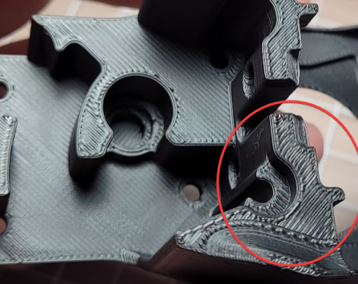 

- Some amount of this is unavoidable, but there are some things that *may* help:
    - Use single top perimeters (SuperSlicer). This simply makes these infill areas a bit larger.
    - Try reducing your pressure advance smooth time (I use 0.02)
    - Try reducing top infill speeds and accelerations.
