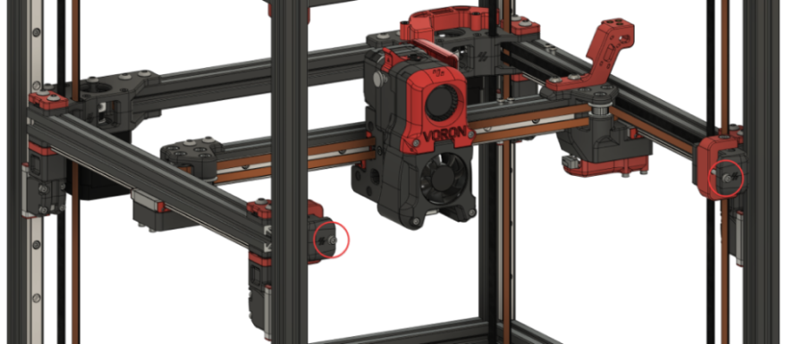
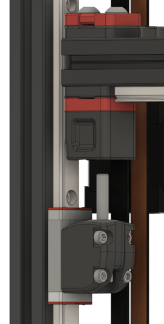
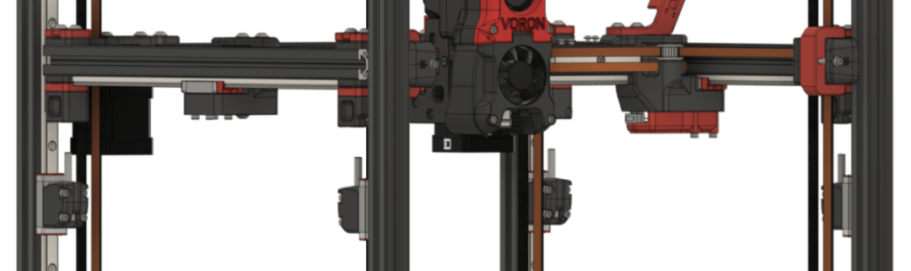
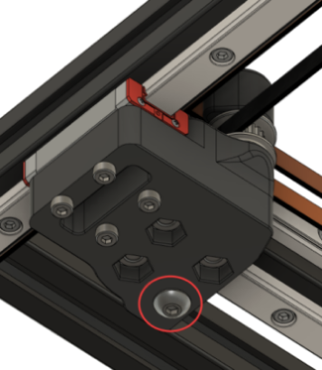
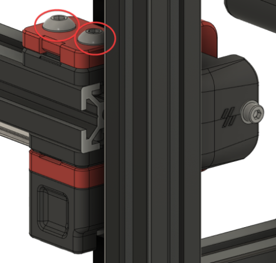
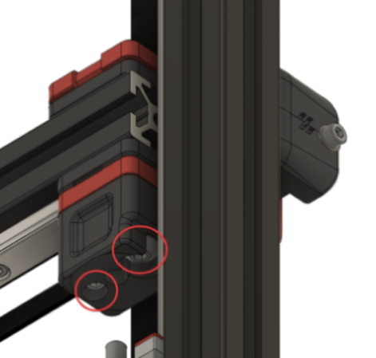
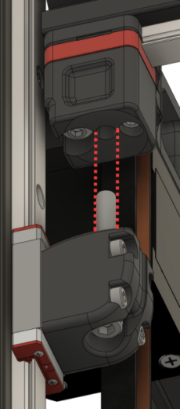
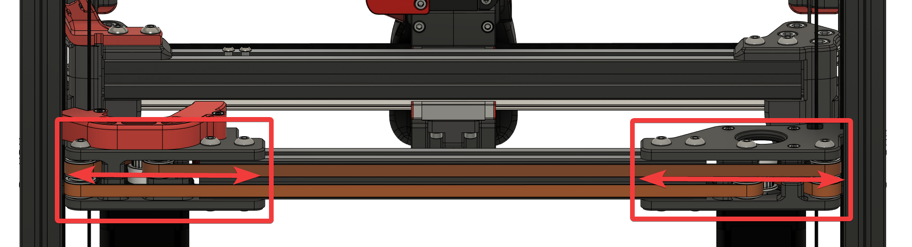
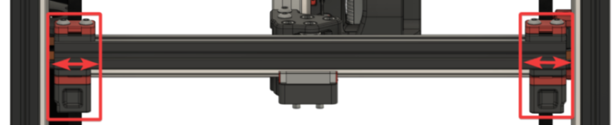
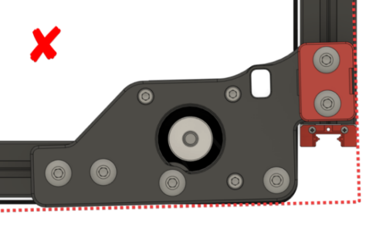

# Voron V2 Gantry Squaring

**1)** Modify your `idle_timeout` in your config to an arbirarily high number, then `reload`. 
- This just gives us time to work. We need the motors to be energized and holding for the whole process.

**2)** `G28`, then `QUAD_GANTRY_LEVEL`. 

**3)** Jog your gantry to around the center of the build volume using the LCD or web interface.
- This will give you space to work. You need easy access to both the bottom and top of your gantry.

**4)** Loosen your A/B belt tension fully.
- This prevents the A/B belt tension from pulling the gantry out of alignment while you work on it.

-  

**5)** Take off your left/right side panels.

**6)** Unscrew and drop your lower Z joints. Your gantry will now be floating on just the belts.

-  

- 

**7)** **PARTIALLY** loosen all connections to the extrusions.  
- You need all of these bolts to be loose enough to freely adjust against the printed part on the extrusions. 
- **(!!!!!!)** Where there are Z belt clamps, **ensure that you do not loosen the bolts so much that the Z belts release**. Only loosen enough to allow for adjustments.

- X/Y joints (repeat for both sides). 
    - Top:
        -  

    - Bottom:
        -  

- A/B joints (repeat for both sides):
    - Top (don't overdo it on the belt clamps!):
        -  

    - Bottom (don't overdo it on the belt clamps!):
        -  

- Front idlers (repeat for both sides):
    - Top (don't overdo it!):

        -  
    - Bottom (don't overdo it!)
    :
        -  

**8)** Adjust your gantry so that the Z joints line up perfectly. 
- Your Z joints should feel perfectly flush along the side.

    -  

- When raising and lowering your lower Z joint, the bolt should slide perfectly into the hole without hitting the sides and without "pulling" your gantry into place:

    -  

- This will usually involve moving gantry corner components further closer together or further apart along the extrusion:
    -  

    -  

- Ensure that you do not inadvertently rotate your A/B joints during this process.
    -  
    -  