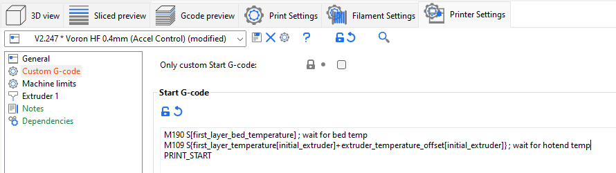

 
# This guide has moved! Please visit [the new site](https://ellis3dp.com/Print-Tuning-Guide/).

# Controlling Temperature G-Code Order
---
:dizzy: This page is compatible with **all printers.**

---

This method is a quick and easy way to move the temperature g-codes before or after your start g-code. See [:pushpin: Example](#example) for what that means.

The method shown in the [:page_facing_up: "Passing Slicer Variables to PRINT_START"](./passing_slicer_variables.md) instructions allows more control than this method, but is more complex.

## Example

Your slicer is putting heating g-codes AFTER `PRINT_START` / your start g-code.\
Your start routines run cold, and then pause at the end for everything to heat.\
You instead want your printer to heat BEFORE running your start routines.

*(or the inverse, or you want to split it)*

 The below method allows you to do this.

## Method

To force the g-code ordering, place any of the following g-codes from the following lists in your start gcode where you desire:
### Prusa Slicer / SuperSlicer
- `M140 S[first_layer_bed_temperature] ; set bed temp`
- `M190 S[first_layer_bed_temperature] ; wait for bed`
- `M104 S{first_layer_temperature[initial_extruder]+extruder_temperature_offset[initial_extruder]} ; set hotend temp`
- `M109 S{first_layer_temperature[initial_extruder]+extruder_temperature_offset[initial_extruder]} ; wait for hotend `
### Cura
- `M140 S{material_bed_temperature_layer_0} ; set bed temp`
- `M190 S{material_bed_temperature_layer_0} ; wait for bed`
- `M104 S{material_print_temperature_layer_0} ; set hotend temp`
- `M109 S{material_print_temperature_layer_0} ; wait for hotend `

### Warnings
- **These are just lists** of available commands, they don't have to be in this order, nor do you have to use all of them. Place them as you like.
- Each bullet point is only **ONE** line. Do not split them into multiple lines.
- There are many other variables available in each slicer, and you can pass whatever variables you like to whatever g-codes you like. The available variables are not always documented.
### Example
Forces both bed and hotend to heat up fully before executing `PRINT_START` (SS):
-  

