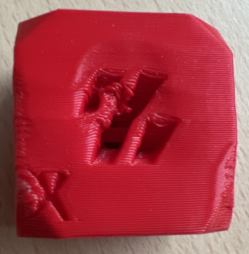
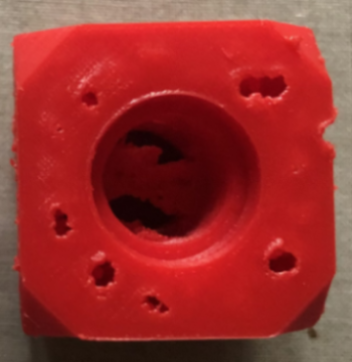
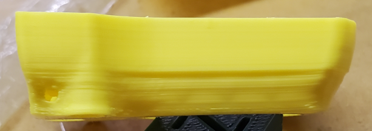
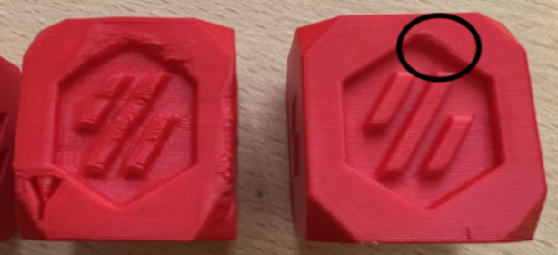
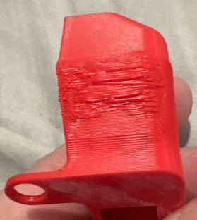
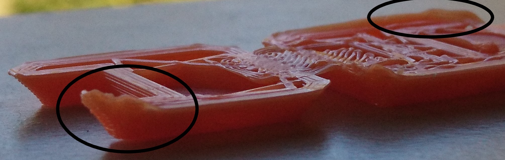
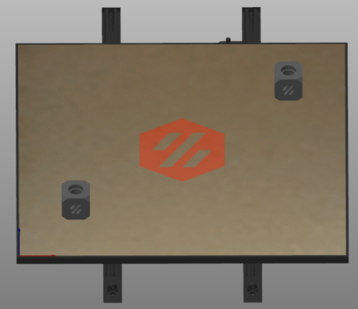

 
# This guide has moved! Please visit [the new site](https://ellis3dp.com/Print-Tuning-Guide/).

# Cooling and Layer Times
---
:dizzy: This page is compatible with **all printers.**

---
## Signs of Overheating
  
 
 
 
 
## How to Fix It
### Increase Fan Speeds
People often start printing by ABS with no cooling. While this is valid advice for unenclosed printers, it's not a universal rule. **ABS often needs some cooling, especially in an enclosure.**
- You probably need higher fan speeds than you think. 

- The higher your chamber temperature is, the higher fan speeds you will need.
    - For example I run AB-BN (5015 fan mod) and have a 63C chamber.
        - For large plates, I use 40-50% fan.
        - For small plates, I may use up to 80% fan.
        - For single small objects, I may use up to 100% fan.

- If your prints are curling away from the bed even at low fan speeds, it may actually be a [:page_facing_up: build surface adhesion](./build_surface_adhesion.md) issue.

- For optimal quality with filaments that shrink, I recommend using constant fan speeds when possible. **Varying fan speeds during a print will cause inconsistent layers and banding.** Otherwise some layers cool and shrink faster than others.

- For very large objects, however, you may want to be more conservative with cooling. Large objects are much more prone to warping.

    - This is the only time I might use differing fan speeds. Lower fan speeds for the majority of the print, with higher fan speeds for overhangs.

### Increase Layer Times
- This can be forced in the slicer using "minimum layer time" / "layer time goal" / "slow down if layer print time is below". This will slow down your print speed to ensure each layer takes at least X amount of time.

    - These settings are located under filament > cooling settings in PS/SS. 

        - You can use **ctrl+f** to find settings by name.

    - I set this to a minimum of 15 seconds for ABS. For unenclosed filaments (PLA/PETG), you can generally use lower.

- This essentially slows down the print for very short/small layers, allowing each layer adequate time to cool.

- When layer times are **too short**, they do not have enough time to properly cool. You will then be printing on top of layers that are still soft.

### Give Objects Some Break Time Between Layers
- You can achieve this by printing more objects at once, and spreading them out.
    -  

    - This allows each object some "break time" between layers. Otherwise you are pumping more and more heat into the object before the previous layer has had a chance to fully solidify.

    - You can also lower travel speeds or even print sacrificial objects to buy more time.

