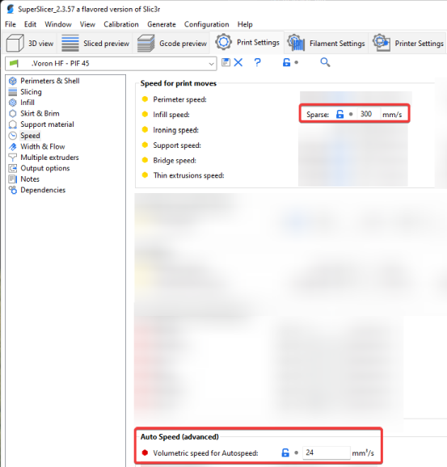
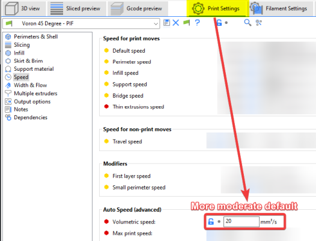
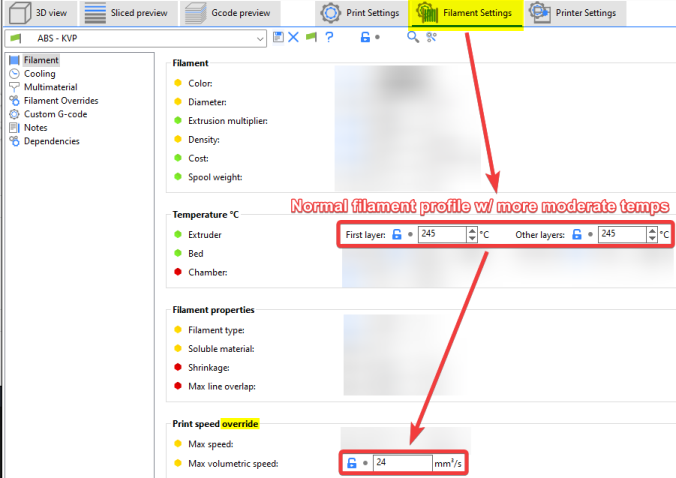
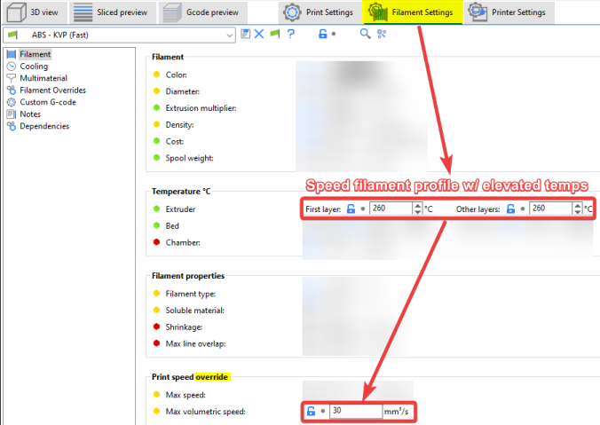
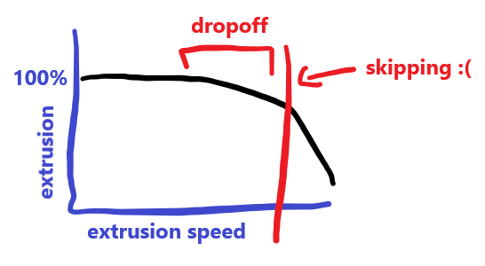

 
# This page has moved! Please visit [the new location](https://ellis3dp.com/Print-Tuning-Guide/articles/determining_max_volumetric_flow_rate.html).

# Determining Maximum Volumetric Flow Rate
{: .no_toc }

---

{: .compat}
:dizzy: This page is compatible with all printers.

---
<details open markdown="block">
  <summary>
    Table of contents
  </summary>
  {: .text-delta }
- TOC
{:toc}
</details>

---

Volumetric flow rate indicates how much plastic that your hotend/extruder can extrude per second.\
Volumetric flow is expressed in mm<sup>3</sup>/s (cubic millimeters per second).
## Why?
You can use this volumetric flow rate **to determine how fast your hotend/extruder is able to print.**
- See the [:pushpin: "how flow rate relates to speed"](#how-volumetric-flow-rate-relates-to-print-speed) section to determine what maximum speeds you can print at with a given flow rate.
    - See the [:pushpin: "approximate values"](#approximate-values) section for approximate values for certain hotends.

- Some slicers (including Prusa Slicer/SuperSlicer) let you configure this limit to ensure that you never outrun your hotend.
    - This means that you can change layer heights, nozzle sizes, line widths, and speeds without worrying about outrunning your hotend. 
    - You can also set any print speeds to a high "absolute maximum" speed (like infill) and let it be limited by the volumetric flow limit. This essentially prints at the maximum speed your hotend will allow:
        - This is utilized by my published SuperSlicer profile (see its [:page_facing_up: "Volumetric Speed Limiting"](https://github.com/AndrewEllis93/Ellis-SuperSlicer-Profiles#volumetric-speed-limiting) section for more information.)
        - [](./images/determining_max_volumetric_flow_rate/volumetric-ss.png){:target="_blank"}
        - :warning: **In Prusa Slicer, this must be set in the filament settings instead.** The setting in the "auto speed" section only applies in specific circumstances in PS.
        
## Approximate Values

These approximate values **assume a standard 0.4mm brass nozzle.** 

| Hotend | Flow Rate (mm3/s) |
| --- | :---: |
| E3D V6 | 11 |
| E3D Revo | 11 |
| Dragon SF | 15 |
| Dragon HF | 24 |
| Dragonfly BMO | 13 |
| Rapido HF | 24 |
| Rapido UHF | 30 |
| Mosquito | 20 |
| Mosquito Magnum | 30 |

You will *usually* be okay using an approximate value from above and just lowering it if you have any issues. But - keep in mind that **there is also no guarantee that you will reach them.** There are many factors and variables that can cause your actual performance to vary.

Nozzle properties may affect these numbers. For example:
- Larger diameter nozzles will have higher flow rates
- Hardened steel has a lower thermal conductivity and you may get lower flow rates unless you compensate with higher temperatures. 
- Plated copper and tungsten carbide have higher thermal conductivity and might allow a bit higher flow rate. 
- Bondtech CHT nozzles use a different internal geometry that allows higher flow rates.

To test your own flow rate, see [:pushpin: here](#method).

## How Volumetric Flow Rate Relates to Print Speed

Working out how quickly you can print at a given volumetric flow rate is quite simple:
- **speed = volumetric flow / layer height / line width**\
*(Or, inversely)* 
- **volumetric flow = speed * line width * layer height**
- For example, if your hotend is capable of 24mm<sup>3</sup>/sec, and you are printing with 0.4mm line width & 0.2mm layer height:
    - 24 / 0.4 / 0.2 = Maximum print speed of 300mm/sec

## Formulas

**mm<sup>3</sup> = mm * 2.4***\
*(Or, inversely)* \
**mm = mm<sup>3</sup> / 2.4**

For example, if you extrude at **5mm/sec**, that comes out to **~12mm<sup>3</sup>/sec.** (5mm * 2.4)

\* <sup>*For 2.85mm filament, use 6.37 instead of 2.4.*</sup>\
\* <sup>*These fomulas are simplified versions of the cylinder volume equation (V=πr<sup>2</sup>h) given r and h or V, rounded to 3 significant figures. This is more than enough accuracy for our purposes (down to the thousandths). [:page_facing_up: Calculator](https://www.calculatorsoup.com/calculators/geometry-solids/cylinder.php)*</sup>

## Method

---

:bulb: This is a "quick and dirty" method that will get you a rough idea of your max flow rate. It's quick, easy, and "good enough" in most cases. There are more precise methods, like [:page_facing_up: CNC Kitchen's](https://youtu.be/lBi0-NotcP0) using [:page_facing_up: this site](https://hotend-flow-tester.netlify.app), however his requires a milligram scale.

If you use the CNC Kitchen method, you may need to temporarily increase your  `max_extrude_cross_section` in your `[extruder]` section.

---

You will follow a similar process to extruder calibration. 

1. Open your printer.cfg and find the `[extruder]` section. Set `max_extrude_only_distance` to 101 or higher and `RESTART`.\
*(+1 just helps avoid rounding error issues)*

2. Heat your hotend. 
    - :bulb: Temperature has a large impact on max flow rates.

        - If you are going for absolute maximum flow rates, you may want to bump your temperatures. Some people print ABS at 250-270C for this reason. This is a tradeoff, however, as it can also cause oozing, overheating, or material degradation at slower speeds. I personally run higher temperatures for fast functional prints, and lower my temperatures (and volumetric limit) for more decorative prints.

3. Extrude a little bit to ensure your E motor is energized and holding.

4. Mark a 100mm length of filament.
    - Use a bit of tape. Stick it at the 100mm mark on a ruler and transfer it to the filament. Using tape makes it quick & easy to mark between tests.
    - Since this is a rough test, you can also measure at the reverse bowden inlet/spool. Just pull the slack out of the filament when marking and when measuring.

5. Extrude at increasing speeds. 
    - At each interval, measure to ensure that ~100mm entered the extruder.
    - The gcode uses mm/min, **not** mm/sec, so multiply your desired speed by 60.
    - For example, the gcode to extrude at 5mm/sec is:
    ```
    M83 ; Relative extrusion mode
    G1 E100 F300 ; Extrude 100mm at 300mm/min (5mm/sec)
    ```

6. Keep increasing speeds and extruding until it starts dropping below 100mm\*. This is your max flow rate. 

    - \* See the [:pushpin: "Flow Dropoff"](#flow-dropoff) section and determine your personal dropoff tolerance. I personally try to stay under 2-3% dropoff.

7. Convert the maximum extrusion speed you found to volumetric speed using the [:pushpin: formulas](#formulas).
    - Example: You reached your personal [:pushpin: flow dropoff](#flow-dropoff) tolerance of 2% at **F600** extrusion speed. 
        - 600mm/min / 60 = 10mm/sec. 
        - 10mm/sec * 2.4 = **Flow rate of 24mm<sup>3</sup>/sec**.

8. Try extruding a longer distance (say 200-300mm). Ensure that your printer can sustain this flow rate.

9. Choose a **slightly lower value than your results**.
    - Real-world flow rates will be a bit less than your synthetic results. 
        - Real prints have more resistance to overcome - they have to press against the previous layer, whereas we only tested an ideal scenario with zero resistance.

10. Set your new value in your slicer.
    - :warning: **In Prusa Slicer, this *must* be managed in the filament settings.** The setting in the "auto speed" section only applies in specific circumstances in PS.

    - In SuperSlicer, you should set the volumetric limit in your print profile to a lower "default" value. 

        - ABS typically achieves high flow rates. Other materials may cap out at a lower flow rate.

        - [](./images/determining_max_volumetric_flow_rate/volumetric-default.png){:target="_blank"}

        - Then, in the filament profiles, put the higher per-filament value.
        
            - Example ABS profile:\
            [](./images/determining_max_volumetric_flow_rate/volumetric-faster.png){:target="_blank"}

            - Example speed ABS profile with elevated temperatures:\
            [](./images/determining_max_volumetric_flow_rate/volumetric-fastest.png){:target="_blank"}

    - Cura [:page_facing_up: has not yet added this feature](https://github.com/Ultimaker/Cura/issues/5248). You will have to manually determine your max print speeds for each line width / layer height using the formulas above. You may need different profiles for different materials/temps (or just use a moderate default).
    
        - If you use variable layer heights, you have to limit the entire print to the volumetric speed of your largest layer height.

## Flow Dropoff
Stephan from CNC Kitchen did some flow rate testing. He has a great article and video [:page_facing_up: here](https://www.cnckitchen.com/blog/flow-rate-benchmarking-of-a-hotend).

I don't want to steal his work, so here's an artist's rendition:

[](./images/determining_max_volumetric_flow_rate/flow-dropoff.png){:target="_blank"} 

*(you should really just visit the link)*


The main takeaway from this is that there is that **the closer you get to the limits of your hotend (extruder skipping), the more and more you will underextrude**.

Many people will actually set a higher volumetric flow rate limit, a bit past the point where this dropoff starts.

- For example, it doesn't really matter if you underextrude a few percent in infill. You can push infill speeds and just let them be capped by your volumetric flow limit (assuming your infill line widths are thick enough to compensate).

- It's up to you where your comfort zone is. Using the test above: 
    - **Stopping at 100mm:** guarantees that you will never underextrude due to speeds. 

    - **Stopping before skipping starts:** you can use this number and push speeds for things like infill, BUT you will need to be more vigilant about what speeds you are printing other features (such as perimeters) to prevent underextrusion and line gaps.

    - The numbers in the [:pushpin: "approximate values"](#approximate-values) section are **somewhere in the middle** of the two extremes.

