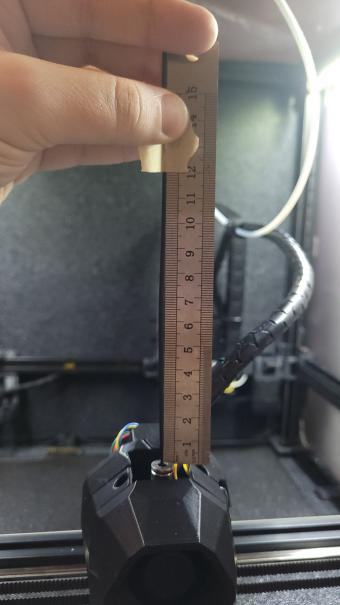

 
# This page has moved! Please visit [the new location](https://ellis3dp.com/Print-Tuning-Guide/articles/extruder_calibration.html).


# Extruder Calibration
{: .no_toc }
---

{: .compat}
:dizzy: This page is compatible with Klipper, Marlin, and RepRapFirmware.

---

Extruder calibration simply ensures that 100mm requested = 100mm extruded. 

- This is separate from [:page_facing_up: Extrusion Multiplier](./extrusion_multiplier.md), which is a per-filament setting.

This simply guarantees that your extrusion multiplier will be the same across any (calibrated) printer, and will be comparable to others.

---

## Hot or Cold?

You may choose to do the test cold (bypassing the hotend). This can ensure things like partial clogs don't throw off your results.

- With bowden, there's no reason to do it hot. Disconnect the tube and do it cold.

- With direct drive, however, **this means taking the nozzle, hotend, or extruder off.**
    - I find this to be a hassle, so I usually calibrate hot.

    - Just run the test a couple times to verify that you get exactly the same every time. I've never had an issue doing this.

---

## Steps

1. Klipper / RepRapFirmware:

    ---
     Klipper
    - Open your printer.cfg and find the `[extruder]` section. 
        - Set `max_extrude_only_distance` to 101 or higher.
            - *(+1 just helps avoid rounding error issues)*
        - Set `min_extrude_temp` to 0 if doing the test **cold**.
        
    - Run `RESTART`.

    ---

     RepRapFirmware
    - If calibrating **cold**, run `M302 P1` (allows cold extrusion)
    
    ---

2. If calibrating hot, heat your hotend to printing temp.
    - If calibrating cold:

        - Bowden: Disconnect the bowden tube from your extruder.
        - Direct drive: Remove your nozzle, hotend, or extruder.

3. Extrude a small amount to ensure that your extruder motor is on and holding.

    - You can usually do this in your printer's web interface, if equipped.
    - G-codes:
        - `M83 ; E relative`
        - `G1 E1 F60 ; Extrude 1mm at 1mm/s (60mm/min)`

4. Take a ruler and place a piece of tape at the 120mm mark.

    - You can use a marker too - I just find tape easier and a bit more precise.
    - 
    - *Don't worry if your ruler has extra length at the ends. We're only taking a relative measurement.*

        - 

5. Where your filament enters your extruder, pull your filament as straight as you can against the ruler. Transfer the tape to mark 120mm.

    -  

6. Extrude 100mm :warning: **at 1mm/s**. :warning:

    If doing this **hot**, watch to make sure the plastic isn't shooting out to the side (partial clog) or showing signs of skipping.
    - You can usually do this in your printer's web interface, if equipped.
    - G-codes:
        - `M83 ; E relative`
        - `G1 E100 F60 ; Extrude 100mm at 1mm/s (60mm/min)`
    - **Only use the LCD to extrude if it allows you to choose a speed.**

    - 

7. Measure how much is left. Subtract it from 120 and note the value for later.

    - **Example**
        - I had 21mm left. 
        - 120mm - 21mm = **99mm actual extrusion**.

    - 

8. Calculate your new `rotation_distance` / e-steps and activate it:

    ---
     Klipper
    - Find the `[extruder]` section in your printer.cfg. Note your current `rotation_distance`.
    - Calculate your new `rotation_distance` using this formula:
        - \<new_rotation_distance\> = \<previous_rotation_distance\> * ( \<actual_extrude_distance\> / 100 )
    - Temporarily set your new value with `SET_EXTRUDER_ROTATION_DISTANCE`.
        - Example: `SET_EXTRUDER_ROTATION_DISTANCE EXTRUDER=extruder DISTANCE=34.99312407591`

    ---
     Marlin
    - Run `M503`. In the output, find the `M92` line and note your current E value.
        - 
    - Calculate your new e-steps using this formula:
        - \<new_e-steps\> = \<current_e-steps\> * ( 100 / \<actual_extrude_distance\> )
    - Temporarily set your new e-steps with `M92`.
        - Example: `M92 E421`.

    ---
     RepRapFirmware
    - Run `M92`. In the output, note the E value. (It will look similar to the screenshot for Marlin above)
    - Calculate your new e-steps using this formula:
        - \<new_e-steps\> = \<current_e-steps\> * ( 100 / \<actual_extrude_distance\> )
    - Temporarily set your new e-steps with `M92`.
        - Example: `M92 E421`.

    ---

9. With your new value activated, mark and extrude again. It often takes a few iterations to dial in.
    - When using the formulas above, make sure you're using your updated `rotation_distance` / e-steps value for the "current" value. Don't keep using the original value. 

    - :warning: If you get different lengths in back-to-back tests, you have an **extruder issue** \
    (or, if printing hot, it could also be a hotend/nozzle obstruction.).
    
10. Once you settle on a value, save it permanently:

    ---
     Klipper
    - Find the `[extruder]` section in your printer.cfg.
    - Update your `rotation_distance` and `RESTART`.

    ---
     Marlin
    - Set your new e-steps with `M92`.
        - Example: `M92 E421`.
    - Run `M500` to save it to EEPROM.

    ---
     RepRapFirmware
    - Edit the `M92` line in your config.g with the new value and reboot.
    
    ---

11.  Klipper only:
    - If you did the test cold, set your `min_extrude_temp` in your `[extruder]` section back to its previous value and `RESTART`.
