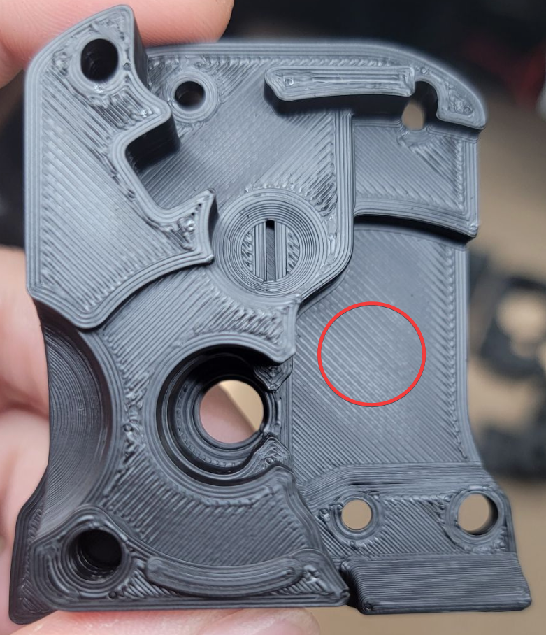
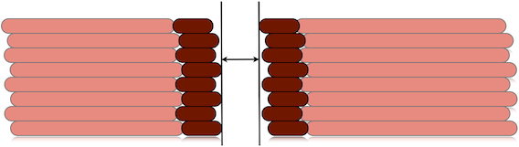

# Extrusion Multiplier

---

:dizzy: This page is compatible with **all printers.**

**:warning: You should [:page_facing_up: calibrate your extruder](https://docs.vorondesign.com/build/startup/#extruder-calibration-e-steps) first.**

- Calibrating your extruder simply ensures that 100mm requested = 100mm extruded. 
- Extrusion *multiplier* is a per-filament setting, depending on their material properties & tolerances.

**:warning: You should [:page_facing_up: tune pressure advance](./pressure_advance.html) first.**

---

## Background

Getting the perfect extrusion multiplier (EM) is *crucial* for good looking prints. There are some [:pushpin: tuned print examples](#tuned-print-examples) below.

EM tuning must be done, at a minimum, per filament brand/type. It may vary by color or by roll, depending how consistent your filament brand of choice is.

Some Slicers seem to need slightly higher or lower EM than others.

This method uses an aesthetics-first approach. For conerns about dimensional accuracy, see the [:pushpin: Rationale & Dimensional Accuracy](#rationale--dimensional-accuracy) section.

I have found that most ABS falls within the 91-95% range, though I have some outliers.

## Method
The best method I have found is purely visual/tactile.

We will print some 30x30x3mm cubes. *(see the [:page_facing_up: test_prints folder](https://github.com/AndrewEllis93/Print-Tuning-Guide/tree/main/test_prints))*

### Print Settings
- **Infill:** 30%+ 

- **Top Layer [:page_facing_up: Line Width](./a_note_about_line_width.html):** 100%
   - **SS/PS:** ctrl+f, search: `top_infill_extrusion_width`
   - **Cura:** "Top/Bottom Line Width" - set to equal your nozzle size.
    - I anecdotally find 100% to create a nice finish and show off EM differences the best.

- **Bottom Layers:** 2
    - **SS/PS:** Also set "minimum shell thickness" to 0 **or it will override this.**
        - (Directly below, AKA `bottom_solid_min_thickness`) 
    - This just makes space for more top layers (next step).

- **Top Layers:** As many as you can fit and still have at least two layers of infill. *(About 10-11 with 0.2mm layer height)*
    - This small bit of infill helps to decouple the first layer squish. Otherwise, an over-squished first layer can propagate all the way to the top - making it appear overextruded.
    - The effects of high/low EM compound with more solid layers.
    - If using thick layers, you may want to scale the cubes up in Z.

- **Top Infill Pattern:** "Monotonic (filled)" in **PS/SS** or "Lines" in **Cura**
    - Ensure that ironing is disabled.

- **Solid Infill Speed:** Your profile's normal value
    - **Cura:** "Top/Bottom Speed"
    - It's best to tune for your actual speeds, as [:page_facing_up: flow can drop off the faster you print](./determining_max_volumetric_flow_rate.md#flow-dropoff). ("Flow Dropoff" section)

- **Top Solid Infill Speed:** Low/Moderate. 60mm/s is what I use.
    - **Cura:** "Top Surface Skin Speed"
    - Keeping this low/moderate helps with surface finish.
    - Set your print profile to the same speed you tune for here (or vice versa).

- **Minimum Layer Time:** 0
    - **SS:** "Layer Time Goal" (in filament cooling settings - AKA `slowdown_below_layer_time`)
    - **PS:** "Slow Down Print if Layer Print Time Is Below" (in filament cooling settings - AKA `slowdown_below_layer_time`)
    - **Cura:** "Minimum Layer Time"

- **Fan Speed:** Moderate to High
    - This depends on your particular setup / chamber temperatures. Maybe around 50% with a 5015 fan setup, or 80% with a 4020 fan.

### Steps

**1)** Slice the test cubes with variations of **1-2% EM.** 
- **Prusa Slicer:**
    - There is no way to set the EM per object. You will have to print the test objects one at a time. 

- **SuperSlicer:**
    1) **:warning: Set your EM to 1 in the filament settings.** \
    The per-object EM settings are **multiplied by** this value.\
    

    2) Import the cube STL. Right-click it and select add settings > filament.\
    

    3) Check "extrusion multiplier".\
    
    
    6) Set your EM for each test cube.\
    

    7) Save the project for reuse later.\
    
    
- **Cura:**

    1) Select each cube and enable the "flow" setting.\
    

    3) Set the EM on each.\
    

    4) Save the project for reuse later.\
    

**2)** Print it!

**3)** Inspect each cube. 
- Near the correct EM, the top should feel noticeably smoother. Too much EM will look and feel rougher, and too little EM will have gaps or valleys between the extrusion lines.
- See [:pushpin: examples](#examples) below.

**4)** If desired, run the process again but with 0.5% intervals.
- **If you can't decide, pick the higher EM.**

## Examples
This is difficult to show in photos - you may have to zoom in. It's easier once you can manipulate and inspect them in different lighting/angles.

Focus on **:exclamation:the center:exclamation:** of the test prints. It's normal for them to look more overextruded near the edges and corners.

You will get better at this through experience.
### 2% Intervals

Here you'll narrow down a general range to work in.

 

The center cube is looking pretty close.

### 0.5% Intervals
Now you can fine-tune in 0.5% intervals.

 

In this example, I chose the second cube, as this particular filament started to look nice and shiny with no gapping. Your particular filament may not shine like this.

For clarity, you are **not** tuning so the lines are "just touching".\
Your infill lines should overlap a bit, and **fill the print in as much as possible without going over**.

Source: https://help.prusa3d.com/article/layers-and-perimeters_1748

Some find magnification to help, but I don't personally find it necessary. 

### Too Low

Holding it up with the infill lines pointing towards a light source can help. This cube's EM is too low - you can see between the lines.

 
### Slightly Too Low

These cubes need a little more EM - you can see slight gapping / valleys / shadows between the lines. 

A bit too high is better than a bit too low.

## Further Tips
### **When assessing extrusion multiplier, *always* look at the widest areas in a given print.** 

It's fairly normal for [:page_facing_up: smaller infill areas to look a bit overextruded](./troubleshooting/small_infill_areas_overextruded.html) *(though there are a few things that can help a bit in that link- that's another topic)*

In this example, I would look at the circled area. While some of the smaller areas look overextruded, the overall EM is actually pretty good.
-  

## More Examples
(ABS)
-  
-  

(eSun ABS+ - more matte)
-  
-  

---

## Rationale & Dimensional Accuracy

My above method is an **aesthetics-first approach**. This method creates very smooth top surfaces and can also help with layer consistency. The resulting prints generally have perfectly acceptable tolerances for most projects (Voron parts included) with no further compensation.

Get your prints looking great first, THEN account for dimensions if needed. (in my opinion)

### Voron Parts
- Voron parts are designed with ABS shrinkage in mind. **You do not need any compensation apart from a good EM tune.**

### **If You Need True-to-CAD Dimensional Accuracy for Other Projects**
- Firstly, *adjust your expectations*. 
    - Remember, our 3D printers are hobby-grade, glorified hot glue guns, not CNC. You will not reliably get 0.01mm tolerances everywhere.
- After tuning EM:
    - Try your slicer's **shrinkage compensation** settings.
        - This is pretty much glorified X/Y part scaling. 
            - Shrinkage occurs much less in the Z axis.
            - 100%-101% X/Y scaling is about the range you would expect with ABS.
        - Print any suitable test object and measure it. Ensure that you are measuring flat edges - not corner bulging or seams. Determine how much shrinkage compensation you need.
    - **Don't mess with your `steps_per_mm`/`rotation_distance`**. Deviations are almost always from material shrinkage, bulging, layer inconsistencies, etc, NOT issues with your axes. Tinkering with these values will usually only add another variable.

### **Methods I'm Not a Fan Of**
- #### **Measuring Wall Thickness With Calipers**
    - Some guides mention printing a single or two-walled object and measuring the thickness with calipers.
        - I simply never have good results with this approach, and different people seem to get (sometimes wildly) different results.
        - The measured widths can vary depending where you measure it and how much pressure you use.
        - Any layer wobble or inconsistent extrusion (which all printers have in varying degrees) causes these walls to measure thicker.
            - \
            Source: https://manual.slic3r.org/troubleshooting/dimension-errors
        - This method requires half-decent calipers, which many people just don't have. This limits the accessibility.

- #### **SuperSlicer Calibration**
    - SuperSlicer has a built-in flow calibration tool, however I do not like this either, for a few reasons:
        - It uses 100% infill, so the first layer squish carries through all the way to the top. This causes your first layer squish to impact your results.
        - It has ironing turned on by default.
        - The objects are small. It's normal for [:page_facing_up: small infill areas to look a bit more overextruded than larger infill areas.](./troubleshooting/small_infill_areas_overextruded.html)

