 
# This guide has moved! Please visit [the new site](https://ellis3dp.com/Print-Tuning-Guide/).

# First Layer Squish
{: .no_toc }

I'm going to call it "squish" to be unambiguous. "Z offset" and "z height" can be conflated with other concepts. 

---

{: .compat}
:dizzy: This page is generally compatible with **all printers.** Commands and setting locations are detailed for Klipper and Marlin.

{: .prereqs}
>- You should do a rough [:page_facing_up: Z offset calibration](https://docs.vorondesign.com/build/startup/#initial--simple-process) first.
>
>- You should also [:page_facing_up: calibrate your extruder](./extruder_calibration.md) first.
>   -  [:page_facing_up: Marlin instructions](https://www.3dmakerengineering.com/blogs/3d-printing/estep-calibration)
>
>- This section also assumes that you have *consistent* first layer squish, both across the entire build surface and between prints. 

:bulb: See the [:page_facing_up: Thermal Drift](./troubleshooting/first_layer_squish_consistency_issues/thermal_drift.md) article, **even if you are not having any issues.** Thermal drift is in important thing to know about with larger enclosed printers.

---

  

    Table of contents
  

  {: .text-delta }
- TOC
{:toc}

---

## Method
1. Set your first layer height to **0.25** or greater (in my opinion).

    - Thicker first layer heights are less sensitive and easier to maintain, especially on larger printers where first layer consistency can be a challenge.

    - Aside from that, this is personal preference.

2. Scatter square patches around your bed in your slicer. 
    - See the [:page_facing_up: test_prints folder](https://github.com/AndrewEllis93/Print-Tuning-Guide/tree/main/test_prints). 
        - Choose a patch that matches your first layer height.\
        *(`First_Layer_Patch-0.25mm.stl` if you chose to follow step 1)*

    - 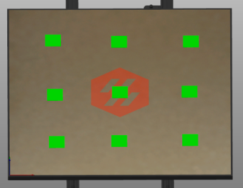  
        - Tip: in PS/PSS, you can right-click the "arrange" button and set the distance to a large value.*
        - \
        \* *To exceed 100mm, either click the edit button on the right side, or ctrl+click the bar.*

3. Set your first layer [:page_facing_up: line width](./a_note_about_line_width.md) to **120%** or greater.

4. Start the print. While it is printing, live adjust z (also known as "baby stepping").
    - This can be done via g-codes/macros, LCD, or via your printer's web interface (Fluidd / Mainsail).\
    I find it easiest to sit in front of the printer and fine-tune with the LCD.
    -  **Klipper**
        - **LCD**
            - Under the "Tune" menu (may only appear while printing), look for "Offset Z".
        - **Mainsail**
            - 
        - **Fluidd**
            - 
        - **G-code**
            - `SET_GCODE_OFFSET A_ZDJUST=0.01 MOVE=1`
            - `SET_GCODE_OFFSET A_ZDJUST=-0.01 MOVE=1`
    -  **Marlin**
        - This may have to be [:page_facing_up: enabled in firmware](https://github.com/MarlinFirmware/Marlin/blob/bugfix-2.1.x/Marlin/Configuration_adv.h#L2057). Most printers come with it enabled already.
        - **LCD**
            - Under the "Tune" menu (may only appear while printing), look for "Babystep Z".
        - **G-code**
            - `M290 Z0.01`
            - `M290 Z-0.01`

    **Examples**

    In these examples, the third square is closest.\
    There are real-life print examples in the next section.

    Note: When I refer to "gaps", I mean where you can see between/through the extrusion lines.

    If you can see any light (excluding pinholes at the perimeter), or the next layer on real prints, then you need more squish.
    - #### Smooth Build Surface
        - **Top Surface**
            - You don't want too many ridges/hairs on top. 
                - It's normal to have a *little* bit of this near the corners, or in small print areas.
            - You shouldn't see any gaps* between the lines.
                - It's fine to have some very small pinholes where the infill meets the     perimeters.
            - **NOTE:** Upon review, somewhere between square 3 and 4 is closer to ideal.
            - 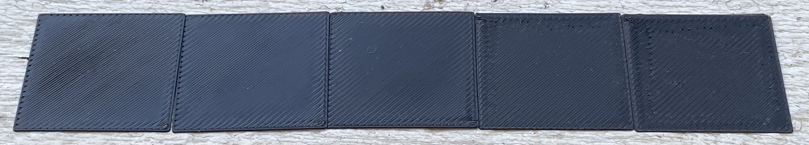
            - 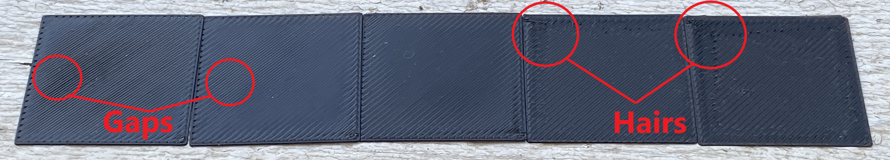

        - **Bottom Surface**
            - You should not have any gaps between the lines.
            - You should still be able to clearly see the lines at the center. They should not be fading or invisible.
                - It's normal for the lines to fade a bit near the edges/corners.
            - **NOTE:** Upon review, somewhere between square 3 and 4 is closer to ideal.
            - 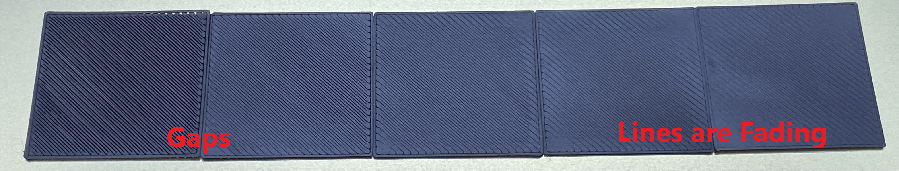
    - #### Textured Build Surface
        - **Top Surface**
            - Follow the same guidance as for smooth build surfaces (above). You can see hairs/lumps with too much squish, and gaps with not enough squish.
            - 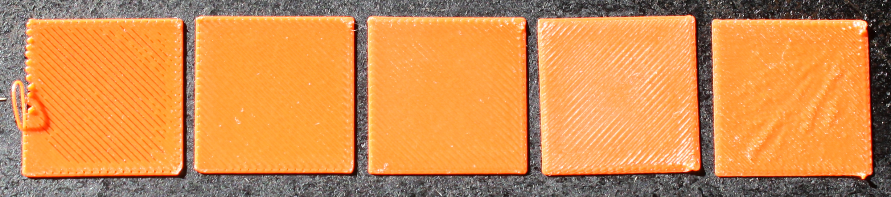
        - **Bottom Surface**
            - **The lines will not be as visible as on a smooth build surface.**
                - *Note: this doesn't mean they should be **invisible**.*
            - As with smooth build surfaces, you should not have any gaps between the lines.
            - With textured, it's a bit easier to tell squish using the top surface rather than the bottom surface.
            - 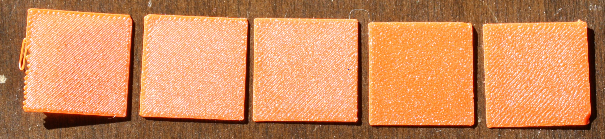

5. Once you are happy with your squish, cancel the print and then save your new offset with one of the below methods:
    -  **Klipper**
        - **Dedicated Z Endstop:**\
        (With dedicated Z endstops. Stock V0/V2/Trident are set up this way)
            - Enter `Z_OFFSET_APPLY_ENDSTOP`* 
                - This will apply your new offset to your stepper_z's `position_endstop`.
            - Enter `SAVE_CONFIG`.
        - **Virtual Z Endstop:**\
        (When using the probe *as* the Z endstop. Stock Switchwire and Legacy are set up this way)
            - Enter `Z_OFFSET_APPLY_PROBE`*
                - This will apply your new offset to your probe's `z_offset`.
            - Enter `SAVE_CONFIG`.
        - **Klicky Auto Z Calibration:**\
        (This is a mod, it uses Klicky AND nozzle endstop to automatically baby step before each print. See [:page_facing_up: here](https://github.com/protoloft/klipper_z_calibration) for more information.)
            - Manually adjust your `switch_offset` based on how much extra you had to baby step. 
                - Higher value = more squish 
                - Lower value = less squish
            - If your value is straying too far from your switch's theoretical `switch_offset` (usually 0.5), there may be another issue at play. Values of 0.4-0.6 are fairly normal (for the standard Omron switches).
    -  **Marlin**
        - Select "Store settings" on the LCD or use `M500`.

## Print Examples 
You should still clearly be able to see the lines. If it's completely smooth, your squish is too much.
If you see gaps between the lines, you need more squish.

### Good Squish
- 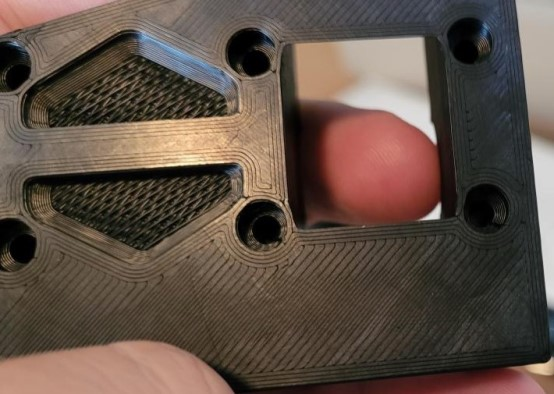 

### Too Much Squish

- Can't see any lines, or the lines are starting to fade (smooth PEI):

    - 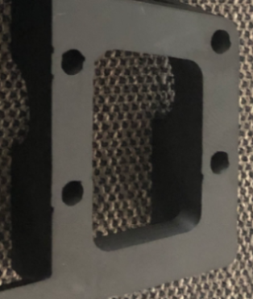 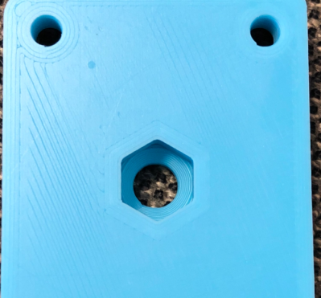 

- Wavy patterns appear:

    - 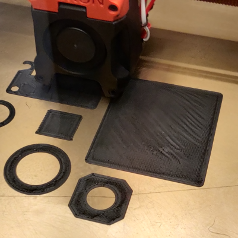 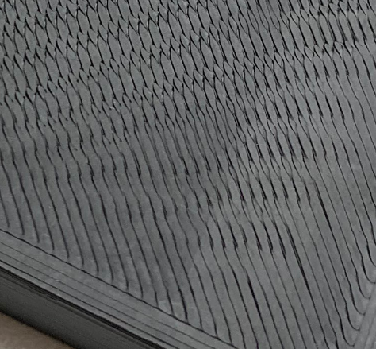 

### Not Enough Squish
- There are gaps between the lines (you can see through to the next layer):

    - 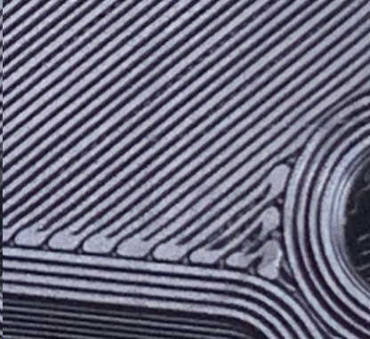 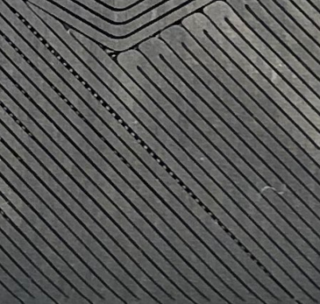 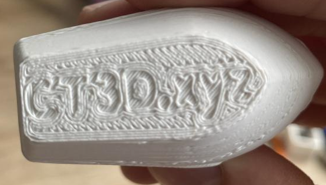 

## Further Fine-Tuning

- If you have a gappy *second* layer (or first few layers), it may indicate that you need a little more squish.

    - There are other possible causes for this issue (like not heat soaking for long enough, or flow dropoff)

- This cube needs just a tiny bit more squish.\
You can see very slight gapping / shadows between the perimeters and some areas of the infill. The corners are also starting to pull away a bit.

- 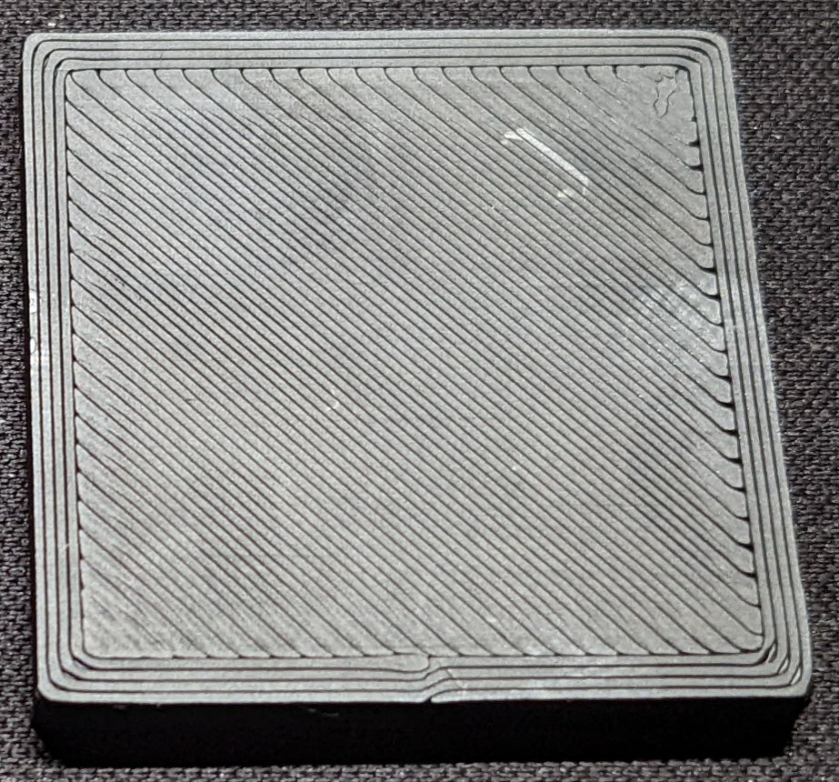

- **Better!**
    - 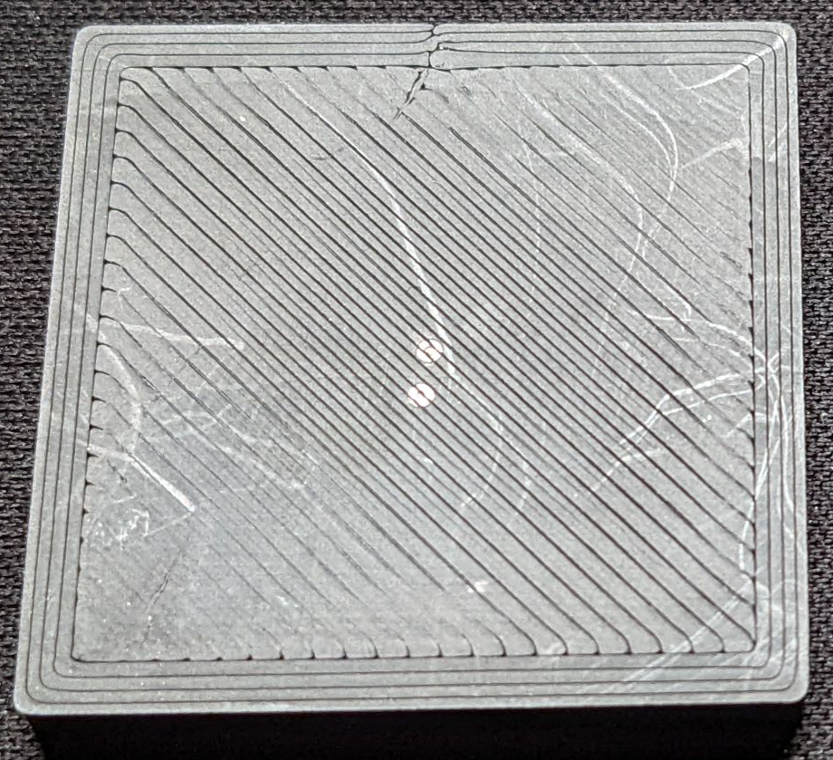

