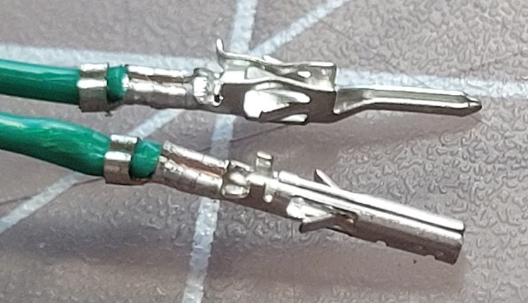
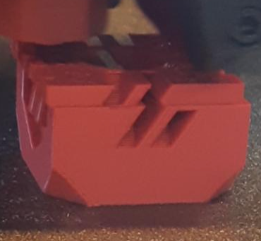

 
# This page has moved! Please visit [the new location](https://ellis3dp.com/Print-Tuning-Guide/articles/index_troubleshooting.html).

# **Troubleshooting**
*Even without issues, you should look through these to familiarize yourself with things to look out for.\
**Especially** thermal drift under "First Layer / Squish Consistency Issues"*

---

## [Build Surface Adhesion](./troubleshooting/build_surface_adhesion.md)

---

## [Bulging](./troubleshooting/bulging.md)
- Bulging Layers
    - {:target="_blank"} 
    - {:target="_blank"} 

- Bulges at STL Vertices
    - {:target="_blank"} 
    - {:target="_blank"} 

- Bulging around features
    - {:target="_blank"} 

- Bulging Patterns on Overhangs (SS)
    - {:target="_blank"}

---

## [Crimps](./troubleshooting/crimps.md)
- {:target="_blank"}

---

## [Extruder Skipping](./troubleshooting/extruder_skipping.md) 
- {:target="_blank"}
{:target="_blank"}
{:target="_blank"}

---

## [Extrusion Patterns / "Wood Grain"](./troubleshooting/extrusion_patterns.md)
- Extruder Backlash
- Other Factors
- Clockwork 1
- Mini Afterburner
- {:target="_blank"}

---

## [First Layer Inconsistencies](./troubleshooting/index_first_layer_squish_consistency_issues.md)
- :warning:Thermal Drift
- First Layer Conistency
- Squish Consistency (Between Prints)
{:target="_blank"}

---

## [Layer Shifting](./troubleshooting/layer_shifting.md) 
- Mechanical
- Electrical
- Speeds and Accelerations
- {:target="_blank"}

---

## [PLA is Overheating](./troubleshooting/pla_overheating.md)

---

## [Perimeter Separation](./troubleshooting/perimeter_separation.md)
- {:target="_blank"}

---

## [Pockmarks](./troubleshooting/pockmarks.md)
- {:target="_blank"}

---

## [Slicer is Putting Heating G-codes in the Wrong Place/Order](./troubleshooting/slicer_putting_heating_g-codes_wrong_order.md) 

---

## [Small Infill Areas Look Overextruded](./troubleshooting/small_infill_areas_overextruded.md)
- {:target="_blank"} 

---

## [VFAs (Vertical Fine Artifacts)](./troubleshooting/vfas.md)
- VFAs With ~2mm Spacing
- VFAs With Non-2mm Spacing
- {:target="_blank"}

---