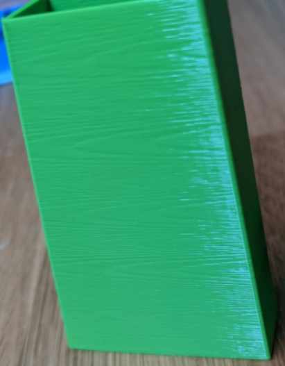
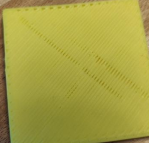
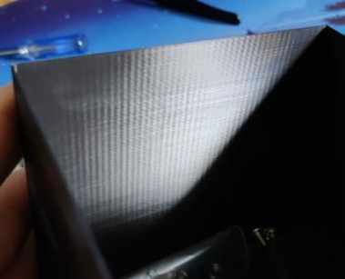

# **Troubleshooting**
*Even without issues, you should look through these to familiarize yourself with things to look out for.\
**Especially** thermal drift under "First Layer / Squish Consistency Issues"*
## [Extrusion Patterns / "Wood Grain"](http://localhost:4000/Print-Tuning-Guide/articles/troubleshooting/extrusion_patterns.html)(:first_quarter_moon:)
- Extruder Backlash
- Other Factors
- Clockwork 1
- Mini Afterburner

---
## [Bulging](http://localhost:4000/Print-Tuning-Guide/articles/troubleshooting/bulging.html) (:full_moon:)
- Bulging Layers
    -  

- Bulges at STL Vertices
    -  

- Bulging around features (SS)
    -  

- Bulging Patterns on Overhangs (SS)
    - 
---
## [Crimps](http://localhost:4000/Print-Tuning-Guide/articles/troubleshooting/crimps.html) (:full_moon:)

---
## [Extruder Skipping](http://localhost:4000/Print-Tuning-Guide/articles/troubleshooting/extruder_skipping.html) (:first_quarter_moon:)

---
## [First Layer / Squish Consistency Issues](http://localhost:4000/Print-Tuning-Guide/articles/troubleshooting/first_layer_squish_consistency.html) (:new_moon:)
- :warning:Thermal Drift
- First Layer Conistency
- Squish Consistency (Between Prints)

---
## [Layer Shifting](http://localhost:4000/Print-Tuning-Guide/articles/troubleshooting/layer_shifting.html) (:first_quarter_moon:)
- Mechanical
- Electrical
- Speeds and Accelerations

---
## [Perimeter Separation](http://localhost:4000/Print-Tuning-Guide/articles/troubleshooting/perimeter_separation.html) (:full_moon:)

---
## [PLA is Overheating](http://localhost:4000/Print-Tuning-Guide/articles/troubleshooting/pla_overheating.html) (:full_moon:)
---
## [Pockmarks](http://localhost:4000/Print-Tuning-Guide/articles/troubleshooting/pockmarks.html) (:full_moon:)

---
### [VFAs (Vertical Fine Artifacts)](http://localhost:4000/Print-Tuning-Guide/articles/troubleshooting/vfas.html) (:new_moon:)
- Repeating VFAs With ~2mm Spacing
- Repeating VFAs With Non-2mm Spacing

---
## [Slicer is Putting Heating G-codes in the Wrong Place/Order](http://localhost:4000/Print-Tuning-Guide/articles/troubleshooting/slicer_putting_heating_g-codes_wrong_order.html) (:first_quarter_moon:)
---
## [Small Infill Areas Look Overextruded](http://localhost:4000/Print-Tuning-Guide/articles/troubleshooting/small_infill_areas_overextruded.html) (:waxing_gibbous_moon:)
 