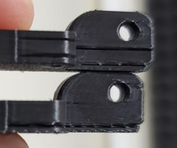
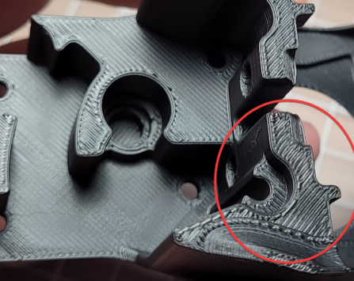

 
# This guide has moved! Please visit [the new site](https://andrewellis93.github.io/Print-Tuning-Guide/).

# **Troubleshooting**
*Even without issues, you should look through these to familiarize yourself with things to look out for.\
**Especially** thermal drift under "First Layer / Squish Consistency Issues"*
## [Extrusion Patterns / "Wood Grain"](./troubleshooting/extrusion_patterns.html)
- Extruder Backlash
- Other Factors
- Clockwork 1
- Mini Afterburner

---
## [Bulging](./troubleshooting/bulging.html)
- Bulging Layers
    -  

- Bulges at STL Vertices
    -  

- Bulging around features (SS)
    -  

- Bulging Patterns on Overhangs (SS)
    - 
---
## [Crimps](./troubleshooting/crimps.html)

---
## [Extruder Skipping](./troubleshooting/extruder_skipping.html) 

---
## [First Layer / Squish Consistency Issues](./troubleshooting/first_layer_squish_consistency.html)
- :warning:Thermal Drift
- First Layer Conistency
- Squish Consistency (Between Prints)

---
## [Layer Shifting](./troubleshooting/layer_shifting.html) 
- Mechanical
- Electrical
- Speeds and Accelerations

---
## [Perimeter Separation](./troubleshooting/perimeter_separation.html)

---
## [PLA is Overheating](./troubleshooting/pla_overheating.html)
---
## [Pockmarks](./troubleshooting/pockmarks.html)

---
### [VFAs (Vertical Fine Artifacts)](./troubleshooting/vfas.html)
- Repeating VFAs With ~2mm Spacing
- Repeating VFAs With Non-2mm Spacing

---
## [Slicer is Putting Heating G-codes in the Wrong Place/Order](./troubleshooting/slicer_putting_heating_g-codes_wrong_order.html) 
---
## [Small Infill Areas Look Overextruded](./troubleshooting/small_infill_areas_overextruded.html)
 