# Misconceptions & Bad Advice
{: .no_toc }

---

  

    Table of contents
  

  {: .text-delta }
- TOC
{:toc}

---

This is just a list of things that I often see floating around that are, in my opinion, misconceptions or bad advice.

## Tuning Extrusion Multiplier By Measuring 1-2 Cube Walls

When measuring two walls, you may run into the [:pushpin: issue described below](#two-04mm-perimeters--08mm). Two walls does **NOT equal line width * 2** in some slicers!

In both cases, you are also measuring **layer wobble and inconsistent extrusion**, which all printers and filaments have in some degree. You will always be measuring the bit that sticks out most.

 

Please excuse the upcoming vomit I used to bodge this table's widths/spacing

 

|  &nbsp;&nbsp;&nbsp;&nbsp;&nbsp;&nbsp;&nbsp;&nbsp;&nbsp;&nbsp;&nbsp;&nbsp;&nbsp;&nbsp;&nbsp;&nbsp;&nbsp;**Layer Wobble** &nbsp;&nbsp;&nbsp;&nbsp;&nbsp;&nbsp;&nbsp;&nbsp;&nbsp;&nbsp;&nbsp;&nbsp;&nbsp;&nbsp;&nbsp;&nbsp;   |  **Inconsistent Extrusion /** &nbsp;&nbsp;&nbsp;&nbsp;**Filament Diameter Fluctuations**&nbsp;&nbsp;&nbsp;&nbsp;   |
| :-----------: | :-----------: |
|  [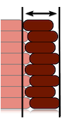](./images/misconceptions/layer_wobble_marked.png){:target="_blank"}   | [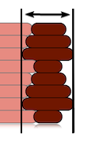](./images/misconceptions/extrusion_inconsistency_marked.png){:target="_blank"} |

- Your measurement will basically **always** be a bit too large because of this!

- Additionally, when making small measurements like this, **small errors become big errors**:

    - For example, the difference between 0.42mm and 0.4mm, an only 0.**0**2mm difference, is about **5%**.

        - **That's a huge adjustment!** It's very easy to measure 0.02mm off - due to consumer-grade calipers, where you measure, how much layer wobble you have, how much pressure you use, the diameter fluctuations of your filament, what you ate for breakfast, etc...

            - You should always make dimensional adjustments based on **larger objects**, where minor errors are proportionally much smaller.*

              - *I actually don't like adjusting extrusion multiplier based on measurements at all.\
             I don't think it makes sense to have a gappy or rough print just to compensate for dimensions.\
             See [:page_facing_up: here](./extrusion_multiplier.md) for how I do it - tune for a perfect top surface, and then adjust slicer settings like shrinkage compensation and horizontal expansion, as needed, to tweak dimensions.*

**This method is, much to my chagrin, extremely prevalent:**
- [https://teachingtechyt.github.io/calibration.html#flow](https://teachingtechyt.github.io/calibration.html#flow)
- [https://help.prusa3d.com/article/extrusion-multiplier-calibration_2257](https://help.prusa3d.com/article/extrusion-multiplier-calibration_2257)\
Even Prusa recommends it!
- [https://3dprintbeginner.com/flow-rate-calibration/](https://3dprintbeginner.com/flow-rate-calibration/)

Send help. I'm going insane.

## "Two 0.4mm Perimeters = 0.8mm"

---

{: .attention }
> **This applies to Slic3r and its derivatives (Prusa Slicer & SuperSlicer).**
> - Cura uses different flow math that assumes a simple rectangular cross-section.
>   - I am still looking into Cura's behavior, and I have not yet looked into other slicers.

---

The title is just an example, this applies to any line width or perimeter count.

- I'm using 0.4mm for simplicity, even though I generally recommend printing line widths larger than nozzle diameter.

Two 0.4mm perimeters **does not equal 0.8mm.**

The "spacing" (center-to-center distance - 0.357 in the below example) is not equal to the line width. It's determined using this formula:
- spacing = extrusion_width - layer_height * (1 - PI/4)\
[Source](https://manual.slic3r.org/advanced/flow-math)

At 0.2mm layer height, two perimeters actually equals **0.757mm!**
- [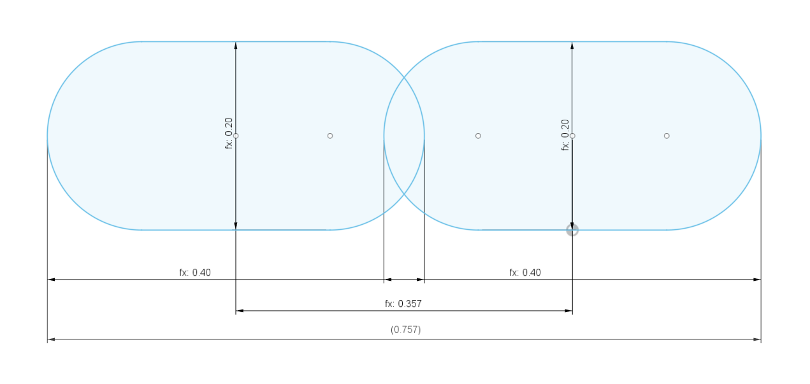](./images/misconceptions/spacing.png){:target="_blank"}

    - And then three perimeters would equal **1.114mm!**

        - [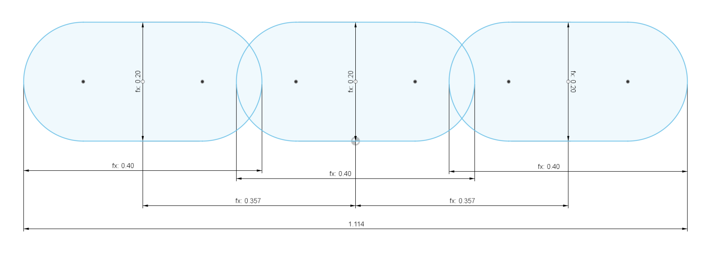](./images/misconceptions/spacing_3x.png){:target="_blank"}

### If You Want Clean Multiples (SuperSlicer Only)
If you want two walls to equal a clean multiple like you may expect, SuperSlicer allows you to specify **spacings** rather than line widths.

You would put a **spacing** *(or "width & spacing combo" for external perimeters)* of 0.4mm / 100% rather than a **line width** of 0.4mm / 100%:
- [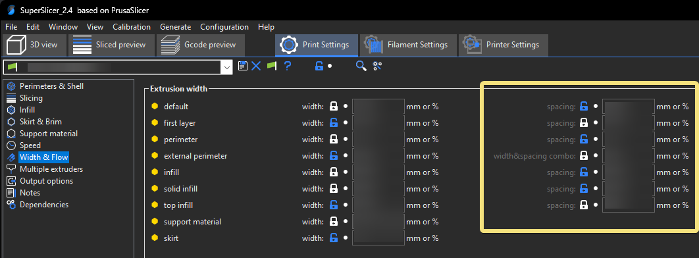](./images/misconceptions/ss_spacing.png){:target="_blank"}

- Then two lines would equal 0.8mm, three lines would equal 1.2mm, and so on.

## "You Shouldn't Tune Extrusion Multiplier, The Slicer Knows Best"
..."e-steps / extruder calibration is all you need to do"

---

{: .attention }
> **This section uses flow math from Slic3r and its derivatives (Prusa Slicer & SuperSlicer) as an example.**\
> Different slicers may use different models. The overall argument is the same, however - each have their unique quirks, and none of them can perfectly predict reality.

---

This section was created by heavily referencing [:page_facing_up: Slic3r Flow Math documentation](https://manual.slic3r.org/advanced/flow-math). Prusa Slicer is a fork of Slic3r, and SuperSlicer is a fork of Prusa Slicer. They both use this math as their basis. Other major slicers also use the same math.

In a perfect world, the slicer would be perfect, and know exactly how much plastic to extrude. But - nothing can ever be simple, can it?

### The Assumptions

Slic3r-based slicers make some assumptions.\
The first major assumption they make is that extrusion comes out in this exact shape:
- [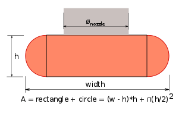](./images/misconceptions/slic3r_cross-section.png){:target="_blank"}\
[Source](https://manual.slic3r.org/advanced/flow-math)

- The cross-sectional area of this shape is calculated using the formula shown.\
To calculate the volume of plastic needed for a given extrusion line, this cross-sectional area is then multiplied by the length.

Based on the first assumption, a second assumption is then made.

- If the extrusion lines did not overlap, you would get voids (highlighted).

  - [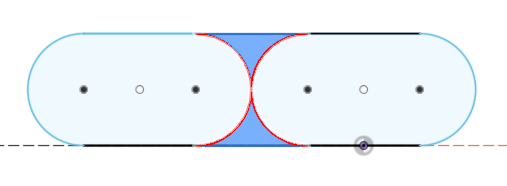](./images/misconceptions/voids.png){:target="_blank"}

  - To fill this space, the lines are instead set to overlap a bit. The colliding plastic is forced out, with the intent of filling these voids.\
  The assumption made is that we need to overlap the paths so that the overlapping area equals the void area (of these *theoretical* cross-sections):
    - [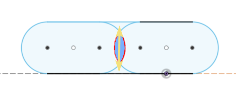](./images/misconceptions/overlap_voids.png){:target="_blank"}

This all provides a convenient and "good enough" model - but it of course ignores countless variables and unknowns (internal stresses, viscosity, extrusion speed, temperatures, the size and location of the unavoidable air gaps,  etc.)

### A Bit of Guesswork
This is an excerpt from the Slic3r documentation. 
- [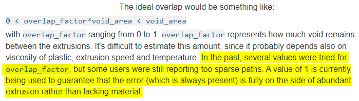](./images/misconceptions/slic3r_spacing_text.png){:target="_blank"}\
[Source](https://manual.slic3r.org/advanced/flow-math)
  - As you can see, there was basically a bit of guesswork done, and it was chosen to lean on the side of **overextrusion**.

### Demonstration

These examples will use a 0.4mm nozzle, and 0.2mm layer height.

This shape is actually *impossible* at layer widths below `nozzle size + layer height`.

- At the very common line width of 0.4mm (100%), that assumption would look like this:

  - [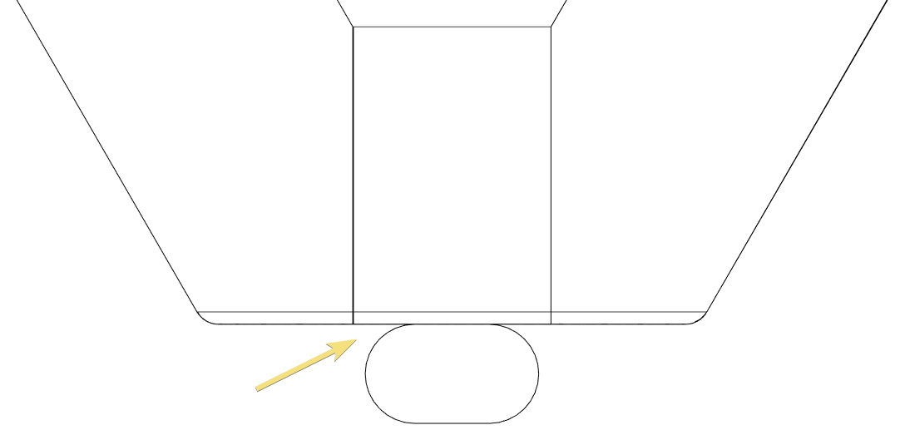](./images/misconceptions/0.4mm_0.2mm.png){:target="_blank"}

  - See the problem?\
  At most common line widths, **this assumption would mean that the extrusion does not even cover the nozzle orifice.** It's **physically impossible** for the filament to "jump" out of the nozzle and create that gap!

- The only way to cover that orifice would be to increase your extrusion width to `nozzle size + layer height` - in this example, that would be 0.6mm (150%). 

  - [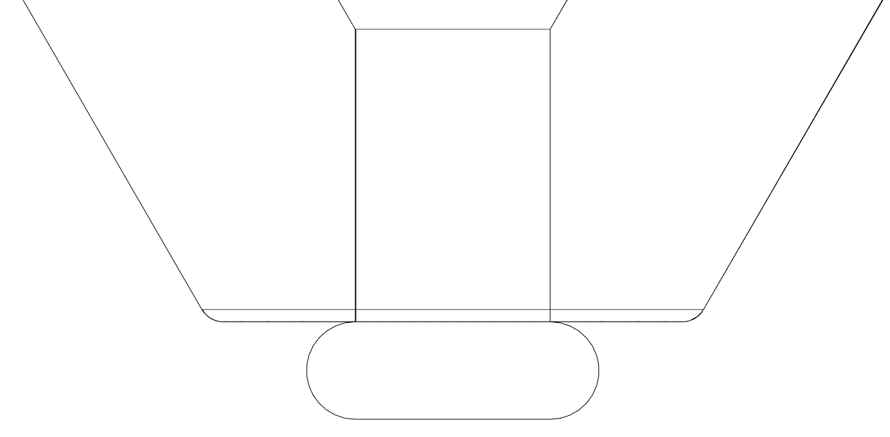](./images/misconceptions/0.6mm_0.2mm.png){:target="_blank"}
  - Most people don't use line widths this thick, and certainly not for *all* features.

- To contribute some of my own speculation, I would think that a "0.4mm" (100%) line would look something a bit more like this:
  - [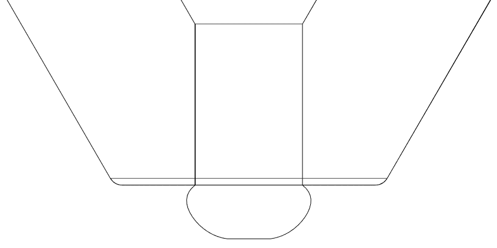](./images/misconceptions/cross_section_speculation.png){:target="_blank"}
  - Just to reinforce: this is **only speculation**. I tried to show some die swell, and to consider that the nozzle orifice must be covered.
  - If this were true, that would likely mean more material at the top than at the bottom, and would create larger air gaps at the bottom.

To sum up - we really can't predict **exactly** what the cross section will look like. We also can't say exactly where there will be inevitable air gaps, and how large they will be.

Because of all of this, we can't predict **exactly** how much plastic to extrude. Even if we did know the exact cross section through observation, it could entirely change as soon as you change any one variable. 

Slicers just use a convenient and "close enough" model to predict it. 

That can only mean one thing - **we have to tweak the extrusion multiplier a bit** based on real-world results, the properties of our specific material, our own temperatures and speeds, and all of the other unknown variables - not just implicitly trust that the slicer's flow model is perfect.

Sorry Angus (Maker's Muse), I love your videos but I have to [:page_facing_up: disagree with you here](https://youtu.be/YPAXeBuq9qU?t=869)!

## "Never Use Cooling for ABS"
While this is valid advice for unenclosed printers, it's not a universal rule.

ABS often needs some cooling. In warmer enclosures, it can need *significant* cooling.\
That's actually one of the advantages of a good enclosure - that you *can* use cooling!

See [:page_facing_up: Cooling and Layer Times](./cooling_and_layer_times.md).

## Using Paper to Set Z Offset

It's fine to get a very rough starting point - but paper is otherwise not to be used for absolute measurements, only relative ones.

*(More info to come...)*

 

## Calibrating Belted Axis Steps

- https://youtu.be/YPAXeBuq9qU?t=166
- https://teachingtechyt.github.io/calibration.html#xyzsteps
- https://all3dp.com/2/how-to-calibrate-a-3d-printer-simply-explained/
- https://www.3dbeginners.com/how-to-calibrate-a-3d-printer/

 