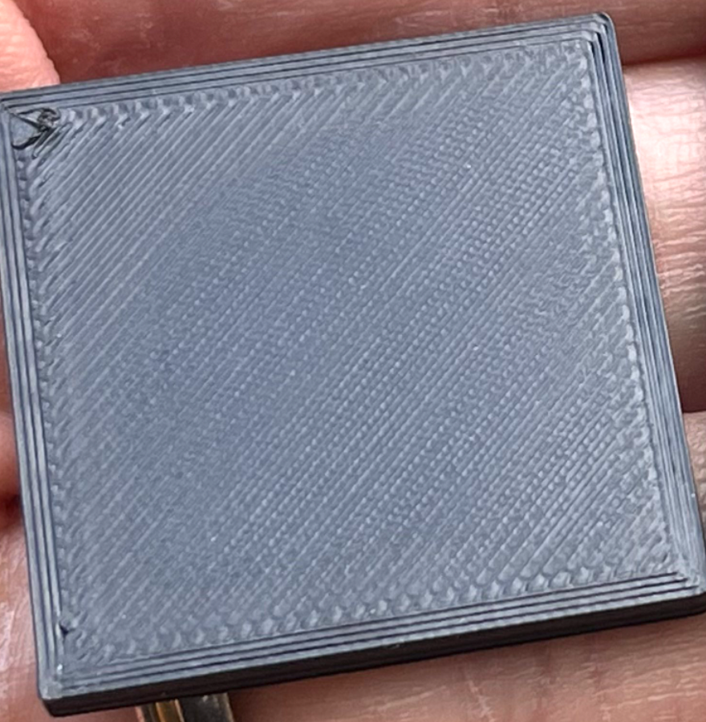

 
# This guide has moved! Please visit [the new site](https://andrewellis93.github.io/Print-Tuning-Guide/).

# PA / EM Oddities
---
:dizzy: This page is compatible with Klipper *and* Marlin.

---
## Slight Perimeter Gapping
Some find that after tuning PA and EM, minor perimeter gapping is still present:

Assuming EM is well tuned, this is often caused by a slight [:page_facing_up: flow dropoff](./determining_max_volumetric_flow_rate.md#flow-dropoff) at higher print speeds — since most people print their perimeters faster than their top layer.

There are a few different things you can try:\
*(in order of my preference)*
1. Ensure that you are not [:page_facing_up: outrunning your hotend](./determining_max_volumetric_flow_rate.md) and that you do not have a partial nozzle clog.
2. Take measures to improve your hotend's max flow rates.
    - **Higher flow ceilings allow for better extrusion consistency at lower flow rates**, as the [:page_facing_up: flow dropoff](./determining_max_volumetric_flow_rate.md#flow-dropoff) curve starts later. It is beneficial for extrusion consistency at different speeds, **even when you don't intend to use the full flow rate.**
    - Try increasing hotend temperatures a bit.
        - Temperature can have a significant effect on max flow rates. 
        - Note: temp changes can have a minor effect on PA values.
    - Use a hotend and/or nozzle with a higher flow ceiling.
        - [:page_facing_up: Bondtech CHT](https://www.bondtech.se/product-category/nozzles/bondtech-nozzles/bondtech-cht/) and [:page_facing_up: Bozzle](https://www.fabreeko.com/products/bozzle-0-5mm-full-tungsten-carbide-nozzle-by-rentable-socks) both provide a sizeable flow rate increase to any hotend that supports V6 nozzles. CHT also has a Volcano variant.
    - These steps can reduce the effect, but may not 100% fix it.
5. Increase your EM until the gaps disappear. Then, lower your top layer flow (`fill_top_flow_ratio` in SS) until your top surfaces look perfect again.
6. Follow my [:page_facing_up: "determining maximum volumetric flow rate"](./determining_max_volumetric_flow_rate.html) instructions, and choose the "conservative" (always-100mm) value to enter into your slicer (PS/SS).
7. Slow your perimeters down. The faster you print, the greater this flow dropoff becomes.
