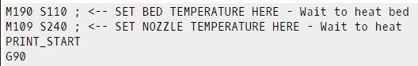
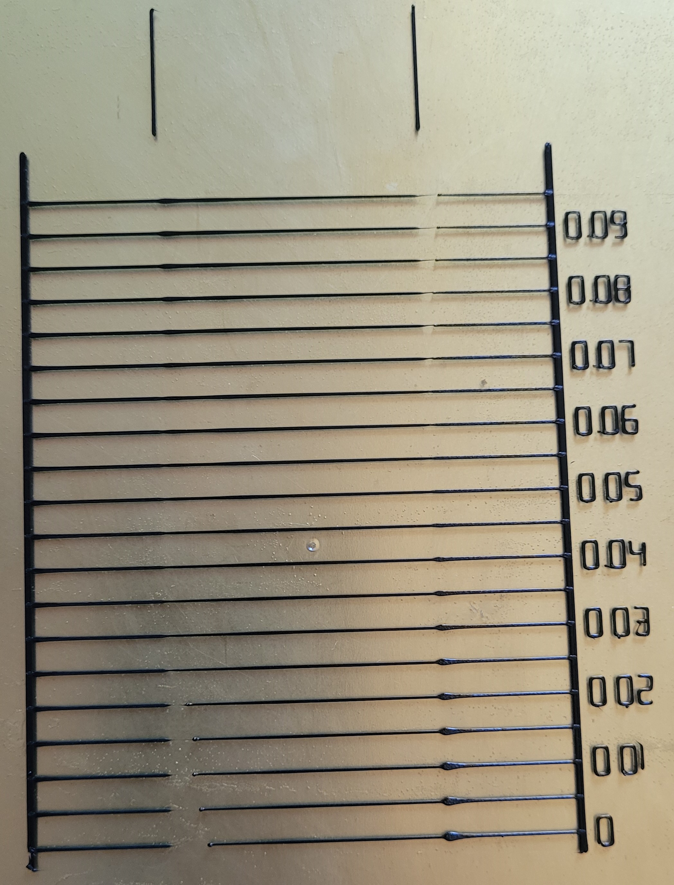
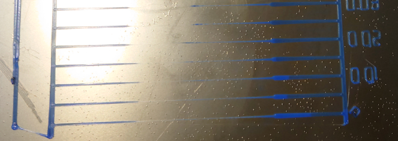

# Lines Method (DEPRECATED)
---

:dizzy: This page is compatible with Klipper *and* Marlin.

### :warning: This has been deprecated in favor of my new pressure advance tuning tool! See [:page_facing_up: here](./pressure_advance.html).

### :warning: The contents of this page may be out of date!
---

### Steps

**1)** Visit the [:page_facing_up: pressure advance calibration site](https://andrewellis93.github.io/pressure_advance_lines_method_deprecated/pressure_advance.html).
- Thanks to Deuce#8801 for helping with this!
- If you are using :fish: Marlin, use [:page_facing_up: Marlin's linear advance site](https://marlinfw.org/tools/lin_advance/k-factor.html) instead.

**2)** Fill out the parameters specific to your setup (printer name, bed size, retraction, etc.) 

**3)** Modify the **Start G-code** section.

:warning: *Exercise caution here. As mentioned previously, you can damage your printer if you don't set up the start g-code correctly, for example forgetting `QUAD_GANTRY_LEVEL` or `PRINT_START` (if used).*
- **This is where you will set your temperatures (`M109`/`M190`).**
- Copy over your slicer's start g-code (from your printer profile) and paste it beneath the `M109`/`M190`. 
    - You can usually replace the default gcode beneath the `M109`/`M190` with your own start g-code*, but use your best judgment. The defaults are there as safeguards.
    - **Klipper**
        - Stock `PRINT_START`/`START_PRINT` macros usually contain all the necessary start gcode (minus the temperatures), but please double check.
            - For **Vorons** with the stock `PRINT_START` macro, this is all you need:
                - 
            - If you are [:page_facing_up: passing variables to `PRINT_START`](./passing_slicer_variables.html), remember to append them here. Example: `PRINT_START HOTEND=240 BED=110`
                - Your variable naming may be different, e.g. `EXTRUDER=X` instead of `HOTEND=X`.
                - You can then comment out the separate heating g-codes.
    - Remove the `M112`. This is an emergency stop / reading comprehension check to ensure you have reviewed the start gcode.
    - \* *If the start g-code from your slicer has any slicer variables (for example `[first_layer_bed_temperature]`), make sure to replace them with appropriate values.*

**4)** Fill out the tuning parameters. Many can be left at defaults, but here are some specific settings that I recommend:
- **Printer**
    - **Layer Height**: 0.2mm*
        - *Or the primary layer height that you intend to print at. <0.2mm can make first layer difficult, however.
        - *On **textured beds**, you may want to try 0.25mm to verify if your results are reading high (>0.06 PA on direct drive)
- **Speed**
    - **Slow Printing Speed**: Your `square_corner_velocity` From your printer.cfg. Default is 5.
        - :fish: For Marlin, use your typical jerk value.
    - **Fast Printing Speed**: Your perimeter speed
        - If your internal/external perimeter speeds are different, use the faster of the two.
        - :warning: **See [:page_facing_up: this table](https://docs.google.com/spreadsheets/d/1Ns3c4Yidn4unrxx7mJRS2iVHYgxszeJGdHS8gNP_Tz4/edit?usp=sharing) to ensure that you are not exceeding the maximum flow rate of your hotend.**
            - The line widths refer to the "nozzle line ratio" option.
                - Default is 1.2 (120%).
        - *If your perimeter speeds are particularly slow, it may be hard to read the results. You may need to use a higher speed here in that case.
    - **Acceleration**: Your perimeter acceleration
- **Pattern**
    - **Starting Value for PA:** 0
    - **Ending Value for PA:**
        - **Direct Drive:** 0.1
        - **Bowden:** 1.5*
    - **PA Stepping:**
        - **Direct Drive:** 0.005
        - **Bowden:** 0.05*
    - **Test Line Spacing:**
        - **Voron 0 (120mm bed):** 4
        - **Default**: 5
    - **Print Anchor Frame**: Checked
- **Advanced**
    - **Nozzle Line Ratio**: 1.2
    - **Prime Nozzle**: Unchecked
    - **Dwell Time**: 0

\* *These bowden values cover a wide range of PA (0-1.5), because each bowden setup can vary widely. Once you narrow down a general range to work in, you may want to run the test again with a narrower range of PA values.*

**5)** Generate and download the g-code file.

**6)** Print it, and inspect the results.

- In the below example, I would choose about **0.055**.
    #### Result
-  
- This is a great visual representation of what I mentioned earlier: **that pressure advance is rarely perfect.** 
- Always choose the lower value if you are not entirely sure.
- Sometimes the best acceleration and decelerations values will not be on the same line. In this case, you should pick a **midpoint between both.**
    - If they are more than a line or two apart, see the next section.
### Anomalies / Issues
This PA test also serves as a nice extruder stress test, and it's a great visual indicator for extrusion issues. It ensures that your extruder/hotend can handle your requested speeds, PA, and accelerations.
- If your best accel/decel PA values are more than a line or two apart:
    - You may have too much [:page_facing_up: backlash](https://gfycat.com/mealycautiouscoqui) in your extruder. Pressure advance uses a reverse extruder move during decelerations. Excessive backlash causes some of that reverse move to be lost. 
        - See [:page_facing_up: here](https://github.com/AndrewEllis93/Print-Tuning-Guide/blob/main/articles/troubleshooting/extrusion_patterns.html) for more information on the effects of backlash/gear tension.
        - *You still want a tiny amount of backlash (when filament is loaded) to ensure your extruder gears aren't over tensioned. Essentially as little as you can manage.*
        - This is not adjustable on some extruders like the Orbiter (doesn't have the same backlash issues anyway in my experience!)
- If your PA numbers are unusually high:
    - This may indicate a partial nozzle clog or that your hotend temperature is too low. More back pressure means more pressure advance.
- If the middle (fast) section is not printing, or is only partially printing:
    - 
    - Your printer is having issues extruding at faster speeds. You may be outrunning your hotend, have your temperature too low / incorrect thermistor type in your config, have your extruder motor currents incorrect, have a partial clog, or have an extruder assembly issue. See [:page_facing_up: here](https://github.com/AndrewEllis93/Print-Tuning-Guide/blob/main/articles/troubleshooting/extruder_skipping.html) for more in-depth troubleshooting.
    - If this only happens above your ideal PA value, it's not an issue.

**7)** In the `[extruder]` section of your config, update `pressure_advance` to the new value and issue a `RESTART`.
- Alternatively: 
    - In **PS/SS**, you can manage this per-filament by putting `SET_PRESSURE_ADVANCE ADVANCE=`\<value> in your custom filament g-code.
        - You can also set different values for different nozzle sizes using [:page_facing_up: this](https://github.com/AndrewEllis93/Ellis-SuperSlicer-Profiles#changing-pa-based-on-nozzle-size).
    - In **Cura**, you can set it during slicing using [:page_facing_up: this plugin.](https://github.com/ollyfg/cura_pressure_advance_setting)
- **:fish: Marlin:**
    - Place `M900 K`\<value\> in your filament g-code (same as above). This must be set each time.
    - You can save a permanent default to the firmware by modifying Configuration_adv.h and reflashing the firmware. Instructions in the "Saving the K-Factor in the Firmware" section [:page_facing_up: here](https://marlinfw.org/articles/features/lin_advance.html).
    - In **Cura**, you can set it during slicing using [:page_facing_up: this plugin.](https://github.com/fieldOfView/Cura-LinearAdvanceSettingPlugin)

**8)** Try printing something! 

