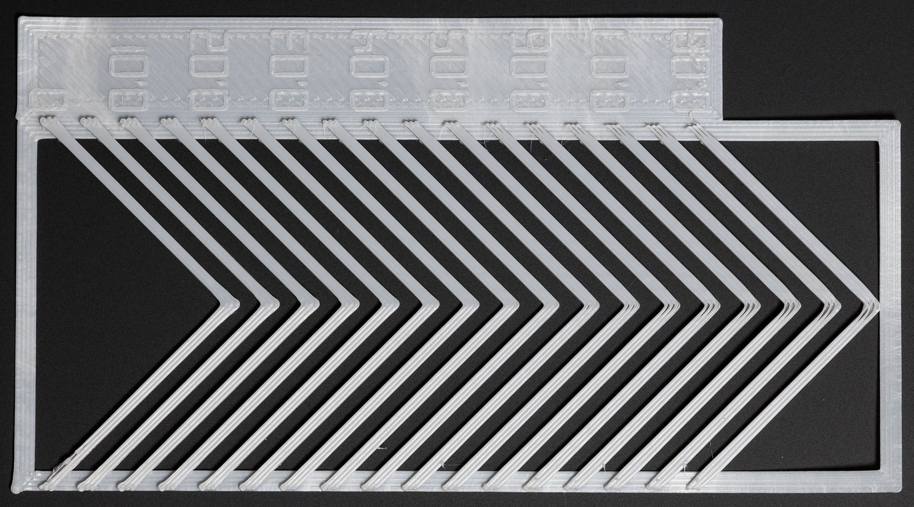
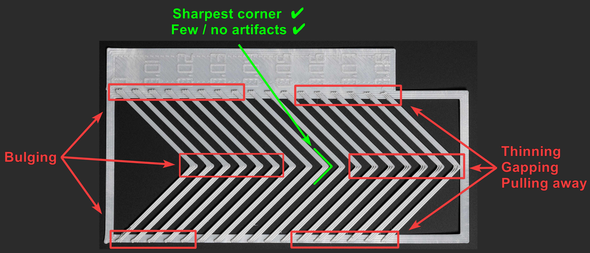

# Pattern Method
---
:dizzy: This page is compatible with Klipper *and* Marlin.

---

**Visit [:page_facing_up: my calibration site](https://andrewellis93.github.io/pressure_advance/pressure_advance.html).**
- Fill out the form to generate the g-code and then print it. 
    - I won't go into much detail here, or this article will become 20 pages long. Treat it like a slicer.
    - Most of these settings should be relatively intuitive, or have descriptions explaining what they do. 

- You should get a result like this:

### What You're Looking For
You are looking for the **sharpest corner** with the fewest artifacts (gaps, bulges, divots).

- *Note - **there is rarely such thing as perfect pressure advance.** You are not looking for perfection here! Just as close as you can get.*

Imagine you're holding a machinist's square over each corner.\
*(No need to ACTUALLY use a square - just an analogy.)*

In this example, I would choose around 0.04 (in green).

I find I get the best real prints when I lean toward **higher** values. 
- For example - if your sharpest corner has a *tiny* bit of gapping, I'd still personally choose it.\
*(And then I'd just cover up the slight gapping with single top perimeters - which is unfortunately exclusive to SuperSlicer.)*

- The sharpness of these corners has a large effect on the outer surface or prints, particularly surrounding features like logos, text, slots, etc.

I personally run the test again at 0.001-0.002 intervals (with direct drive) once I have found a range to work in.

It's up to you how finely you want to tune!

---

:warning: If you can't get a clean corner, or you have gapping and bulging at the same time, **you likely have extruder issues.** 
- One thing to check is your [:page_facing_up: extruder backlash](./troubleshooting/extrusion_patterns.md#extruder-backlash). This is a common cause, but only one of many!
- Make sure there is no "dead zone" when reversing extruder directions by hand.
- Make sure nothing is misaligned or loose.
- On bowden extruders, ensure that your tube fittings have minimal/no play.

It's often faster to just rebuild your extruder than to burn an entire day troubleshooting.

---