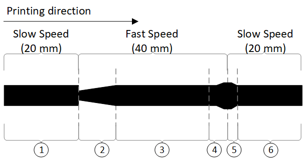
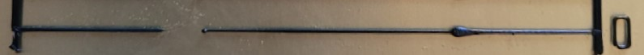
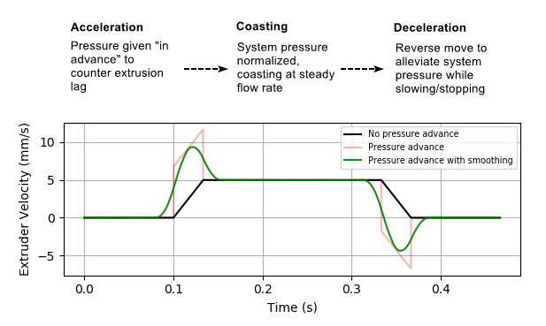
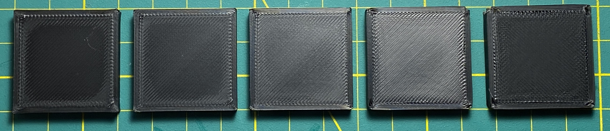
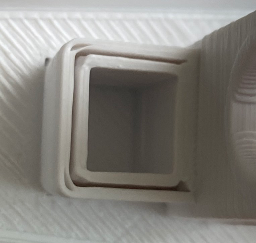
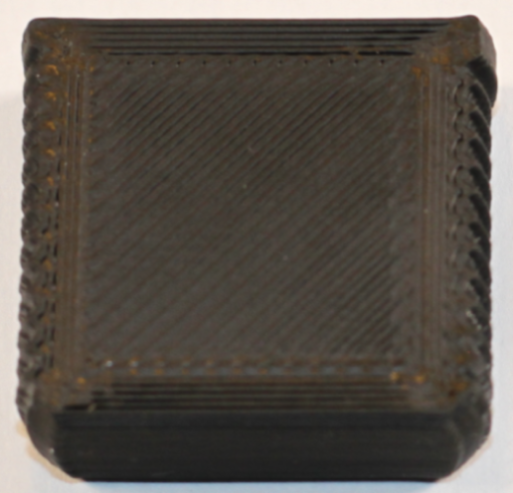

 
# This page has moved! Please visit [the new location](https://ellis3dp.com/Print-Tuning-Guide/articles/pressure_linear_advance/introduction.html).

# Introduction
{: .no_toc }

---

:bulb: This guide will call it "pressure advance", or "PA".

-  **Marlin** calls it "Linear Advance", but it's the exact same thing.
    - The only difference is that Marlin's linear advance does not have a "smooth time" setting.

---

{: .compat}
:dizzy: This page is compatible with Klipper, Marlin, and RepRapFirmware.

{: .prereqs}
> - You should [:page_facing_up: calibrate your extruder](https://docs.vorondesign.com/build/startup/#extruder-calibration-e-steps) first.
> -  **Marlin**: Linear advance must be [:page_facing_up: enabled in firmware](https://marlinfw.org/docs/configuration/configuration.html#linear-advance). Not all printers have it enabled by default. 

---

  

    Table of contents
  

  {: .text-delta }
- TOC
{:toc}

---

:bulb: **Pressure advance will change:**
- With different filaments and brands.
    - *Different colors of the same material/brand *can* behave differently, but it's \*usually\* not significant.*
- With different nozzle sizes.
- With large hotend temperature changes.
    - *Large temp changes can affect the viscosity of the plastic (and therefore the back pressure / resistance).*
- When enabling or disabling input shaper.
- When changing hotend, extruder, or bowden tube length (NOT reverse bowden)

---

## Why Pressure Advance is Needed

### What Happens Without PA

Consider an extrusion line - where the toolhead speeds up, and then slows again.\
Ideally, you would have a straight line.

In reality, however, this happens:

- {:target="_blank"}\
[Source](https://marlinfw.org/assets/images/features/lin_advance/k-factor_low.png)\
{:target="_blank"}

#### Explanation
- *The numbers will refer to the image above.*

A certain pressure must be reached for plastic to flow consistently. This extrusion pressure takes a short time to build up. 

During accelerations, there will be underextrusion while the pressure has not yet built up fully **(2)**.

Then, when decelerating, that pressure will bleed off. This causes excess plastic to blob out **(4)**. It will even a little *after* deceleration has finished **(5)**.

The faster you print, the worse these effects become.

### What PA Does

Pressure advance does what the name implies - it gives an "advance of pressure" (extra pressure) for accelerations, to counter this lag.

During decelerations it does the opposite - it pulls back (kind of like an early retraction) to alleviate the built-up pressure and prevent ooze.

**Compare this image to the above image.** Notice how PA tries to cancel out those unwanted effects.

{:target="_blank"}\
*(Generated using Klipper's [:page_facing_up: graph_extruder.py](https://github.com/Klipper3d/klipper/blob/master/scripts/graph_extruder.py).)*

Keep in mind that pressure advance only changes the **distribution** of material, not the **amount** of material.

### Practical Example

At lower values, you can see less material during the accelerations, and more at the decelerations (corner blobs).

At higher values, you can see more material during accelerations, and less material in the corners (corner gaps).

{:target="_blank"} 

## Tuning
There are three approaches:
- The [:page_facing_up: pattern method](./pattern_method.md) (recommended)
- The [:page_facing_up: tower method](./tower_method.md) (easier to set up for newcomers, but can be harder to read the results & less precise)
- The deprecated [:page_facing_up: "lines method"](./lines_method_deprecated.md).
    - No longer recommended!
    - I created the [:page_facing_up: pattern method](./pattern_method.md) specifically to address issues with the old Marlin tool!

## Signs of Issues

The tool above should be all you need. It closely emulates real prints, and I have found little need to fine-tune afterwards.

Still, it's good to know what to look out for:

### Pressure Advance is Too High
- Divots or underextrusion at corners and line ends.
- Gaps between perimeters at corners.
- {:target="_blank"} 

### Pressure Advance is Too Low
- Bulging at corners and line ends.
- Gaps between straight line perimeters.
- {:target="_blank"} 
