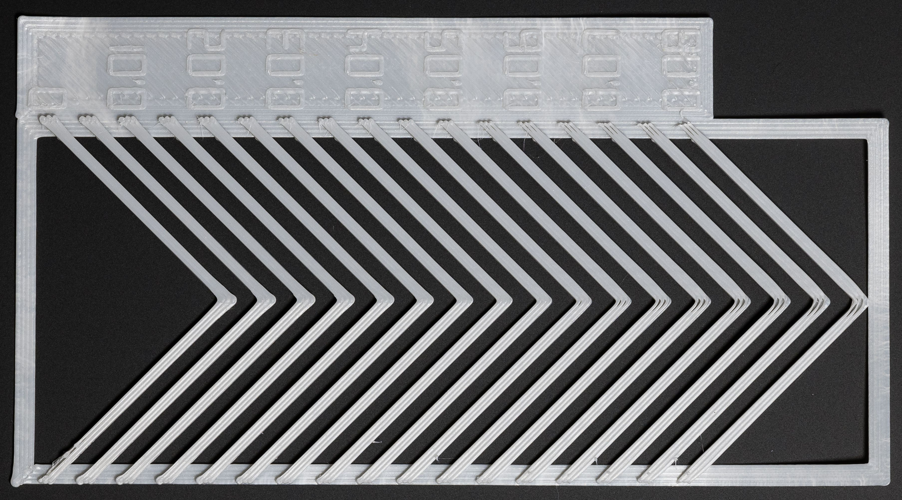



# This page has moved! Please visit [the new location](https://ellis3dp.com/Print-Tuning-Guide/articles/pressure_linear_advance/pattern_method.html).



# Pattern Method

---

{: .compat}
:dizzy: This page is compatible with Klipper, Marlin, and RepRapFirmware.

---

**Visit my [:page_facing_up: calibration tool](https://ellis3dp.com/Pressure_Linear_Advance_Tool/).**

- Fill out the form to generate the g-code and then print it.

  - I won't go into much detail here, or this article will become 20 pages long. Treat it like a slicer.
  - Most of these settings should be relatively intuitive, or have descriptions explaining what they do.
  - Some tips:
    - :bulb: Make sure to read all the tooltips! *(hover over the tooltip icon to the right of some input boxes).*
    - :warning: If you use slicer acceleration control, **make sure you enable that option and set it to your external perimeter acceleration.** 
      - Otherwise it will use your **default (max) acceleration**, or whatever you currently have it set to. If you have a high maximum, this will cause ringing and throw off the test results.\
      *(I disabled this by default because that option was confusing newer folks who don't yet use slicer acceleration control)*

- You should get a result like this:

  *Click the image to open. Ctrl + scroll up / down to zoom.*\
  {:target="_blank"}

### What You're Looking For

You are looking for the **sharpest corner** with the fewest artifacts (gaps, bulges, divots).

- _Note - **there is rarely such thing as perfect pressure advance.** You are not looking for perfection here! Just as close as you can get._

Imagine you're holding a machinist's square over each corner.\
_(No need to ACTUALLY use a square.)_

In this example, I would choose around 0.04 (in green).

*Click the image to open. Ctrl + scroll up / down to zoom.*\
{:target="_blank"}

I find I get the best real prints when I lean toward **higher** values.

- For example - if your sharpest corner has a _tiny_ bit of gapping, I'd still personally choose it.\
  _(And then I'd just cover up the slight gapping with single top perimeters - which is unfortunately exclusive to SuperSlicer.)_

- The sharpness of these corners has a large effect on the outer surface or prints, particularly surrounding features like logos, text, slots, etc.

I personally run the test again at 0.001-0.002 intervals (with direct drive) once I have found a range to work in.

It's up to you how finely you want to tune!

See [:page_facing_up: Saving Your Value](./saving.md).

---

:warning: If you can't get a clean corner, or you have gapping and bulging at the same time, **you likely have extruder issues.**

- One thing to check is your [:page_facing_up: extruder backlash](../troubleshooting/extrusion_patterns.md#extruder-backlash). This is a common cause, but only one of many!
- Make sure there is no "dead zone" when reversing extruder directions by hand.
- Make sure nothing is misaligned or loose.
- On bowden extruders, ensure that your tube fittings have minimal/no play.

It's often faster to just rebuild your extruder than to burn an entire day troubleshooting.

---
