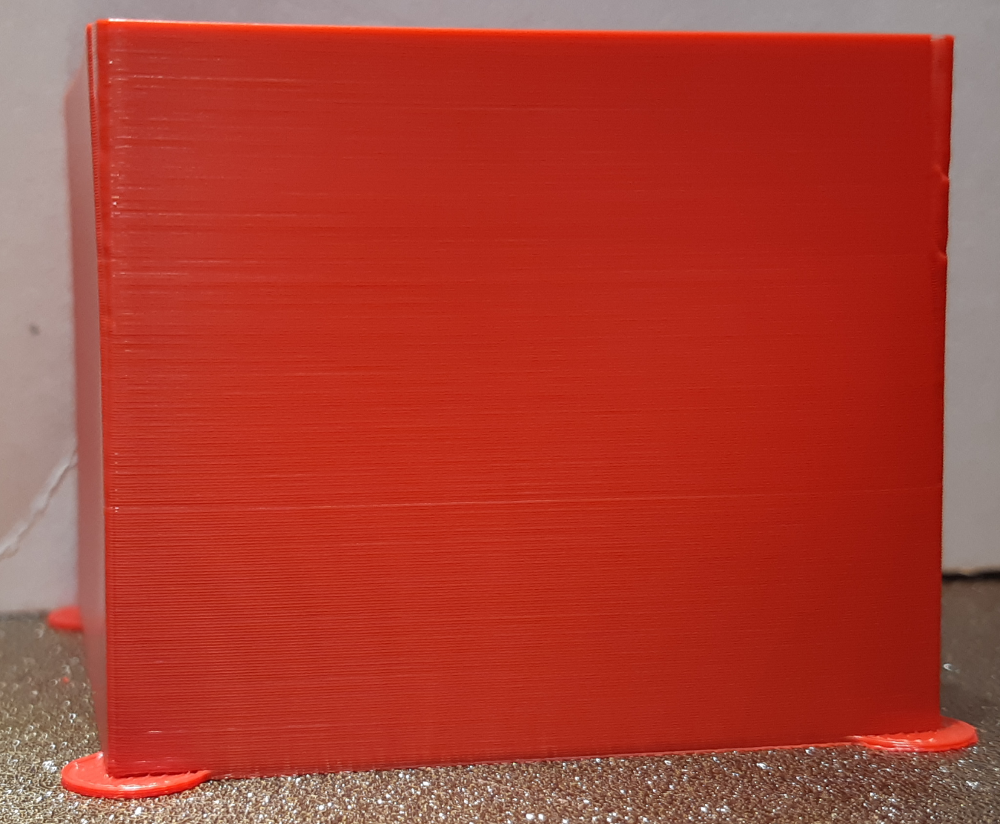
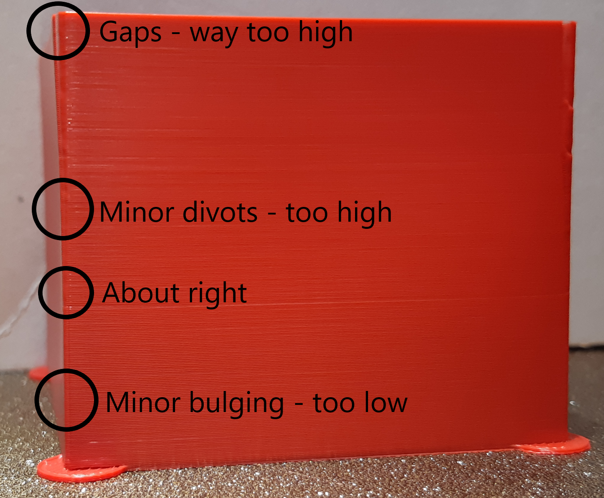



# This guide has moved! Please visit [the new site](https://ellis3dp.com/Print-Tuning-Guide/).



# Tower Method

---

{: .compat}
:dizzy: This page is compatible with **Klipper only**.

---

**I would generally recommend using the [:page_facing_up: pattern method](./pattern_method.md) rather than this method, if you can take some time to wrap your head around it.** It is quicker and more precise.

This "tower method" is here for beginners.

This is based off of the [:page_facing_up: Klipper Pressure Advance guide](https://www.klipper3d.org/Pressure_Advance.html#tuning-pressure-advance), but with some modifications:

- The Klipper guide recommends limiting acceleration to 500 and square corner velocity (SCV) to 1, among other things. The intent behind these changes is to exaggerate bulging as much as possible. I find that this causes **unrealistic** bulging, causing you to set your PA too high to compensate.

  - In my opinion, it is best to run the calibration in close to normal printing conditions!

---

## Steps

1.  Download and slice the [:page_facing_up: Klipper3d pressure advance tower STL](https://www.klipper3d.org/prints/square_tower.stl) with _your normal print settings (accelerations included)_. \
    The only modifications you should make are these:

        - **120mm/s** external perimeter speed
        - **1** perimeter
        - **0%** infill
        - **0** top layers
        - **0 second** "minimum layer time" / "layer time goal" / "slow down if layer print time is below"
            - Under filament cooling settings in PS/SS.
            - You can use **ctrl+f** to find settings by name.
        - **High fan speed**

2.  Initiate the print.

3.  After the print has \*already started\*\*, enter the following command:

    - (Direct Drive) `TUNING_TOWER COMMAND=SET_PRESSURE_ADVANCE PARAMETER=ADVANCE START=0 FACTOR=.0025`
    - (Bowden) `TUNING_TOWER COMMAND=SET_PRESSURE_ADVANCE PARAMETER=ADVANCE START=0 FACTOR=.025`

    You should now see increasing pressure advance values reporting to the g-code terminal as the print progresses.

    \* _Certain patterns in your start g-code can cancel the tuning tower. \
    \* It does not matter how quickly you enter the command, as it is based on height._\
    \* Alternatively, you can temporarily add the tuning tower command after your start g-code.

4.  Allow the print to run until it starts showing obvious issues/gaps. Then you may cancel.

5.  Measure the height of the perfect PA (see [:pushpin: images below](#example))

    - Ensure you are **not** measuring your Z seam corner.
    - There should be no signs of underextrusion before or after the corner.
      - It can help to shine a bright flashlight between the walls.
    - **It is normal for there to be a small amount of bulge on the trailing edge. When in doubt, choose the lower value.**
    - If the height differs between corners, take a rough average.

6.  Calculate your new pressure advance value:

    - Multiply measured height by your `FACTOR`.
    - Add the `START` value (usually just 0).

7.  See [:page_facing_up: Saving Your Value](./saving.md).

### Example

**You may need to zoom in here, the differences are subtle.** There is always some ambiguity.

- 
- 
