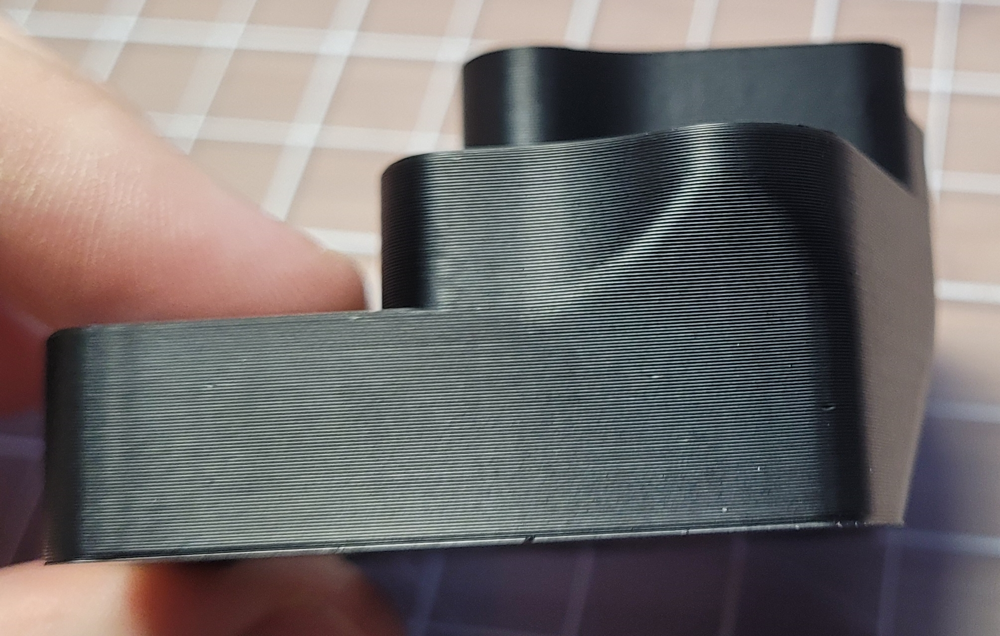
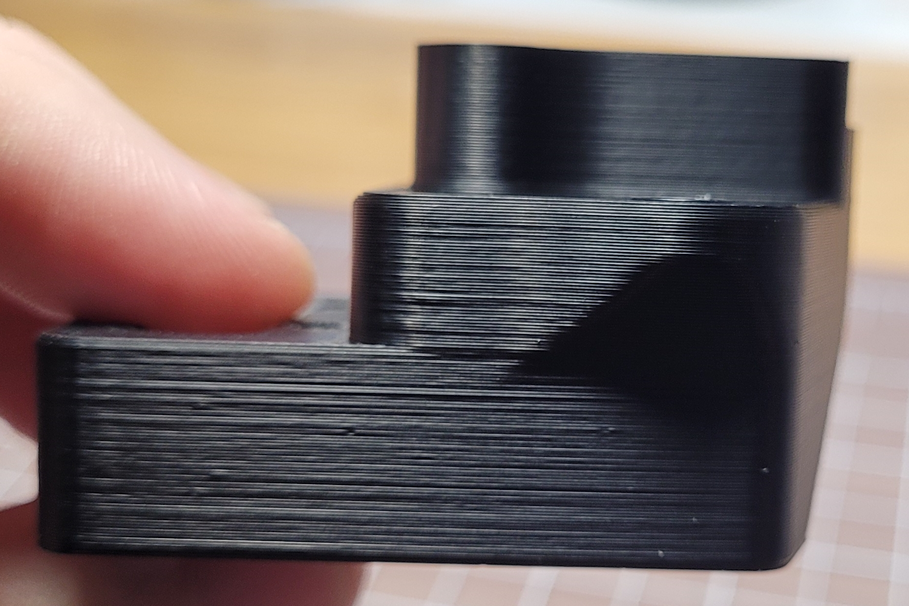
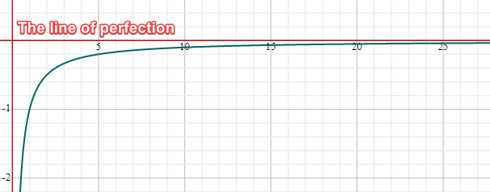

 
# This guide has moved! Please visit [the new site](https://ellis3dp.com/Print-Tuning-Guide/).


# Setting Expectations
{: .no_toc }

---

  

    Table of contents
  

  {: .text-delta }
- TOC
{:toc}

---
## Layer Consistency

This is what your prints can look like!

-  

Or, wait....

-  

Ellis' prints look like shit?  (this is directly under a bright LED lamp at a low angle) 

Well... there's a bit of trickery here. Trickery that everyone seems to partake in.

**Whenever people show off their prints, they tend to take the photo in direct lighting**. 

You can make just about any print look like crap in harsh lighting, mine included.

- (And no, it's not just Vorons / *\<insert brand/printer here\>*.) Even professional printers that cost *many* thousands of dollars produce prints that look like this in harsh lighting (in fact, a lot of them are *worse*.)

## Why?

**Every component in your printer has tiny imperfections.**

These imperfections all combine with each other and create minor inconsistencies in your prints. 

3D prints, by nature, show off these imperfections in harsh lighting. Even a 0.005mm imperfection will be shown off in full force.*

\* (I'm making that number up, but you get the idea.). 

Apart from building your printer well, the single best thing you can do for this issue is simply have *fewer components*. In fact, a simple i3-style printer can achieve slightly better print quality than a CoreXY printer in this regard.

The second best thing you can do is to buy higher quality filaments. Low quality filaments can have fluctuating diameters, [:page_facing_up: which can exacerbate these issues.](https://github.com/Deutherius/Filament-Width-Comp-Experiments/blob/main/README.md#some-updates)

The third best thing you can do is to buy higher quality printer components.

Certain printer/kinematic/extruder designs *can* be better or worse than others (for example, I had a slight improvement when I started using an Orbiter extruder), but you you'll never reach perfection:

## An Analogy
Think of it like the below (arbitrary) graph. 

Tuning efforts at the beginning (this tuning guide!) will have a much higher relative quality increase, but you get diminishing returns the closer you get to perfection. 3D printing just has an unfortunate side effect of showing off those imperfections.

 

My guide should (hopefully) get you somewhere around the 5 or 10.

Now that we've got all that out of the way, on to the tuning!

