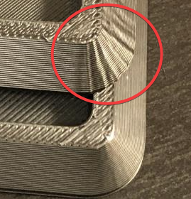
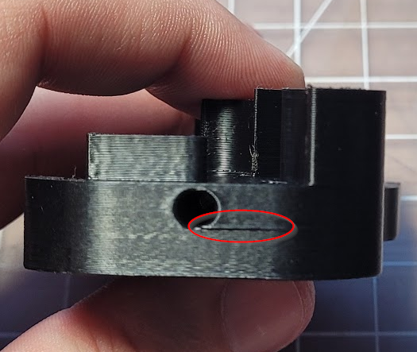

# Bulging
---
:dizzy: This page is compatible with **all printers.**

---
## Bulging Layers

This may or may not just be a Prusa Slicer / SuperSlicer thing. I have not tested it in other slicers. 

-  
    - Disable any "extra perimeters" and "supporting dense layer" settings (PS/SS)
    - Reduce perimeter accelerations.
    - Try printing the external perimeters first (`external_perimeter_first` in PS/SS)
        - This can negatively affect *extreme* overhangs, but is generally fine for daily use.

## Bulges at STL Vertices

 
- Your square corner velocity or jerk may be too low.
- This can also be a sign that your perimeter speeds/accels are too high.

## Bulging Around Features (SuperSlicer)
-   

These types of bulges are often caused by **overextrusion of the supporting solid infill**:

-  

First of all, you should tune your [:page_facing_up: pressure advance](./pressure_advance.html) and [:page_facing_up: extrusion multiplier](./extrusion_multiplier.html) using this guide's methods.

You can also try printing external perimeters first (`external_perimeter_first` in PS/SS)
- This can negatively affect *extreme* overhangs, but is generally fine for daily use.

After that, see [:page_facing_up: Small Infill Areas Look Overextruded](./troubleshooting/small_infill_areas_overextruded.html).\
When you have overextrusion issues in small areas, it greatly contributes to this issue.
- The above link goes into this in much more detail about this issue, but one of the larger improvements for me was to use these settings in SuperSlicer:
    - Top infill: "Not connected"
    - Solid infill: "Not connected"
    - Infill/perimeter overlap (encroachment): 20-25%
        - *(Lower is better, but don't go too low or your infill can disconnect from the perimeters)*

- There is some additional (advanced!) reading in that page with some more recent findings about a retraction trick. 
    - BUT that trick has downsides without using an **experimental** SuperSlicer build. **No support provided!**
    - The page describes applying it to the top layer. You would have to disable "only retract when crossing perimeters" for it to apply to this solid infill too. That can slow down your print, however.
## Bulging Patterns on Overhangs (SS)

- Some SuperSlicer profiles have "above the bridges" flow set to greater than 100%. This can cause the issues you see above. 
- There are three solutions:
    - **Set "threshold for bridge speed and fan" to 0**
        - This totally prevents SS from applying bridging settings to overhangs.
        - 
    - **Set "threshold for bridge flow" to 0**
        - This prevents SS from applying *bridging flow* settings to overhangs, but still applies bridging speeds/fan settings.
        - 
    - **Reduce "above the bridges" flow to back to 100%**
        - 
- This can also occur above where the print has lifted from the build surface (it curls up into the nozzle a bit, and the plastic no longer has space to go, so squishes outwards)
- If these do not fix it, it might instead be an [:page_facing_up: overheating issue.](./cooling_and_layer_times.html).