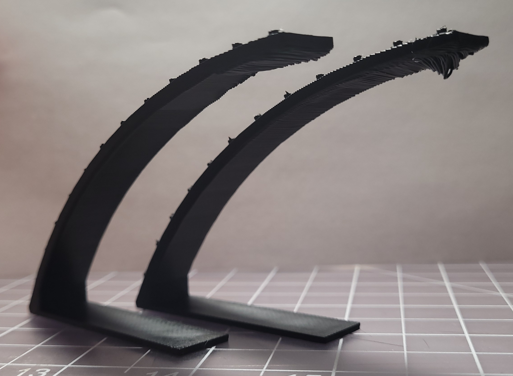
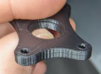

 
# This page has moved! Please visit [the new location](https://ellis3dp.com/Print-Tuning-Guide/articles/troubleshooting/bulging.html).

# Bulging
{: .no_toc }

---

{: .compat}
:dizzy: This page is compatible with all printers.

---

  

    Table of contents
  

  {: .text-delta }
- TOC
{:toc}

---

## External Perimeters First

This is in its own section because it can help with multiple of the other bulging sections below.

It can also help with extrusion / layer consistency.

- PS/SS: `external_perimeter_first`
- Cura: "Wall Ordering" -> "Outside To Inside"

-  
-  

- :warning: This can negatively affect *extreme* overhangs, and occasionally cause some other oddities, so just keep it in mind when troubleshooting. It's generally okay for daily use, though.
    -  

## Bulging Layers

-  
-  

**Possible Solutions**
- Printing [:pushpin: External Perimeters First](#external-perimeters-first) can help a lot with this particular type of bulging.
- Disable any "extra perimeters" and "supporting dense layer" settings (PS/SS)
- Reduce perimeter accelerations.

## Bulges at STL Vertices
- 

-  

**Possible Solutions**
- Your square corner velocity or jerk may be too low (or too high!)
- This can also be a sign that your perimeter speeds/accels are too high.
- If you are using input shaper, try disabling or re-tuning it.
- Check over your printer axes for mechanical issues. Move the toolhead/bed by hand and see if anything feels off.

## Bulging Around Features
-   

These types of bulges are often caused by **overextrusion of the supporting solid infill**:

-  

First of all, you should tune your [:page_facing_up: pressure advance](../pressure_linear_advance/introduction.md) and [:page_facing_up: extrusion multiplier](../extrusion_multiplier.md) using this guide's methods.

You can also try printing [:pushpin: External Perimeters First](#external-perimeters-first)

After that, see [:page_facing_up: Small Infill Areas Look Overextruded](../troubleshooting/small_infill_areas_overextruded.md).\
When you have overextrusion issues in small areas, it greatly contributes to this issue.
- The above link goes into this in much more detail about this issue, but one of the larger improvements for me was to use these settings in SuperSlicer:
    - Top infill: "Not connected"
    - Solid infill: "Not connected"
    - Infill/perimeter overlap (encroachment): 20-25%
        - *(Lower is better, but don't go too low or your infill can disconnect from the perimeters)*

- There is some additional (advanced!) reading in that page with some more recent findings about a retraction trick. 
    - BUT that trick has downsides without using an **experimental** SuperSlicer build. **No support provided!**
    - The page describes applying it to the top layer. You would have to disable "only retract when crossing perimeters" for it to apply to this solid infill too. That can slow down your print, however.
    
## Bulging Patterns on Overhangs (SS)
- 
- 
- 

Some SuperSlicer profiles have "above the bridges" flow set to greater than 100%. This can cause the issues you see above. 
- There are three solutions:

    - **Reduce "above the bridges" flow to back to 100%**
        - **You should definitely do this**, in my opinion. 110% "above the bridges" flow can also cause [:page_facing_up: other issues](https://github.com/supermerill/SuperSlicer/issues/3410). The other two options can be used in addition, but are more of a preference. 
        - 
        
    - **Set "threshold for bridge speed and fan" to 0**
        - This totally prevents SS from applying bridging settings to overhangs.
        - 

    - **Set "threshold for bridge flow" to 0**
        - This prevents SS from applying *bridging flow* settings to overhangs, but still applies bridging speeds/fan settings.
        - 

- This can also occur above where the print has lifted from the build surface (it curls up into the nozzle a bit, and the plastic no longer has space to go, so squishes outwards)
- If these do not fix it, it might instead be an [:page_facing_up: overheating issue.](../cooling_and_layer_times.md).