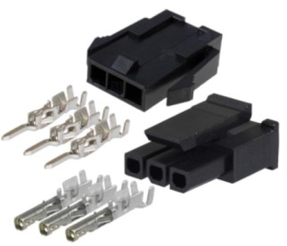
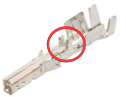
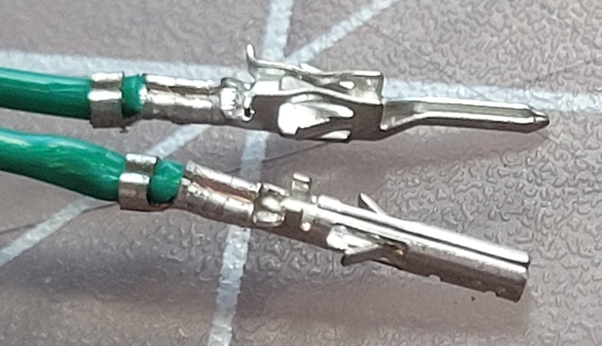
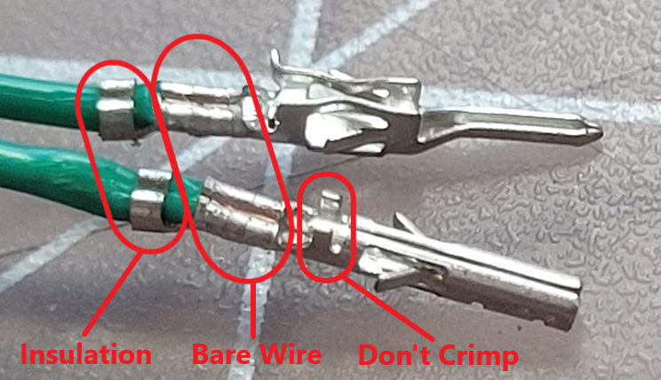

 
# This page has moved! Please visit [the new location](https://ellis3dp.com/Print-Tuning-Guide/articles/troubleshooting/crimps.html).

# Crimps
---

{: .compat}
:dizzy: This page is compatible with **all printers** that use Molex Microfit 3.0 connectors.

---
- Pull on each wire. Ensure that none of the pins are starting to back out of the housings.
    - If any pins are backing out, it's possible that you may have crimped incorrectly. 
        - You may not have pushed the pins all the way into the housings. Push them in with some sharp tweezers, SIM card tool, or similar until you feel them click into place.
        - Incorrectly crimping microfit pins is very common, and an easy mistake to make.
            - *Male* pins go into the *female* housings, and vice versa.
                - {:target="_blank"}
            - The crimped side of the pins should be facing *towards the latch*, as shown above.
            - The female pins have *three* sets of arms. *You should only crimp the lower two.*
                - **:warning: DO NOT CRIMP THESE ARMS.**
                - {:target="_blank"}
            - **Example of correct crimps:**
                - {:target="_blank"}
                - {:target="_blank"}

        - Do a "pull test". Ensure that the pins do not come out of the housings. 
            - Microfits hold *very* strongly. The pins should be nearly impossible to pull out of the housings. The wire will usually tear before they ever come out.

