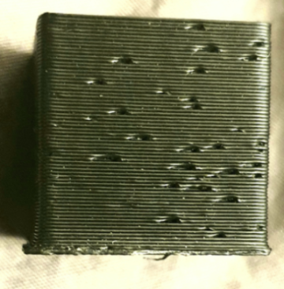
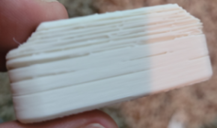
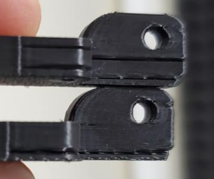
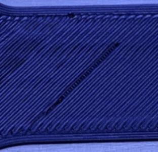
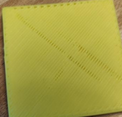
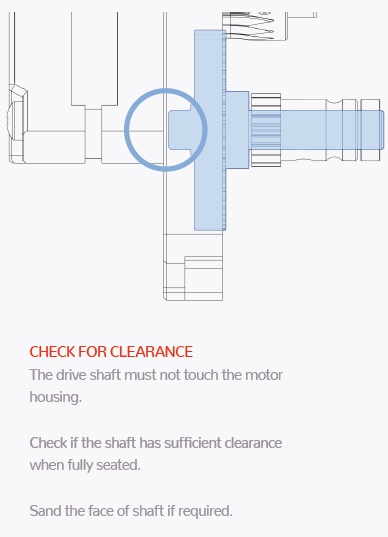

 
# This guide has moved! Please visit [the new site](https://andrewellis93.github.io/Print-Tuning-Guide/).

# Extruder Skipping
---
:dizzy: The concepts on this page is relevant to all printers, but certain parts are tailored to **Voron** printers.

---
These skips will typically be wider than [:page_facing_up: pockmarks.](./pockmarks.md)

\
\

Skipping below top layer:

- If you are printing PLA, **don't do it in an enclosure**. Enclosure temps can *easily* get hot enough to soften PLA in the extruder/heatbreak and cause endless jams. Open your chamber door - or better yet, take the panels/enclosure off entirely.

- Mark a line on your extruder motor shaft with a sharpie (on the back side of the motor). Observe what it's doing while the issue is occuring.
    - Shuddering: A wiring issue or mechanical resistance.
    - Not moving at all: A wiring or electrical issue, or stepper driver overheating.
    - Rotating normally: Either the filament isn't gripping properly, or a grub screw has come loose.
- Try a new nozzle. It's often just a partial nozzle clog.

- If it occurs mainly on the first layer, ensure that you are not printing with [:page_facing_up: too much squish](../first_layer_squish.md) or with too much first layer flow.
- Ensure that your filament gear tension (usually a spring tensioner screw) is not too tight or too loose.
    - Yank on the filament and keep tightening the tensioner screw until it stops slipping. Tighten it a little extra, maybe 1-2 turns. Too tight will cause skipping, and too loose will cause filament stripping.
- **Use a reverse bowden tube*** with direct drive, and ensure that there is not too much resistance coming from the spool.
    - *Reverse bowden tubes go from the direct drive extruder back to the spool (and should be fixed at the spool side), and prevent fast toolhead movements from yanking the filament.
    
        - Use a 3mm inner diameter tube. 1.9mm/2mm ID tubes are more restrictive.
        - Ensure that it doesn't have any kinks.
        - Ensure that your spool is not catching on anything as it rotates. 
        - If you are pulling from a dry box, try without.
        - For Voron spool holders, make sure you have the PTFE tube piece installed to lessen friction.
        - If your bowden tube is FEP or another material, try real PTFE instead.
- For Voron direct drive toolheads, ensure that you have the short piece of PTFE tubing installed between the clockwork and the hotend. 
    - Make sure it is not too long or too short. You should trim it down until it just fits without compressing the tube.
- Ensure that there are no issues with your hotend fan.
    - Ensure that your hotend fan is running and is not stopping/starting during printing from a wiring issue.
    - Also ensure that your hotend fan is running at 100%. 

        - Some vendor githubs have the `[heater_fan hotend_fan]`'s `max_power` setting at 0.4 (40%) for some    reason.
        - Ensure that you are running it at the correct voltage.
- Ensure that your hotend thermistor is correct in your config and that you are not using temps that are too    low.
- Ensure that your retraction distance is not too high. 
    - The default Cura profile uses a high retraction distance, as it is configured for bowden. 
    - You should generally use a maximum of 1mm for direct drive.
- With the filament latch open, try extruding by hand. **It should be easy.** \
If there is much resistance, *figure out where it is coming from:*
    - You may need to drill out the filament path in the printed parts.
    - Your nozzle may be partially clogged. 
        - See if extruded plastic is shooting out to the side instead of straight down when extruding in mid-air.
        - Unclog it using a cold pull or nozzle cleaning needles.
        - Try a new nozzle.
    - Your heatbreak may be partially clogged. 
        - Remove the nozzle, cool the hotend, and try pushing fresh filament through it. Make sure to cut off the bulged tip. *If there is resistance:*
            - Unload the filament and remove the nozzle.
            - Get access to the top of the hotend (you may need to either remove the hotend or the clockwork).
            - Shine a light through the hotend and look into the other side. See if there is any plastic stuck against the walls of the heatbreak or heatsink. *If it is obstructed*: 
                - Unplug the hotend fan.
                - Heat the hotend up to your normal printing temp for that filament.
                - We are purposefully inducing heat creep to soften the plastic in the heatbreak.
                - Push a long, thin (<=1.8mm) allen key or similar through the top side of the hotend to push the obstruction out of the bottom.
                - **:warning: Turn off the hotend as soon as you have freed the obstruction.**
                    - If you let it cook without cooling for a long time, it will eventually start to soften the printed hotend mounting.
                - **Be careful - don't burn yourself!**

- Ensure that you are using the correct `run_current` for your motor. Too high or too low can both cause skipping.
    - As a general rule, don't exceed 50-60% of the rated current of your motor as your `run_current`. *Some motors like more or less current, though*, so your best bet would be to look at the stock configs or to ask in Discord.
    - Clockwork 2 / Galileo / Orbiter:

        - There is some confusion about different motor models. 

            - If you have the 20mm 1a LDO motor, try ~0.65a. 
            - If you have the 17mm 1a LDO motor, try 0.35-0.4a.
- Check your extruder motor and hotend fan's [:page_facing_up: crimps](../troubleshooting/crimps.md) and wiring.
- Check the volumetric speed preview in your slicer. See if it is [:page_facing_up: high for your particular hotend](../determining_max_volumetric_flow_rate.md#approximate-values). Or see [:page_facing_up: here](../determining_max_volumetric_flow_rate.md#determining-maximum-volumetric-flow-rate) to determine your maximum.
    - If you are exceeding hotend limits, try lowering your volumetric speed limit in your slicer (PS/SS) or reducing line widths / layer heights / speed (other slicers) until you are under the limit.
- Try rotating the extruder (if possible) without filament loaded. It should be easy.
- If you're still using Afterburner, try using a cooling mod, like the [:page_facing_up: AB-BN](https://github.com/VoronDesign/VoronUsers/tree/master/printer_mods/Badnoob/AB-BN). It optimizes hotend cooling and can help with heat creep issues. Or upgrade to Stealthburner.
- Try lowering your extruder motor's microstepping and disabling interpolation (and stealthchop if you have it on, which you shouldn't).
- Take out the motor, and see how powerful it feels. See if you can stop it easily with your fingers. This may indicate a bad motor or bad wiring.
## Clockwork 1
- Try turning the plastic gear with your finger with the motor turned off and filament unloaded. It should be relatively easy. *If there is too much resistance:* 
    - Ensure that you have a small amount of [:page_facing_up: backlash in the plastic gear.](../troubleshooting/extrusion_patterns.md)
        - If they are pushed together too hard, it will cause resistance.
    - Ensure that your drive shaft is not rubbing against the motor:
        - A little cheat I have heard here is to test continuity between the drive shaft and the motor. Test throughout the full rotation.
        - 

