 
# This page has moved! Please visit [the new location](https://ellis3dp.com/Print-Tuning-Guide/articles/troubleshooting/extrusion_patterns.html).

# Extrusion Patterns / "Wood Grain"
{: .no_toc }

---

{: .compat}
:dizzy: The concepts on this page are relevant to all printers, but the specific adjustment instructions are tailored to **Voron** extruders.

---

  

    Table of contents
  

  {: .text-delta }
- TOC
{:toc}

---

## Examples
- See [:page_facing_up: "Setting Expectations"](../setting_expectations.md). **You are very unlikely to get this perfect**, but some things can be done to potentially improve it.  
- The left cube shows an "innie-outie" pattern across each extrusion line.\
The right cube was printed after adjusting [:pushpin: extruder backlash](#extruder-backlash), and the pattern is lessened.
    - [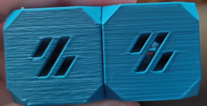](./images/extrusion_patterns/Backlash-Comparison.png){:target="_blank"}
- "Wood Grain":
    - [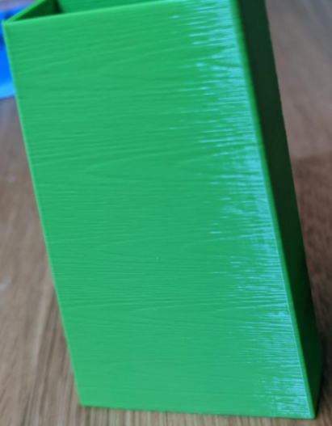](./images/extrusion_patterns/Backlash-WoodGrain.png){:target="_blank"}
- Diagonal patterns:\
*Note: this kind of pattern can also be caused by mechanical issues with printer axes.*
    - [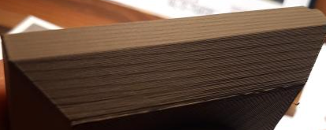](./images/extrusion_patterns/Backlash-Pattern.png){:target="_blank"}

## Test Prints
See the [:page_facing_up: test prints from MihaiDesigns](https://mihaidesigns.com/inconsistent-extrusion/)

## External Perimeters First

Printing external perimeters first can help with extrusion consistency *and* with [:page_facing_up: bulging](./bulging.md) issues.

This is moreso about *general* extrusion inconsistency rather than wood grain specifically, but it may still help. 

- PS/SS: `external_perimeter_first`
- Cura: "Wall Ordering" -> "Outside To Inside"

- [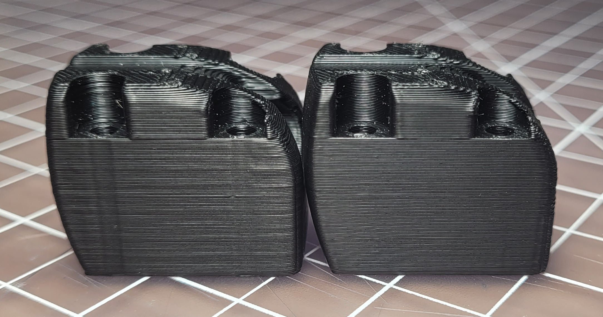](./images/extrusion_patterns/external_first_1.png){:target="_blank"} 
- [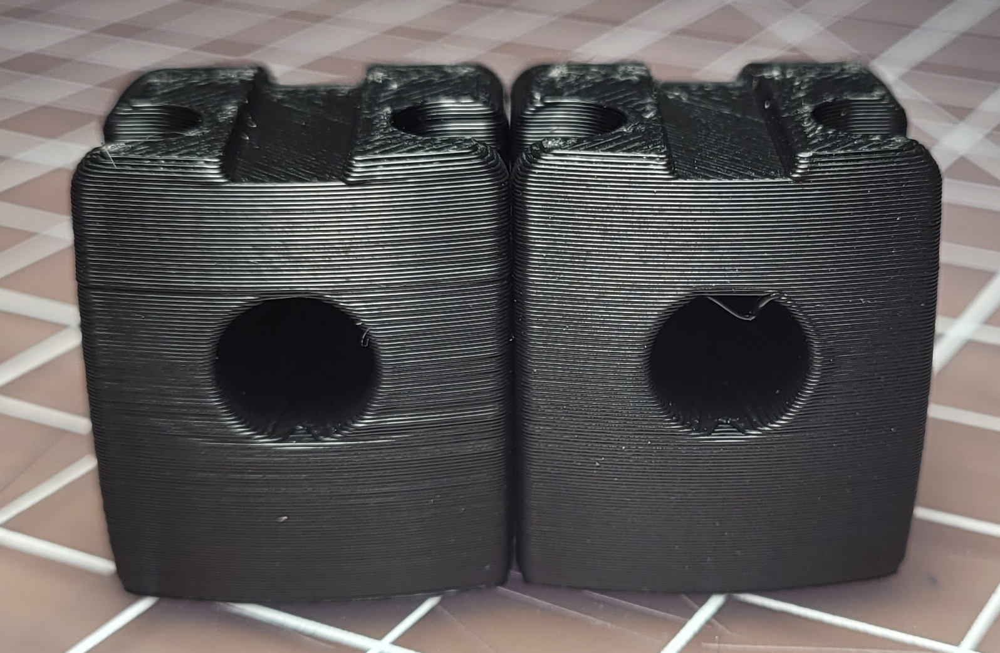](./images/extrusion_patterns/external_first_2.png){:target="_blank"} 

- :warning: With external perimeters first, it's especially important to ensure that you have a good [:page_facing_up: stepover](../stepover.md) for your overhangs. It's less resistant to poor stepover.

    - External perimeters first can still negatively affect *extreme* overhangs, and occasionally cause some other oddities, so just keep it in mind when troubleshooting. It's generally okay for daily use, though.
    
    - [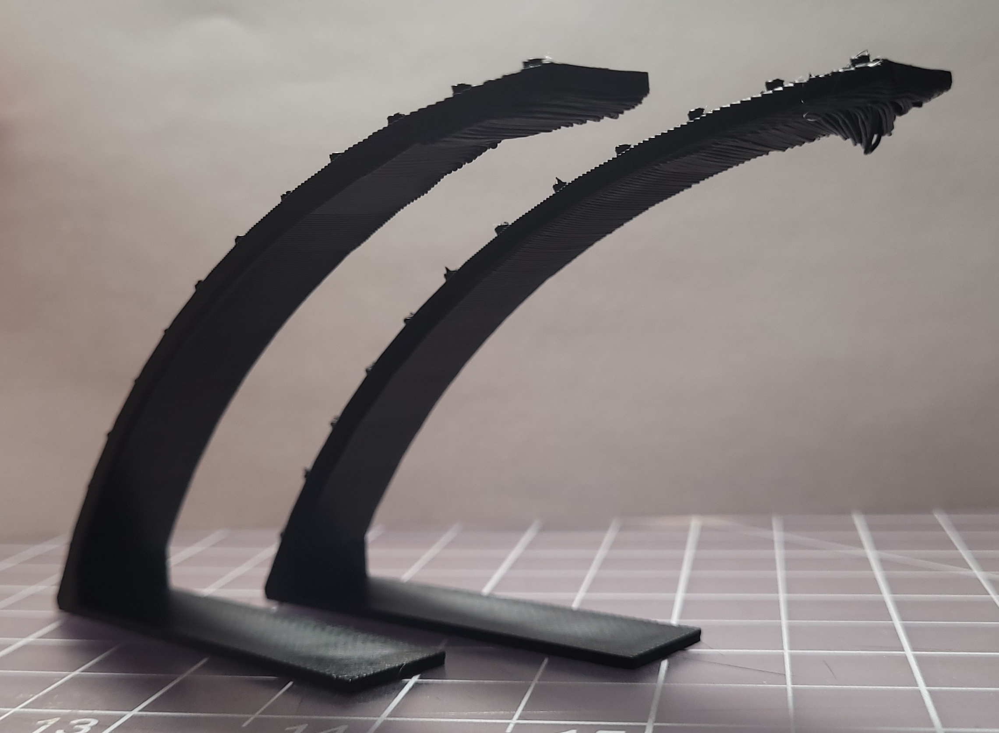](./images/bulging/external_first_3.png){:target="_blank"} 

## Extruder Backlash

**Ensure that you have some [:page_facing_up: backlash](https://gfycat.com/mealycautiouscoqui) between the motor gear and the plastic gear.**
- Gauge this with filament loaded and the spring tensioned (the backlash will reduce a bit once it is loaded).
- You **want** a tiny amount of backlash (but as little as possible - this is just to make sure that you haven't over tensioned the gears. Too much tension can cause accelerated wear.) 
- Too much backlash can cause issues with pressure advance and retractions.
- You may need to re-tune PA (and sometimes esteps) after adjusting this.
- This is not adjustable on some extruders like the Orbiter (doesn't have the same backlash issues anyway in my experience!)
- Adjusting backlash can help considerably with these issues, but is not always guaranteed to fix it.

### Too Little Backlash
- Repeating patterns in extrusion (see above)
- Accelerated wear and damage of the plastic gear, further contributing to repeating patterns in extrusion.
    - This can cause permanent extrusion consistency issues until replacement. Check the spaces between the gear teeth. This gear is damaged:

    - [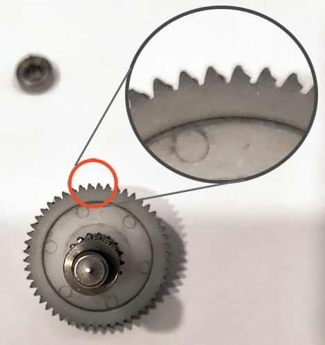](./images/extrusion_patterns/bmg-tooth-damage.png){:target="_blank"}

### Too Much Backlash
- Repeating patterns in extrusion (see above)
- Clacking noises during retraction and pressure advance moves
- Pressure advance consistency issues (such as causing ideal PA values to differ for accelerations and decelerations).
- Stringing

## Other Factors
- Try adjusting your filament tension screw/thumbscrew (if equipped).
- Poor quality or misaligned extruder parts can contribute to these issues.
    - For BMG parts, Bondtech or Trianglelab are best.
    - Any [:page_facing_up: eccentricity](./images/extrusion_patterns/eccentricity.png) or [:page_facing_up: misalignment](./images/extrusion_patterns/filament_gear_misalignment.png) in the extruder gears will contribute to these patterns.
        - [:page_facing_up: Here](https://youtu.be/c6JmCdovE0U?t=431) is an excellent video showing this effect, and the source for the linked images.
        - [:page_facing_up: Weaslus#8108](https://discordapp.com/users/195286997240250368/) is working on a testing methodology to help narrow down causes. See his[:page_facing_up: GitHub page](https://github.com/weaslus/Inconsistent_Extrusion_Diagnostics) on the subject.
            - :warning: **This methodology is still in testing.** :warning: 
            - He is looking for feedback. Please direct any feedback to the **#off_topic_theorycrafting** channel in the [:page_facing_up: Voron Discord Server](https://discord.com/invite/voron) and tag him. 
- Anecdotally, Galileo/Orbiter seem to be less likely to have these extrusion patterns in my experience. Bowden systems are also less prone, presumably due to the bowden springiness acting as a buffer.

## Clockwork 2
These screenshots are directly from the manual.

- [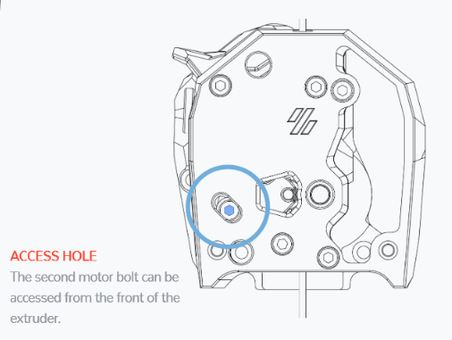](./images/extrusion_patterns/cw2-adjust-1.png){:target="_blank"} 
- [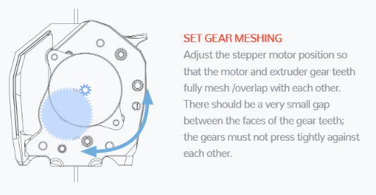](./images/extrusion_patterns/cw2-adjust-2.png){:target="_blank"} 
- [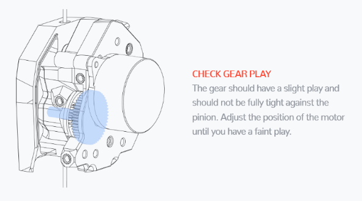](./images/extrusion_patterns/cw2-adjust-3.png){:target="_blank"} 
- [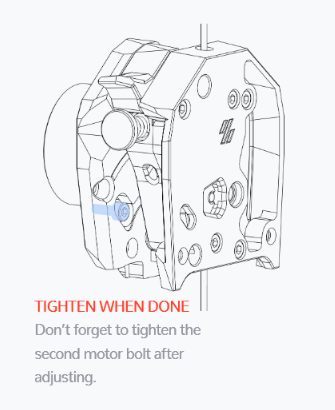](./images/extrusion_patterns/cw2-adjust-4.png){:target="_blank"}

## Clockwork 1
This is adjusted by moving the motor itself up and down.\
The motor plate has 3 slotted screw holes to allow for adjustment:

[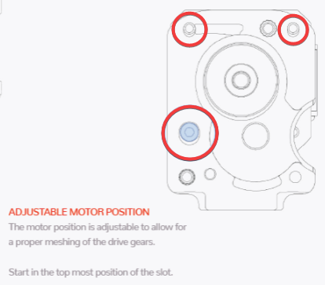](./images/extrusion_patterns/Backlash-Adjust.png){:target="_blank"}

- The top two screws are easily reachable.
- The bottom left screw can be reached by opening the filament latch fully and using a ball-end hex driver.

## Mini Afterburner

I don't have a Mini Afterburner so I can't give an exact process for tweaking it. I believe it also has some slotted screw holes to allow for adjustment.

I have heard that loosening and threadlocking these screws may also help with its extrusion consistency:
- [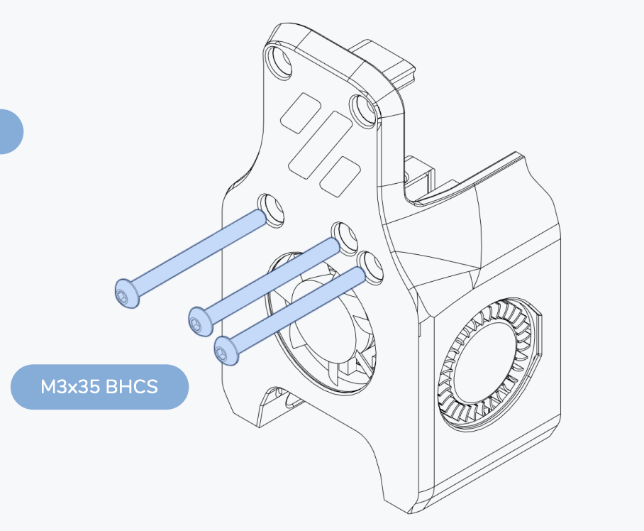](./images/extrusion_patterns/Backlash-MiniAB-Screws.png){:target="_blank"}

