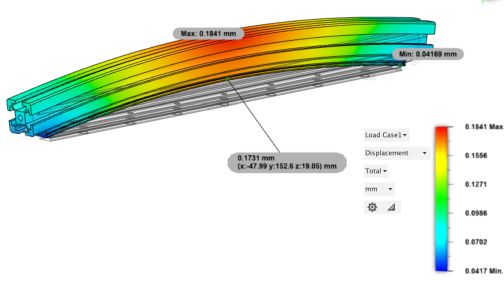

 
# This page has moved! Please visit [the new location](https://ellis3dp.com/Print-Tuning-Guide/articles/troubleshooting/first_layer_squish_consistency_issues/thermal_drift.html).

# Thermal Drift
---

{: .compat}
:dizzy: This page is tailored to **Voron** printers.

---

(This can affect first layer consistency *and* z offset consistency between prints.)

- **:warning: On larger enclosed printers (i.e. V2 & Trident), ensure that you are heat soaking for *at least* an hour.*** 
    - **This is not necessary when printing unenclosed. If you have a thick bed, or your bed is mounted to frame extrusions, give it 5-10 minutes.*

Z will drift upwards as the frame and gantry thermally expand with chamber heat. This can cause your first layer squish to vary between prints, and can even cause your first layer to drift up *as it prints*.

Look at the graph below. The red line represents Z offset drift over time as the frame comes up to temperature (this is on a V2.).

It's not ideal, but just get into a routine - start the heat soak from your phone when you wake up in the morning.

There *are* ways around this - specifically by using gantry backers in combination with software-based frame thermal expansion compensation. This is also commonly combined with auto z calibration (or auto baby-stepping, as I prefer to call it) to allow for an accurate starting offset at any temperature.

- Below are some links.\
**:warning: This guide is NOT a tutorial about any of the below, so you're on your own here!**
    - **Backers**
        - [The science behind backers](https://github.com/VoronDesign/VoronUsers/tree/master/printer_mods/whoppingpochard/extrusion_backers)
            - Featuring such smash hits as 
                - "Why is thermal expansion such a dick?", and
                - "Why does my mesh look like a taco?"\
            
        - [My preferred backers (MGN9s)](https://github.com/VoronDesign/VoronUsers/tree/master/printer_mods/bythorsthunder/MGN9_Backers)
        - [Titanium backers](https://www.fabreeko.com/products/v2-4-trident-titanium-extrusion-backers?variant=40722087968966)
            - These are available from multiple other stores.
        - [Steel backers](https://sendcutsend.com)
            - A set of 3 backers in 1.9 mm steel can be custom ordered at SendCutSend for somewhere in the neighborhood of $10 (presuming you've met their minimum order of $29). See first link.
    - **Mechanical Probes / Auto Baby-stepping**\
    :warning: **Auto baby-stepping is some work to set up, and builds off of other knowledge (standard Z endstop offset adjustment / probe offset adjustment) that you should ideally become familiar with first.**
        - [Klicky probe](https://github.com/jlas1/Klicky-Probe)
        - [Euclid probe](https://euclidprobe.github.io)
        - [Auto baby-stepping](https://github.com/protoloft/klipper_z_calibration)
    - **Frame Expansion Compensation (z_thermal_adjust)**\
    :warning: **Thermal compensation is an advanced feature which requires some know-how, Python script tinkering, and inference.**
        - [Klipper z_thermal_adjust config reference](https://www.klipper3d.org/Config_Reference.html#z_thermal_adjust)
        - [Klipper set_z_thermal_adjust command reference](https://www.klipper3d.org/G-Codes.html#set_z_thermal_adjust)
        - [Determining your temperature coefficient](https://github.com/alchemyEngine/measure_thermal_behavior)
            - This is currently the only way to measure your coefficient. 
            - Forewarning: In the creator's own words, it's "jank".
            - For script related errors, alch3my has asked that you [:page_facing_up: contact him on Discord](https://discordapp.com/users/655029671829962752).