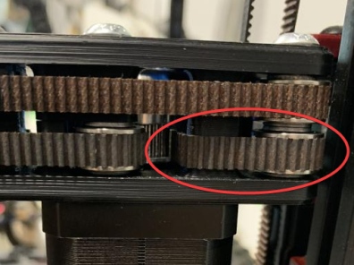

 
# This page has moved! Please visit [the new location](https://ellis3dp.com/Print-Tuning-Guide/articles/troubleshooting/layer_shifting.html).

# Layer Shifting
{: .no_toc }

---

{: .compat}
:dizzy: This page is compatible with **all printers**, but some notes are specific to Voron printers.

---

  

    Table of contents
  

  {: .text-delta }
- TOC
{:toc}

---

{:target="_blank"}

{:target="_blank"}
## Mechanical
- Check your belt tension. When tensioning belts by feel, most people tend to make them way too tight. Too loose can also cause tooth slipping. 
    - For Vorons, see [:page_facing_up:here](https://docs.vorondesign.com/tuning/secondary_printer_tuning.html#belt-tension). I use 120hz for X/Y and 140hz for Z (over a 15cm span of belt).
    - 120hz (again, over a **15cm span of belt**) would likely also work on other printers, but I can't say for sure.
- Try using z lift (z hop), and [:page_facing_up: check your prints for signs of overheating](../cooling_and_layer_times.md). Print curling can cause nozzle strikes and subsequent layer shifts.
    - Around 0.2-0.3mm of z lift is usually enough. Too much can cause stringing.
- Ensure that you have good quality motors. 
    - Some off-brand motors (notably Oukeda*) have a history of poor quality. You may have to run lower speeds/accels and sometimes higher currents with off-brand motors.

        -  \* *Some Oukeda motors have been labeled as "Oukedj". They can't even spell their own brand name correctly.*
- Identify which axis the shifting is occuring in by inspecting your prints. \
The circles represent a printed object shifting in the direction of the arrows.

    - **CoreXY:**
        - When looking at your printer from the front, the B motor is on the left, and A is on the right. \
        ....It goes "BBBAA" like a sheep. Sounds silly, but that's how I remember it.
        - {:target="_blank"}{:target="_blank"}

    - **Cartesian:**
        - {:target="_blank"}{:target="_blank"}

- With the motors powered off: 
    - Move the toolhead by hand in each axis. Feel if one axis has more resistance than the other.
    - Also pull on each belt and compare the resistance.
- Once you have indentified the problem axis, go through and check that entire axis/belt path. Find the source(s) of the mechanical resistance.
- Make sure your belts are routed correctly.
    - Check for belt dust. This can indicate rubbing or misrouting.
    - A common mistake is to accidentally route the belts around the plastic post in the back of the A/B drives:
        - {:target="_blank"}
    - Ensure that the belts are not rubbing/riding up against any of the bearing flanges.
        - It's normal that they may not run perfectly centered. It's usually only an issue if they are rubbing.
- Loosen the belts, pull the belts over the side of each bearing stack, and ensure that they all spin freely by hand.
- Try rotating the motors by hand. Sometimes a bad motor will be the cause of the resistance.

## Electrical
- ### Motor Currents
    - Check your motor currents. Ensure that the `run_current` configured for your A/B/X/Y motors are correct. See [:page_facing_up: this article.](../determining_motor_currents.md)
- ### Wiring
    - [:page_facing_up: Check your crimps.](../troubleshooting/crimps.md)
    - Ensure that you are using high strand count wire, of 24awg (0.25 mm²) or thicker.
        - Low strand count wires / solid core wire will break in the drag chains with repeated bending. These breaks usually will not be visible, as they occur inside of the insulation.
        - You should always run your own wire through the drag chains. Don't trust the wire that came with anything.
    - Ensure that your wiring is not damaged, shorted, or caught under any screw heads. Check continuity.
- ### Thermal
    - Ensure that your stepper drivers sticks are getting adequate cooling. 
        - Ensure that they have heatsinks installed on them.
        - Ensure that they have adequate airflow*. 
            - \* *The v0 does not spec stepper driver cooling by default. This is usually fine, as it runs lower motor currents. It may be worth trying, though, if you are having issues (especially if you are running higher motor currents.)*

## Speeds and Accelerations
Sometimes layer shifting can occur because you are simply asking too much of your steppers. You may be running accelerations or speeds that are too much for your motors to handle. 

- Try turning accelerations down, especially if you are not using input shaper.
    - Input shaper also allows for higher accelerations, not just less ringing.
- Disable stealthchop.
- Ensure that you are not running your microstepping too high.
- Check [:page_facing_up: this article](../determining_max_speeds_accels.md) to test.
    - Try running the `TEST_SPEED` macro without any arguments to test your current maximums.
- You can try increasing motor currents. Don't exceed the maximums described in [:page_facing_up: this article](../determining_motor_currents.md). 
    - Ensure that you have proper stepper driver cooling before doing this.
