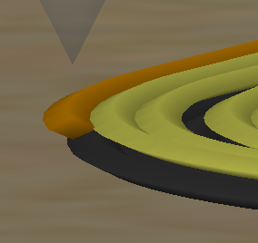

 
# This guide has moved! Please visit [the new site](https://ellis3dp.com/Print-Tuning-Guide/).

# Perimeter Separation
{: .no_toc }

---

{: .compat}
:dizzy: This page is compatible with all printers.

---

  

    Table of contents
  

  {: .text-delta }
- TOC
{:toc}

---

Adapted from [:page_facing_up: **bythorsthunder**](https://discordapp.com/users/830305218679144509)'s Discord pin. Thanks!

## If It Happens Primarily on Lower Layers

- Ensure you have enough first layer squish. See [:page_facing_up: here.](../first_layer_squish.md) 
- Check your elephant's foot / first layer compensation settings. 
    - Reduce the amount, disable it, or fade it (SS only).
    - Having this set too high (especially when combined with bottom chamfers) can cause perimeters to **print over nothing.**
        - **Too high:**\
        
        - **Off:**\
        
    - **SuperSlicer:** "XY first layer compensation" (`first_layer_size_compensation`)
        - You can also increase `first_layer_size_compensation_layers`, which gradually fades the compensation out over X number of layers.
    - **Prusa Slicer:** "Elephant foot compensation" (`elefant_foot_compensation` - yes it's misspelled)
    - **Cura:** "Initial layer horizontal expansion"

## If It Happens Everywhere
- Make sure your external perimeter line width is wide enough. 
    - \* *Unless you are printing Voron parts - they are designed for 0.4mm external perimeter widths.*
    - See [:page_facing_up: Stepover](../stepover.md) for a link to a great visualization by Maker's Muse. A good stepover can greatly help with giving your perimeters more surface area to grab onto each other.
    - **Especially** if you are using a layer height greater than 50% of your nozzle diameter. 100% line widths do not work well when exceeding 50% layer height.
        - For example (with a 0.4m nozzle), imagine an extrusion line of 0.3mm height and 0.4mm width. You're basically printing sausages! (Again, see the stepover link above)
- Verify your extrusion multiplier. There should be no gaps or holes in top solid surfaces. See [:page_facing_up: here](../extrusion_multiplier.md).
- Try decreasing your perimeter speed.  
    - If it only affects holes, you can slow them down in PS/SS by lowering `small_perimeter_speed`.
        - In SS, you can configure small perimeter size thresholds using `small_perimeter_min_length`/`small_perimeter_max_length`. 
    - Use the speed preview to ensure that it's activating where you want it to.
- Try increasing your hotend temperature. This helps with layer bonding strength.
    - High speed printing often needs a temperature bump. ABS is usually in the 240-255 range.
- Make sure you are not printing external perimeters first.
