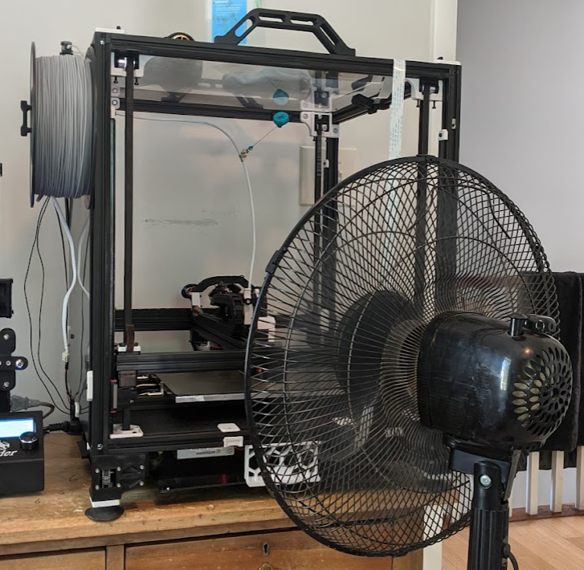

 
# This guide has moved! Please visit [the new site](https://ellis3dp.com/Print-Tuning-Guide/).

# PLA is Overheating
---
:dizzy: This page is compatible with **all printers.**

---
- Open the front door at minimum. Or take off all the side panels.
- If you are using Afterburner, try [:page_facing_up: AB-BN](https://github.com/VoronDesign/VoronUsers/tree/master/printer_mods/Badnoob/AB-BN) or another cooling mod, or upgrade to Stealthburner.
- Point a fan at it.
    - Don't go too crazy, or your bed heater might not be able to keep up.
     
- You can also try printing with the bed heater turned off.

