 
# This guide has moved! Please visit [the new site](https://ellis3dp.com/Print-Tuning-Guide/).

# Small Infill Areas Look Overextruded
---
:dizzy: This page is compatible with **all printers.**

---

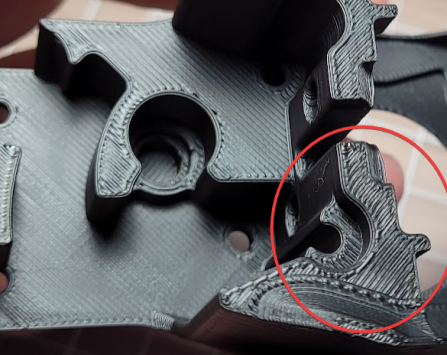 

**Some amount of this is unavoidable and is totally normal.**\
But, there are some things that *may* help a bit:
- Use single top perimeters (SuperSlicer). This simply makes these infill areas a bit larger.
- Try reducing your pressure advance smooth time (I use 0.02).
    - Direct drive can handle lower smooth times than bowden. Going too low will cause extruder skipping during PA movements.
        - Run the PA pattern test afterwards to make sure you haven't introduced any skipping.
    - **There seem to be diminishing returns here**, at least in my testing. There's no need to tune this down as low as physically possible.
- Try reducing top infill speeds and accelerations.
    - Again, there are diminishing returns here. On my printer, I stop seeing noticeable improvements below around 2k acceleration. Your mileage may vary.
- Ensure that your extruder gears don't have too much [:page_facing_up: backlash](https://gfycat.com/mealycautiouscoqui). 
    - You **want** a tiny amount of backlash (but as little as possible - this is just to make sure that you haven't over tensioned the gears. Too much tension can cause [:page_facing_up: extrusion patterns](../troubleshooting/extrusion_patterns.md) and accelerated wear.) 
    - Too much backlash can cause issues with pressure advance and retractions.
    - You may need to re-tune PA (and sometimes esteps) after adjusting this.
    - This is not adjustable on some extruders like the Orbiter (doesn't have the same backlash issues anyway in my experience!)
- Sometimes you can change your infill angle to avoid short infill lines, but this is highly geometry dependent.
    - Concentric top infill patterns can help with some STLs, but again, it's highly geometry dependent. (And the aesthetics are love-it-or-hate-it).

## "Not Connected" Top Infill (SuperSlicer)
I find that setting top infill to "not connected"  makes a noticeable improvement.\
This is default behavior in Cura, and is not available in Prusa Slicer.

- 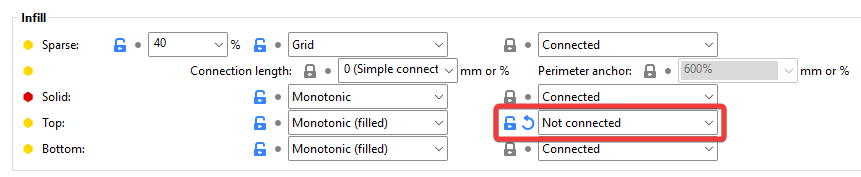
- :warning: This setting overshoots perimeters more than "connected" does. If you have raised your infill/perimeters encroachment (overlap), **consider setting it back to default** (for now. You can fine-tune later).
    - Overshoot
        - 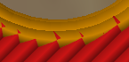
    - Reset infill/perimeter encroachment
        - 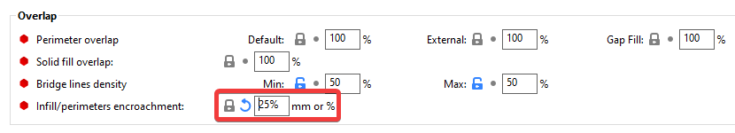
        - **:warning: Don't set it too low, however, as it also affects sparse infill**. A low value can cause sparse infill to become detached from the perimeters:
            - 
### What it Does

- 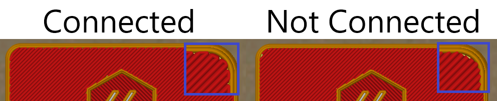

## When assessing extrusion multiplier, *always* look at the widest areas in a given print.
(Excerpt from the [:page_facing_up: Extrusion Multiplier](../extrusion_multiplier.md) article)
- You want to tune your extrusion multiplier for the areas where your extrusion system has had a chance to equalize pressure and coast at a constant flow rate.
- In this example, I would primarily be looking at the circled area. 
- While some of this print looks overextruded, I think the overall EM is actually pretty good.
    - 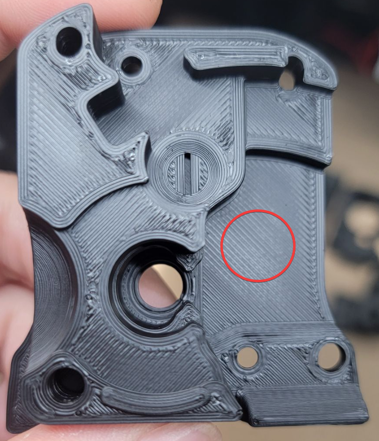 

---
# The Magic Bullet?

---
### :warning: This section is advanced reading.:warning:
**These techniques have downsides that are only addressable by an EXPERIMENTAL custom SuperSlicer build.**

This is only here to share some interesting findings / what I'm tinkering with.

---

This setting has yielded the largest improvement of all for me. Your mileage may vary of course, but I'm curious to hear your experiences with it.

**In combination with** the "not connected" top infill setting described above, you can set "minimum travel after retraction" to 0.\
This will cause a retraction at every direction change. 

:warning: **This is very slow with Z hop, however**. These successive Z hops can also be **quite loud** on many printers.

- Setting
    - 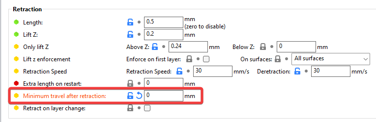

- Each purple spot is a retraction.
    - 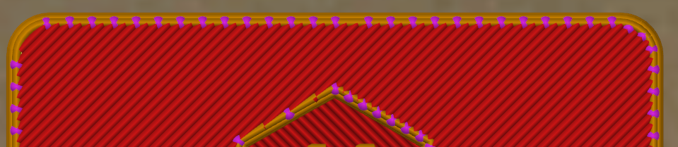

- Excessive Z hopping.
    - 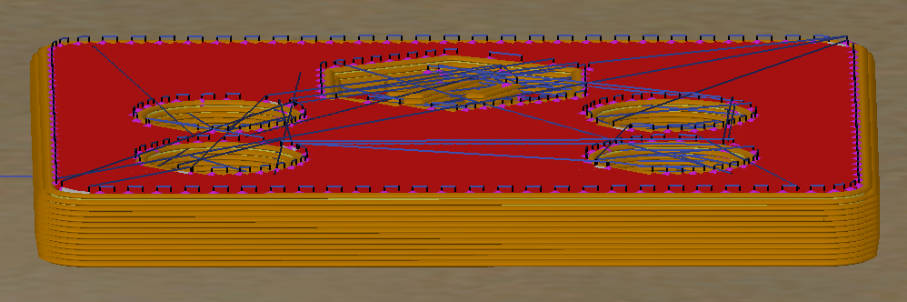

### Making it Faster (Still With Some Downsides)
- You can turn Z hop off for *only* the top layer, like so:

    - 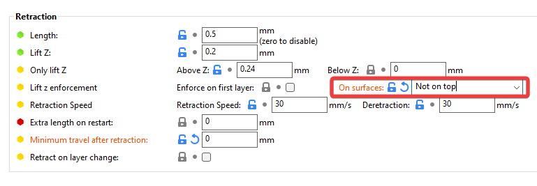

    - Result
        - 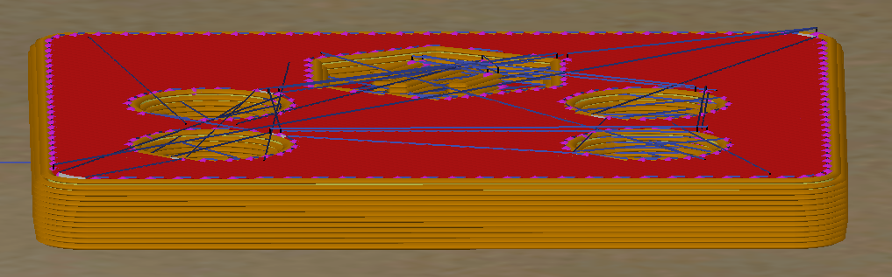

- This is considerably faster and quieter, however it too carries some downsides:
- :warning: **Downsides**
    - It will still be slower than standard, but not nearly as much as with z-hop. The top layers are something like 30% slower, if I had to guess.
    - Disabling Z hop on the top layer carries some risk of:
        - Minor surface scarring during travels
        - Knocking over parts if you have excessive curling

### Solid Infill Considerations
- Further small improvements may be made by also setting solid infill to "not connected".
- However, :warning: make sure you also check "only retract when crossing perimeters".

- 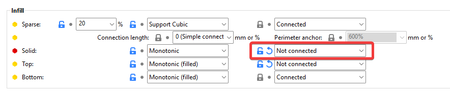

- 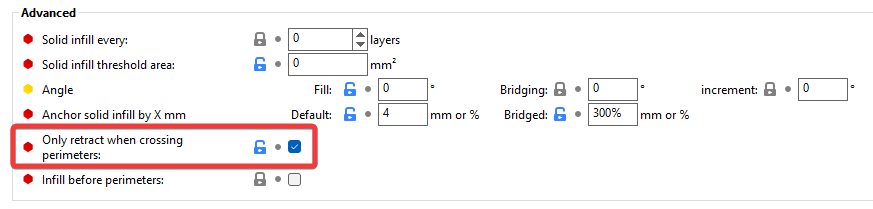

- :warning: Otherwise, these additional retractions (and the slowdown!) will occur on **ALL solid layers, not just the top.**

    - 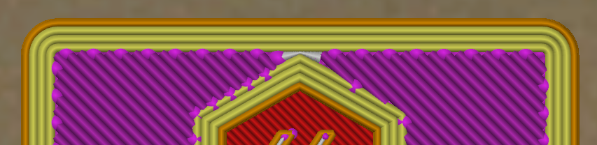

### Demonstration

All samples with "not connected" are shown with [:pushpin: top retractions](#the-magic-bullet) **enabled**.

Lower overlaps show more small improvements, but also start to create pinholes.

In my case, I decided to stick with NC/NC/25%. Still a nice improvement.\
Anything lower would create [:page_facing_up: pinholes](../infill_perimeter_overlap.md), and as mentioned in [:pushpin: this section](#the-magic-bullet), too low would start to disconnect the infill.

- 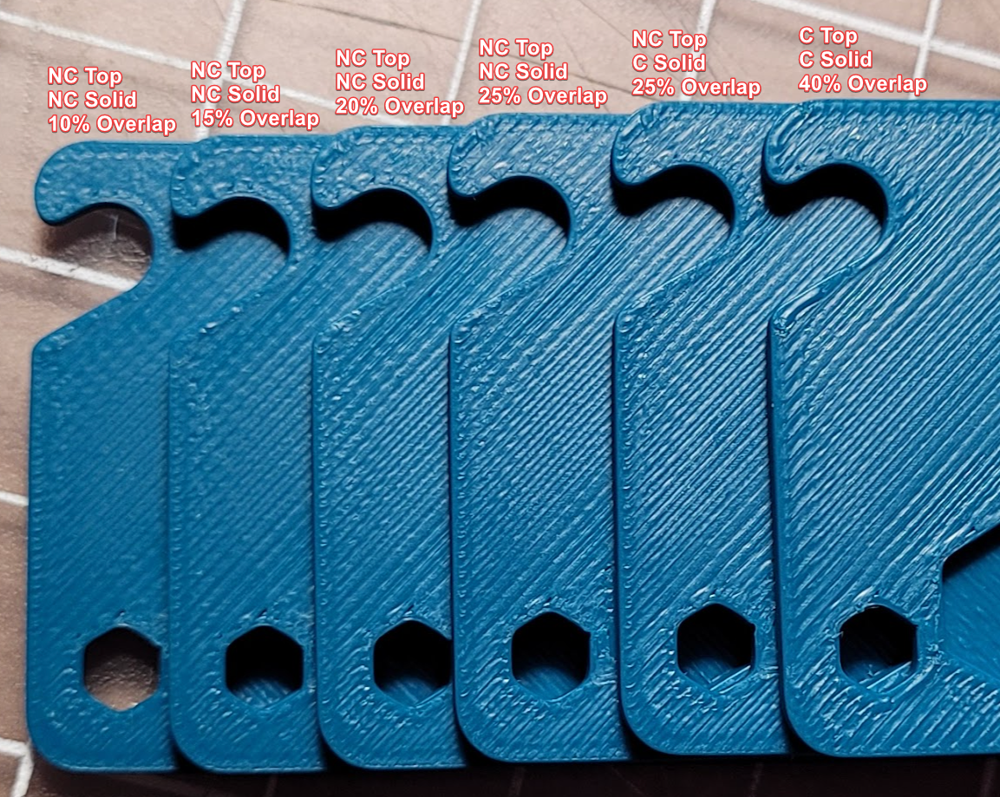

---
### The Experimental SuperSlicer build

- No warranty or support provided! Most of the Mac builds are currently not working either. These are a **work in progress.**
- Builds: https://github.com/julianschill/SuperSlicer/actions
    - `nightly-dev` is 2.5.59 and `rc` is 2.4.58.
    - Most of the Mac builds are not working.

- This is the new setting:
    - This (in the right combination) should address the downsides mentioned above.

    - 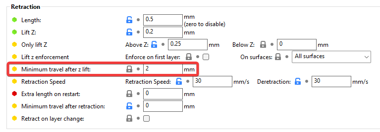
    - **This setting will likely MOVE and be reworked at some point, which may cause future incompatibilities with profiles you save using this.** 
        - You should use a separate appdata folder with experimental SuperSlicer builds by having a separate shortcut using `<path to SS exe> --datadir <separate appdata path>`.

    - The winning combination is:
        - Top & solid infill: "not connected"
        - Encroachment: ~25%
        - "Minimum travel after z lift" (The experimental setting): 2 (default)
        - "Minimum travel after retraction": 0
        - "Only retract when crossing perimeters": Enabled.

