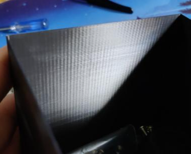

# VFAs (Vertical Fine Artifacts)
## Repeating VFAs With ~2mm Spacing
If the marks are about 2mm apart, that usually means that it's coming from **belt/pulley/idler teeth** somewhere. 

Ensure that these artifacts are **still perfectly vertical** even when printing irregularly shaped objects like the *"rectangular 2 recommended.stl"* object [:page_facing_up: here](https://mihaidesigns.com/pages/inconsistent-extrusion-test). \
If they are not vertical (i.e. wood grain, diagonal, etc), see [:page_facing_up: this article](http://localhost:4000/Print-Tuning-Guide/articles/troubleshooting/extrusion_patterns.html) instead.

Print a square object at 45 degrees and see if it appears A, B, or both. This will tell you which axis/axes to look at.



- Your belts may be too tight. [:page_facing_up: Your A/B belts should be about 110Hz over a 150mm length.](https://docs.vorondesign.com/tuning/secondary_printer_tuning.html#belt-tension)
    - Don't miss the video link in page linked above. 
    - Apps:
        - Android: Gates Carbon Drive (select "motorcyle" option) or Spectroid.
        - iPhone: Gates Carbon Drive (select "motorcyle" option) or Sound Spectrum Analysis.
- Your belts may be rubbing a flange somewhere.
    - It's nearly impossible to have them all running dead-center, but you can look around for belt wear and belt dust to find where it may be rubbing too much.
    - Ensure your motor pulleys are not positioned too high or too low.
    - For V2, follow my [:page_facing_up: V2 gantry squaring](http://localhost:4000/Print-Tuning-Guide/articles/voron_v2_gantry_squaring.html) instructions. A poorly squared gantry can be the root cause of a lot of alignment issues.
    - On all CoreXY printers: [:page_facing_up: de-rack](https://www.youtube.com/watch?v=cOn6u9kXvy0). 
        - For V2, this is part of the gantry squaring instructions above. Please follow those first/instead.
- Ensure that your pulleys, idlers, and extruder gears/idlers are all clean. Debris can accumulate and compress in the teeth. 
- You may have poor quality belts. **Only use genuine Gates brand belts.**
- You may have poor quality motor pulleys and idlers.
    - I, and a few others, have had improvements from switching to authentic Gates brand pulleys and idlers. They are more expensive, but are worth it in my opinion. 
        - On v2 at least, you only need them for A/B motors and X/Y idlers. Don't waste the money on Z.
        - US source:
            - :page_facing_up: https://www.filastruder.com/products/gates-2gt-pulley?variant=15443750518855
            - :page_facing_up: https://www.filastruder.com/products/gates-2gt-idler?variant=15443755728967
    - For idlers, there is some debate over toothed vs smooth. My personal opinion is:
        - Gates toothed idlers > smooth idlers (2x F695 bearings) > china toothed idlers.
## Repeating VFAs With Non-2mm Spacing

Try printing the test objects [:page_facing_up: here](https://mihaidesigns.com/pages/inconsistent-extrusion-test).

Ensure that the artifacts are *always vertical or diagonal, regardless of part geometry*. These patterns can be subtle (lumps) or sharp (lines).

If the pattern looks like "wood grain", or any of the example photos in that link, see [:page_facing_up: this article](http://localhost:4000/Print-Tuning-Guide/articles/troubleshooting/extrusion_patterns.html) instead.

- **Ensure that your A/B pulleys and XY joint idlers are all clean.** Debris can accumulate and compress between the teeth.
- You may have a bad/poor quality pulley or toothed idler.
    - See above section for more info / links.
- You may have a bad/poor quality bearing.
    - Loosen the A/B belts, pull the belt over the side of each bearing flange, and turn each bearing by running it against your finger. Make sure the whole rotation feels smooth.
- You may have poor quality belts. **Only use genuine Gates brand belts.**
- You may have a bad/poor quality linear rail.

### Narrowing it Down (CoreXY)
Print two wide square objects, one in normal orientation, and one at 45 degrees. \
Inspect the object to see which axes the artifacts appear most prominent in.

*(components in each section are in order of likelihood)*
- Artifacts are equally prominent in all directions:
    - **A *and* B** motor pulleys
    - **X *and* Y** linear rails
    - **A *and* B** belts
    - **A *and* B** motors
- Artifacts are most prominent in in A:
    - Bearings in **A** belt path
    - **A** motor pulley
    - **A** belt
    - **A** motor
- Artifacts are most prominent in in B:
    - Bearings in **B** belt path
    - **B** motor pulley
    - **B** belt
    - **B** motor
- Artifacts are most prominent in in X:
    - **XY** joint idlers
    - **X** linear rails(s)
- Artifacts are most prominent in in Y:
    - **Y** linear rails
- Artifacts are most prominent in in A/B/X, but not Y:
    - **XY** joint idlers
    - **X** linear rail(s)
- Artifacts are most prominent in in A/B/Y, but not X:
    - **Y** linear rails
- Artifacts are most prominent in in X/Y, but not A/B:
    - **A *and* B** motors
        - Certain motor models have been found to cause this when both are operating at the same time (i.e. X/Y moves)
        - The following motor settings are [:page_facing_up: passed around on the Voron Discord](https://discord.com/channels/460117602945990666/696930677161197640/925934388703793192), and apparently can help in some cases (particularly with certain LDO motors on Voron V0). It may also help in other cases, worth a try.


```
# Set the below settings for both X AND Y motors, **in addition** to your current settings.

[stepper_x]
microsteps: 32

[tmc2209 stepper_x]
interpolate: false
stealthchop_threshold: 999999  # I'm not sure on this one. I tend to advise against using stealthchop (set to 0). Try both.
driver_TBL: 2
driver_TOFF: 2
driver_HEND: 1
driver_HSTRT: 4
driver_PWM_LIM: 8 
driver_PWM_GRAD: 8
driver_PWM_FREQ: 1
driver_PWM_REG: 4
```


