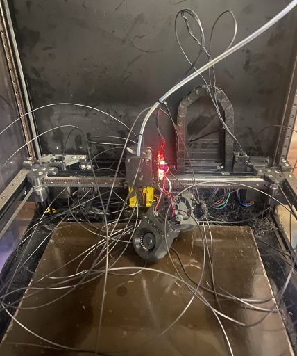
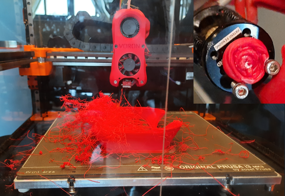
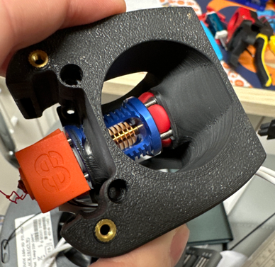
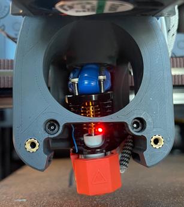

 
# This guide has moved! Please visit [the new site](https://andrewellis93.github.io/Print-Tuning-Guide/).

# Hotend Fan RPM Monitoring
---
:dizzy: Macros are compatible with **Klipper only**.

---

This macro polls your hotend fan RPM and executes custom gcode if a fan failure is detected. 

**Macro located [:page_facing_up: here](https://raw.githubusercontent.com/AndrewEllis93/Print-Tuning-Guide/main/macros/fan_tach_monitor.cfg).** Written by [:page_facing_up: alch3my](https://discordapp.com/users/655029671829962752). 
### :warning: **I highly recommend implementing this. It can save your printer from some pretty catastrophic failures.**

\
 \

## Info

**This macro set requires a 3-wire fan with tachometer_pin configured.** 
- If yours is a two-wire fan, I would still recommend replacing it.
- For a 4010 fan, I recommend the Sunon `MF40101VX-1000U-G99` or the Delta `AFB0412VHA-DU48`. 
    - Note that these are both **12V** fans. I tend to prefer 12V fans because there is much more choice.
        - On boards with a selection jumper, make sure to set your fan output to 12V. 
        - Otherwise, connect the positive wire to a 12V supply or buck converter. 
            - The negative lead should still go to the fan header's control pin.
    - Good 24V alternatives are the NMB `04010SS-24N-AT-00` and the Orion `OD4010-24HB01A`.
    - These are far from the only fans available. If they're out of stock, use Digikey's search for 3-wire fans. 
        - Preferably avoid sleeve bearings - they work fine, but they're [:page_facing_up: less suited to elevated (chamber) temperatures](https://www.newark.com/pdfs/techarticles/mro/ballVsSleeve.pdf), and I've personally had more fail on me.
        - [:page_facing_up: DigiKey 24v search](https://www.digikey.com/en/products/filter/dc-brushless-fans-bldc/217?s=N4IgjCBcpgLFoDGUBmBDANgZwKYBoQB7KAbXAFZyAmADggF0CAHAFyhAGUWAnASwDsA5iAC%2BBWADYEIZJHTZ8RUiFgAGCQE5yAdhDj1WmiEYhW7LnyGiC5I9BmpMuAsUhkAzGG01VEfZ7AjEzNITh4BYTFwDXdpWXlnJTcQCVhvVT0U8ncqckyJHSpdAgkJVVgqY2Y2UIsI6xBbDTjHBRdlNNVc4vBNGlgjAjA%2BtMzhjQ0qeCHNScHeiapYgipVdxoCzNX3GJ7tjVg-EH33POCasMtIqKl7XgATdjANI5DL%2BoIWAE8mHHZ7rDIEQiIA)
        - [:page_facing_up: DigiKey 12v search](https://www.digikey.com/en/products/filter/dc-brushless-fans-bldc/217?s=N4IgjCBcpgLFoDGUBmBDANgZwKYBoQB7KAbRAA4B2cgNnJAF0CAHAFyhAGVWAnASwB2AcxABfArBoIQySOmz4ipELAAMNAJwBWSiAnrt9JiDYdu-YWIJb60Gaky4CxSGQDMYaqogE3WmpSUbnoqqh5g9BJgGgBMGvDGppBcvIIi4uAawXay8k5KriA0sF4hNFpuMVplOjG6BDQ0qrAxjCzsyeZpViA2GtK5joouZCWqVfXgmuSwkVMaM5NgmrHwBMsasXMbscEEMWG01fthWZMHbvE%2BIBdZ1YkdKRbpGVJ2fAAmHNHXSU-dBFYAE9mDgOB8sMhRKIgA)

- I recommend using [:pushpin: this guide's pause/resume macros](./pause_resume.md) with this. They will automatically turn the hotend off for a pause and automatically return it to temperature for resume. 
## Setup
**1.** Connect your hotend fan's RPM/tach wire to a spare endstop port.
- On the input pin, not the 5V or gnd pins. Refer to your board's pinout diagrams.

**2.** Set `tachometer_pin` in your `[heater_fan hotend_fan]` section.
- Don't forget a pullup (^) on the tach pin (example: `tachometer_pin: ^P1.29`)
    - Get your pin number from your board's pinout diagram.
- See [:page_facing_up: here](https://www.klipper3d.org/Config_Reference.html#heater_fan) for further tachometer config reference.

**3.** Place `fan_tach_monitor.cfg` in the same directory as your `printer.cfg`.

**4.** Add `[include fan_tach_monitor.cfg]` to your `printer.cfg`.

**5.** Change `min_rpm` and `max_consecutive_stops` in the `HOTEND_FAN_CHECK` macro to your desired values.

**6.** Place your desired hotend fan failure g-code in `FAN_STOPPAGE_ROUTINE`.
