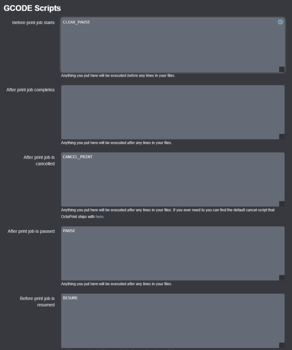



# This page has moved! Please visit [the new location](https://ellis3dp.com/Print-Tuning-Guide/articles/useful_macros/pause_resume_filament.html).



# Pause/Resume, Filament Swaps & Sensors
{: .no_toc }

---

{: .compat}
:dizzy: Macros are compatible with **Klipper only**.

{: .prereqs}
> You need `[pause_resume]` specified in your config to be able to use these.

---

<details open markdown="block">
  <summary>
    Table of contents
  </summary>
  {: .text-delta }
- TOC
{:toc}
</details>

---

## Pause / Resume

{: .attention}
> My pause/resume macros work as a pair. One will not work properly without the other.

### Features

- On pause, moves the toolhead (z hops) up by 10mm, then moves the toolhead to the front for easy loading/unloading.
  - Will not z hop if this exceeds your max Z height.
- Will not allow you to accidentally execute pause or resume twice.
- Allows you to take other actions during the pause without messing anything up.
  - You can move toolhead around during the pause, run load/unload filament macros etc. It will automatically return to its original position before resuming.
  - It also automatically restores your gcode state (absolute vs relative extrusion mode, etc), should it be changed during the pause by another macro.
- Primes the nozzle while traveling back to resume the print, wiping the excess along the way. This just results in one little string to pick off.
- Sets the idle timeout to 12 hours during the pause, and returns it to your configured value upon resume.
- Turns off your filament sensor during the pause, so it doesn't trip and run its runout gcode again while you're already paused.
- Turns off the hotend during the pause, and turns it back on for the resume.\*

  - \* **\*I highly advise keeping this functionality**, even though it can be a bit annoying at times. It's a **safety feature**. It stops your hotend from cooking all night waiting for you to come and swap filament. And with a smart filament sensor, it can even sometimes catch heat creep clogs should your hotend fan fail.\*

  - It's probably okay to leave the hotend on during a non-runout filament change (M600) if you plan to be near your printer. If you want to do that, you can duplicate the macro to M600 (rather than just having M600 as an alias for pause) and comment that part out.

Some things are commented out that rely on other macros. You can uncomment them if you choose to use those other macros.

---

*I use a [:page_facing_up: BTT Smart Filament Sensor](https://www.amazon.com/BIGTREETECH-Printer-Filament-Detection-Detector/dp/B07Z97582P), and highly recommend it, as it can catch skipping and jams, not just runouts. It has saved a *lot\* of prints for me, often due to partial nozzle clogs that are causing extruder skipping. Just **don't forget the pullup on the pin (`^`)!!\***

### Pause

If you use a filament sensor, put its name in the `SET_FILAMENT_SENSOR` command. Otherwise, comment that out.

If you want your toolhead to park somewhere other than front center, modify the X/Y coordinates in the last `G1` command.


```
[gcode_macro PAUSE]
rename_existing: BASE_PAUSE
gcode:
    # Parameters
                                                       ; z hop amount

    
        SET_GCODE_VARIABLE MACRO=RESUME VARIABLE=zhop VALUE={z}                              ; set z hop variable for reference in resume macro
        SET_GCODE_VARIABLE MACRO=RESUME VARIABLE=etemp VALUE={printer['extruder'].target}    ; set hotend temp variable for reference in resume macro

        SET_FILAMENT_SENSOR SENSOR=filament_sensor ENABLE=0                                  ; disable filament sensor
        SAVE_GCODE_STATE NAME=PAUSE                                                          ; save current print position for resume
        BASE_PAUSE                                                                           ; pause print
               ; check that zhop doesn't exceed z max
            G91                                                                              ; relative positioning
            G1 Z{z} F900                                                                     ; raise Z up by z hop amount
        
            { action_respond_info("Pause zhop exceeds maximum Z height.") }                  ; if z max is exceeded, show message and set zhop value for resume to 0
            SET_GCODE_VARIABLE MACRO=RESUME VARIABLE=zhop VALUE=0
        
        G90                                                                                  ; absolute positioning
        G1 X{printer.toolhead.axis_maximum.x/2} Y{printer.toolhead.axis_minimum.y+5} F6000   ; park toolhead at front center
        SAVE_GCODE_STATE NAME=PAUSEPARK                                                      ; save parked position in case toolhead is moved during the pause (otherwise the return zhop can error)
        M104 S0                                                                              ; turn off hotend
        SET_IDLE_TIMEOUT TIMEOUT=43200                                                       ; set timeout to 12 hours
    
```



### Resume

{: .warning}
> This resume macro will move **directly** back to its previous position.\
> If using "complete individual objects" or "one at a time" in your slicer, **ensure that the objects are printed from back to front on the build plate to avoid collisions on the return.**

If you use a filament sensor, put its name in the `SET_FILAMENT_SENSOR` command. Otherwise, comment that out.


```
[gcode_macro RESUME]
rename_existing: BASE_RESUME
variable_zhop: 0
variable_etemp: 0
gcode:
    # Parameters
                                              ; hotend prime amount (in mm)

    
        SET_FILAMENT_SENSOR SENSOR=filament_sensor ENABLE=1                          ; enable filament sensor
        #INITIAL_RGB                                                                    ; reset LCD color
        SET_IDLE_TIMEOUT TIMEOUT={printer.configfile.settings.idle_timeout.timeout}  ; set timeout back to configured value
        
            M109 S{etemp|int}                                                        ; wait for hotend to heat back up
        
        RESTORE_GCODE_STATE NAME=PAUSEPARK MOVE=1 MOVE_SPEED=100                     ; go back to parked position in case toolhead was moved during pause (otherwise the return zhop can error)
        G91                                                                          ; relative positioning
        M83                                                                          ; relative extruder positioning
        
            G1 Z{zhop * -1} E{e} F900                                                ; prime nozzle by E, lower Z back down
        
            G1 Z{zhop * -1} F900                                                     ; lower Z back down without priming (just in case we are testing the macro with cold hotend)
        
        RESTORE_GCODE_STATE NAME=PAUSE MOVE=1 MOVE_SPEED=60                          ; restore position
        BASE_RESUME                                                                  ; resume print
    
```



### Cancel

Clears any pause and runs PRINT_END macro.



```
[gcode_macro CANCEL_PRINT]
rename_existing: BASE_CANCEL_PRINT
gcode:
    SET_IDLE_TIMEOUT TIMEOUT={printer.configfile.settings.idle_timeout.timeout} ; set timeout back to configured value
    CLEAR_PAUSE
    SDCARD_RESET_FILE
    PRINT_END
    BASE_CANCEL_PRINT
```



### Octoprint Configuration

If you use Octoprint, put these in your "GCODE Script" section to enable the UI buttons to work properly.

- [](./images/Octoprint-Gcode-Scripts.png){:target="_blank"}

### M600 (Filament Change) Alias

This allows your pause to work natively with slicers that insert `M600` for color changes. This just calls the pause macro (above).


```
[gcode_macro M600]
gcode:
    #LCDRGB R=0 G=1 B=0  ; Turn LCD green
    PAUSE                ; Pause
```



# Example Filament Sensor Config

Connect your filament sensor to any free endstop port, and update `switch_pin` in the below configs accordingly. **Don't forget the pullup (`^`) on the pin** or you may get false positives.

## Basic Filament Switch Sensor

[:page_facing_up: Klipper Config Reference](https://www.klipper3d.org/Config_Reference.html#filament_switch_sensor)


```
[filament_switch_sensor filament_sensor]
switch_pin: ^P1.24
pause_on_runout: True
insert_gcode:
    M117 Insert Detected
runout_gcode:
    M117 Runout Detected
    #LCDRGB R=1 G=0 B=0  # Turn LCD red
    #BEEP I=12
```



## Smart Filament Sensor

[:page_facing_up: Klipper Config Reference](https://www.klipper3d.org/Config_Reference.html#filament_motion_sensor)

Adjust `detection_length` to change the sensitivity. The BTT sensor "ticks" every 7mm. I recommend starting with 10mm to prevent false positives from flow dropoff, bowden slack, etc.

Note that a smart filament sensor only works when the filament is moving (or not) during extrusion.\
:warning: **Testing with `QUERY_FILAMENT_SENSOR` may not work how you expect**.\
Test by releasing filament drive tension or grabbing/cutting the filament during a print.



```
[filament_motion_sensor filament_sensor]
detection_length: 10
extruder: extruder
switch_pin: ^P1.24
pause_on_runout: True
insert_gcode:
    M117 Insert Detected
runout_gcode:
    M117 Runout Detected
    #LCDRGB R=1 G=0 B=0  # Turn LCD red
    #BEEP I=12
```



# Filament Sensor Management

This disables the filament sensor 1 second after startup. This prevents it from tripping constantly while you're just loading filament, doing testing or maintenance, etc.

Put your filament sensor's name after `SENSOR=`.



```
[delayed_gcode DISABLEFILAMENTSENSOR]
initial_duration: 1
gcode:
    SET_FILAMENT_SENSOR SENSOR=filament_sensor ENABLE=0
```



Then:

- Put `SET_FILAMENT_SENSOR SENSOR=filament_sensor ENABLE=1` in your `PRINT_START`/resume macros.
- Put `SET_FILAMENT_SENSOR SENSOR=filament_sensor ENABLE=0` in your `PRINT_END`/pause/cancel macros.

The above pause/resume/cancel macros have this already. Just update the sensor name.
