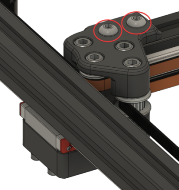
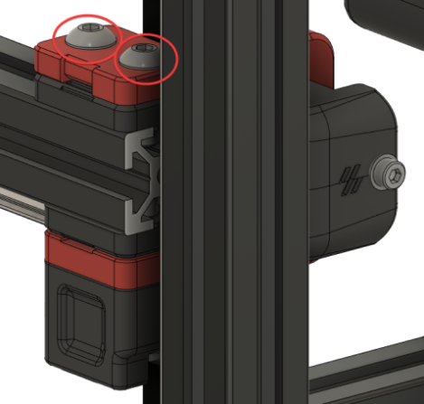
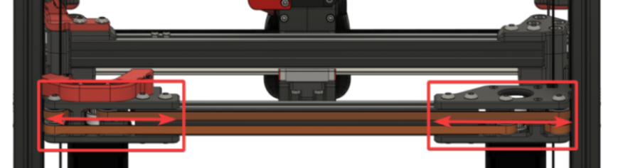
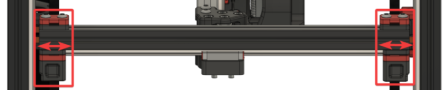
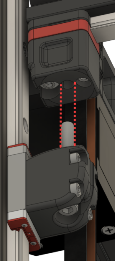

 
# This page has moved! Please visit [the new location](https://ellis3dp.com/Print-Tuning-Guide/articles/voron_v2_gantry_squaring.html).


# Voron V2 Gantry Squaring
Poor gantry squaring can cause a number of problems, such as:
- First Layer issues
- Z belts rubbing against the gantry's printed parts
- X axis to be "racked" at the front but not the back (or vice versa)

Steps 14-16 of the instructions below can also help with gantry stability.

## Demonstration

### Watch [this video](https://user-images.githubusercontent.com/34943186/154356504-b3870f34-32a3-4c2a-a424-7d48def0f834.mp4).

Notice that the idlers get "pinched" when moving the X extrusion back/forth (this is shown with loose Z joints).

## Method

1. Enter this g-code: `SET_IDLE_TIMEOUT TIMEOUT=99999`
    - This arbitrarily high timeout just gives us time to work. We need the Z motors to be energized and holding for the whole process.

2. `G28`, then `QUAD_GANTRY_LEVEL`. 

3. Jog your gantry to the center of the build volume using the LCD or web interface.
    - This will give you space to work. You need easy access to both the bottom and top of your gantry.

4. Turn off ONLY your A/B motors using these g-codes:
    - `SET_STEPPER_ENABLE STEPPER=stepper_x ENABLE=0`
    - `SET_STEPPER_ENABLE STEPPER=stepper_y ENABLE=0`

5. Loosen your A/B belt tension fully.
    - This prevents the A/B belt tension from pulling the gantry out of alignment while you work on it.
    - Your belts should be fully disengaged. If there is still remaining tension with the idlers fully backed off, you may need to release the belt ends from the X carriage.

    -  

6. Take off your side panels.

7. Unscrew and drop your lower Z joints. 
    - Your gantry will now be floating on just the belts.
        - Make sure your printer is on a fairly level surface, otherwise your gantry could swing too much to one side. (it doesn't have to be perfect, just don't do it on a hill),

    -  

    - 

8. **PARTIALLY** loosen all connections to the extrusions.

    - You need all of these bolts to be loose enough to freely adjust against the printed part on the extrusions. 

    {: .warning }
    > Where there are Z belt clamps, **ensure that you do not loosen the bolts so much that the Z belts release**. Only loosen enough to allow for adjustments.

    - X/Y joints (repeat for both sides). 
        - Top:
            -  

        - Bottom:
            -  

    - A/B joints (repeat for both sides):
        - Top:
            - *Don't overdo the belt clamps!*
            -  

        - Bottom:
            - *Don't overdo the belt clamps!*
            -  

    - Front idlers (repeat for both sides):
        - Top:
            - *Don't overdo it!*
            -  
        - Bottom:
            - *Don't overdo it!*
            -  

9. And now, what we have been preparing for.\
Adjust your gantry so that it sits perfectly on top of the lower Z joints.
    - This involves moving gantry components further apart or closer together along the extrusions:
        - **Rear**
            -  
        - **Sides**
            - 

    - Your gantry should align so that:
        - The Z joints feel perfectly flush along the side, and
        - When raising and lowering your lower Z joint by hand, the bolt slides in perfectly without hitting the sides.

        -   

    - Ensure that you do not inadvertently rotate your A/B joints during this process.
        -  
        - (Exaggerated)\
         

10. Tighten every extrusion bolt again, *except* those in the X/Y joints. (you will tighten those during step 12)
    - Ensure that your Z joints still align properly. Sometimes tightening can move things around.

11. Re-install your lower Z joints and *lightly* tighten the M5 bolts.
    - Do NOT hulk them down yet, or even make them tight. The "ball joint" should still be able to articulate completely freely.

12. Follow [:page_facing_up: Nero's de-racking video.](https://www.youtube.com/watch?v=cOn6u9kXvy0) 
    - Make sure to come back here afterwards! The following steps are still important.

13. [:page_facing_up: Re-tension your A/B belts](https://docs.vorondesign.com/tuning/secondary_printer_tuning.html#belt-tension) (to 110hz **over a 15cm span**).

14. Reinstall your panels and fully heatsoak your printer for **1½ - 2 hours minimum.**

15. `QUAD_GANTRY_LEVEL` 3-5 times to "settle in" the gantry (and level it for the next step).
    - If you are getting new tolerance / retry errors, you may have left your Z joints a bit *too* loose. Try tightening them up just a bit more.

16. Open the front door and fully tighten the M5 bolts in your Z joints while it's still hot.
    - This does two things:
        - Somewhat "locks in" your QGL at its state in full thermal expansion.
            - This can help with first layer issues.

        - **Stabilizes your gantry**. 
            - If you have your Z joints too loose, you might notice that your gantry displaces back & forth a bit while printing.

            - This can help with ringing and layer consistency.

17. `RESTART` to reset your idle timeout.