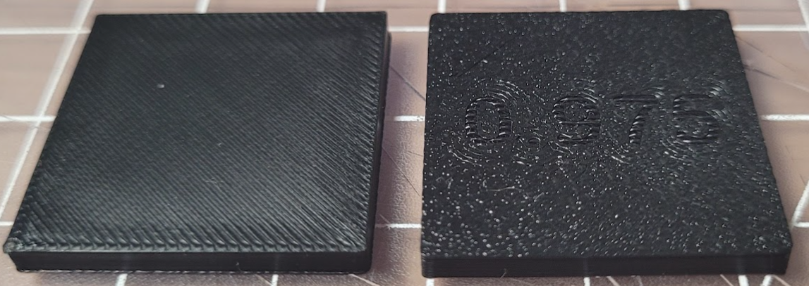

# Labeled Cubes
These cubes are the same, but simply have numbers imprinted on the bottom to help you keep track of which cube is which.

### **They do not have any print settings attached to them.** 
*(STL files cannot include settings. 3MF files can).*

You still have to set the extrusion multiplier for each in your slicer.

{:target="_blank"}

{:target="_blank"}